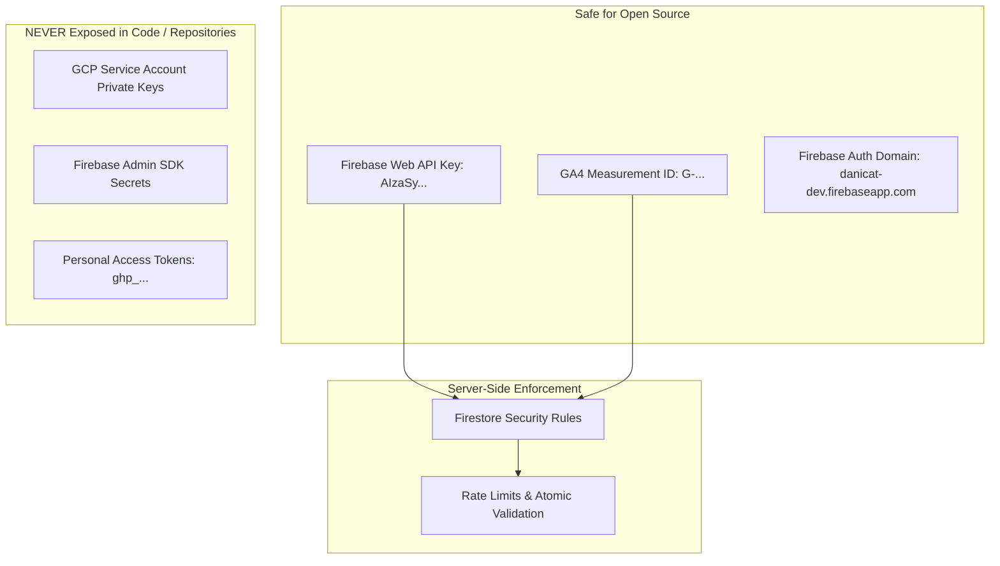
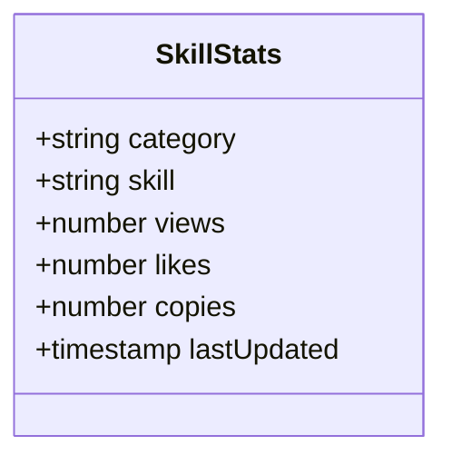
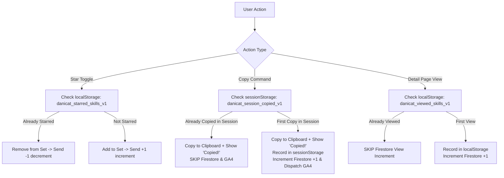

# RFC-0002: Real-Time Telemetry, Social Proof & Popularity Metrics

- Status: Approved
- Date: 2026-08-22
- Author(s): Daniela Petruzalek (daniela@danicat.dev)
- Deciders/Reviewers: Daniela Petruzalek (daniela@danicat.dev)
- ADR Reference: ADR-0002

---

## 1. Executive Summary

This RFC specifies the architecture, security model, data collection protocols, anti-skewing session deduplication, and popularity auto-ranking system for `skills.danicat.dev`.

The system introduces:
1. **Real-Time Social Proof**: Interactive Star/Like toggling (⭐), Detail Page Views (👁️), and background Install/Fetch Copy intent telemetry (📋).
2. **Minimalist UI Visualization**: Public display of Stars (⭐) and Views (👁️) while intentionally hiding the raw copy counter to eliminate UI clutter, preserving copy events strictly as an internal adoption weight in the ranking algorithm.
3. **Session Deduplication & Anti-Skewing Engine**: Strict client-side guards preventing repeated clicks or rapid reloads from distorting metrics.
4. **Dual-Telemetry Pipeline**: Real-time atomic counters backed by Firebase Firestore with anonymous authentication (`danicat-dev`), alongside structured Google Analytics 4 (GA4) custom events (`copy_install_command`, `like_skill`).
5. **Deterministic Popularity Scoring**: Client-side auto-ranking driven by the open weighted formula:
   $$\text{Score} = (3 \times \text{stars}) + (2 \times \text{copies}) + (1 \times \text{views})$$
6. **FLIP-Animated Layout Engine**: Smooth, 0-Cumulative Layout Shift (CLS) DOM reordering with interaction gating during search queries.
7. **Adblock & Offline Resilience**: Complete graceful degradation when JavaScript or third-party telemetry CDNs are blocked.

---

## 2. Context & Motivation

As the catalog of Agent Skills grew across 7+ domain categories, developers and agent orchestrators needed a reliable way to gauge skill maturity, adoption, and community endorsement. Static catalogs lack dynamic social proof and require manual curation to highlight high-value workflows.

By introducing privacy-preserving, lightweight telemetry directly into the static catalog interface, users can immediately identify proven skills while authors gain actionable feedback on adoption.

---

## 3. Security, Privacy & Public Configuration Assessment

A critical design requirement for open-source software is ensuring that all publicly committed credentials and configurations are strictly safe for public disclosure.



### 3.1 Firebase Web API Keys vs. Private Service Account Keys
- **Firebase Web API Keys (`apiKey: "AIzaSy..."`)**:
  - In Google Firebase client architecture, the Web API Key is an **identifier**, not a private secret. It identifies the Firebase project to Google backend services from browser environments.
  - Web API keys are intentionally exposed in client-side HTML/JavaScript across millions of public web applications (including `danicat.dev`).
  - Access control and data protection are enforced on the Google Cloud backend via **Firestore Security Rules** and Firebase Authentication, **not** by keeping the API key secret.
- **GA4 Measurement ID (`G-8RHDQGEGZ2` / `G-97TXNTPG93`)**:
  - Standard public analytics stream identifiers embedded in client-side HTML to route anonymous web beacons to Google Analytics.
- **Strict Prohibition on Private Credentials**:
  - GCP Service Account JSON keys, Firebase Admin SDK private secrets, and developer personal access tokens (`ghp_...`) MUST NEVER be included in public repositories. They are actively blocked by CI validation gates (`scripts/validate_metadata.mjs`).

### 3.2 Privacy & Anonymous Authentication
- **No PII Collected**: Telemetry collects zero personally identifiable information (PII). No usernames, email addresses, IP addresses, or device fingerprints are stored in Firestore documents.
- **Anonymous Authentication**: Clients authenticate ephemerally via `firebase.auth().signInAnonymously()`. Tokens are cached locally in the browser and recycle automatically without creating persistent user identity graphs.

---

## 4. Telemetry Metrics & Data Collection Schemas

The system collects three primary metrics per skill:



### 4.1 Metric Definitions

| Metric | Emoji | Vector & Trigger Event | Semantic Meaning & Weight | UI Visibility |
|---|:---:|---|---|:---:|
| **Stars / Likes** | ⭐ | Interactive `.star-btn` click on skill card or detail hero. | **High Intent (Weight: 3×)**: Explicit quality endorsement and bookmarking by developer. | **Visible** (Live Counter + Toggle) |
| **Detail Page Views** | 👁️ | Unvisited visit to `/${category}/${skill}/`. | **Discovery / Reach (Weight: 1×)**: Baseline discovery traffic. Deduplicated per session. | **Visible** (Live Counter) |
| **Copies / Installs** | 📋 | Click `.copy-button` (npx/kungfu command) or download raw SKILL.md. | **Utility / Adoption (Weight: 2×)**: Intent to execute or integrate the skill into an agent workflow. | **Hidden** (Background Scoring Only) |

---

### 4.2 UI Visibility Rationale: Hiding the Copy Counter

While tracking installation command copies provides high-signal adoption telemetry, the copy count is intentionally **hidden from the card and hero UI**:

1. **Noise Reduction & Visual Scannability**: Displaying three separate numeric badges per card created cognitive clutter and visual noise on dense catalog grids.
2. **Clear Separation of Intent**:
   - **Stars (⭐)** represent explicit human curation and community endorsement.
   - **Views (👁️)** represent reach and audience discovery.
   - **Copies (📋)** represent functional execution utility.
3. **Preventing Premature Metric Gaming**: Raw copy counts can fluctuate widely during bot indexing or repetitive user copy-pasting. By using copies strictly in the weighted popularity formula ($\text{Score} = 3S + 2C + 1V$) rather than displaying raw numbers, the catalog achieves high-quality ranking without exposing vanity copy numbers.

---

### 4.3 Anti-Skewing & Multi-Click Session Deduplication

To prevent accidental double-clicks, repetitive user testing, or intentional reload loops from skewing ranking metrics, the client enforces strict multi-tier deduplication:



1. **Star / Like Deduplication (Idempotent Toggle)**:
   - Backed by `localStorage` (`danicat_starred_skills_v1`).
   - A client can only star a skill once. Clicking again acts as an "unstar" ($ -1 $), removing the skill from local storage and decrementing the Firestore counter. Multiple clicks alternate state rather than accumulating votes.
2. **Copy Command Deduplication (Session Scope)**:
   - Backed by `sessionStorage` (`danicat_session_copied_v1`).
   - When a user clicks the copy button repeatedly on the same skill (e.g. while configuring terminal tabs), the clipboard write and visual feedback ("✓ Copied") occur every time to preserve UX responsiveness.
   - However, the backend Firestore increment (`copies: +1`) and GA4 event dispatch (`copy_install_command`) trigger **only on the first copy per skill per browser session**.
3. **Detail Page View Deduplication (Local Scope)**:
   - Backed by `localStorage` (`danicat_viewed_skills_v1`).
   - Page view increments occur once per unique skill per browser environment. Refreshing the page or navigating back and forth within the catalog does not trigger duplicate view increments.

---

### 4.4 Firestore Document Schema

- **Collection**: `skills`
- **Document ID Strategy**: `{category}-{skillName}` (e.g. `coding-godoctor`, `agents-double-diamond`, `writing-deslopify`)
- **Document Schema**:
  ```typescript
  interface SkillStats {
    category: string;                     // e.g. "coding"
    skill: string;                        // e.g. "godoctor"
    views: number;                        // Cumulative detail page views
    likes: number;                        // Cumulative stars/likes (can increment/decrement)
    copies: number;                       // Cumulative copy-to-clipboard actions
    lastUpdated: firebase.firestore.Timestamp; // Server timestamp of latest interaction
  }
  ```

- **Atomic Upsert Pattern**:
  ```javascript
  function incrementSkillMetric(category, skillName, field, delta = 1) {
    const docId = `${category}-${skillName}`;
    return db.collection("skills").doc(docId).set({
      category: category,
      skill: skillName,
      [field]: firebase.firestore.FieldValue.increment(delta),
      lastUpdated: firebase.firestore.FieldValue.serverTimestamp()
    }, { merge: true });
  }
  ```

---

### 4.5 Google Analytics 4 (GA4) Custom Event Instrumentation

In parallel with real-time Firestore document updates, client actions trigger structured GA4 custom events for aggregated funnel analytics:

#### 1. Skill Star / Like Event (`like_skill`)
```javascript
gtag('event', 'like_skill', {
  skill_category: category,
  skill_name: skillName,
  action: isNowStarred ? 'like' : 'unlike',
  page_location: window.location.href
});
```

#### 2. Copy Install Command Event (`copy_install_command`)
```javascript
gtag('event', 'copy_install_command', {
  skill_category: category,
  skill_name: skillName,
  command_text: commandText,
  page_location: window.location.href
});
```

---

## 5. Popularity Scoring & FLIP Reordering Engine

### 5.1 Mathematical Model
The popularity score computes a single weighted index reflecting true community adoption:

$$\text{Popularity Score} = (3 \times \text{stars}) + (2 \times \text{copies}) + (1 \times \text{views})$$

### 5.2 Deterministic Tie-Breaking
When skills share identical scores, ties are resolved deterministically to prevent random UI shuffling:
1. **Primary**: $\text{Score}_{\text{descending}}$
2. **Secondary**: $\text{Stars}_{\text{descending}}$
3. **Tertiary**: $\text{Copies}_{\text{descending}}$
4. **Quaternary**: $\text{Skill Name}_{\text{ascending}}$ (`a.name.localeCompare(b.name)`)

### 5.3 FLIP Animation Algorithm (First, Last, Invert, Play)
To avoid jarring visual jumps when Firestore metrics arrive asynchronously, the client reorders cards using FLIP animations:

1. **Interaction Gating**: If `#searchInput` is focused or was typed in within 1500ms, DOM reordering is deferred until the input is blurred to protect user keyboard focus.
2. **First**: Record initial bounding rectangles of all visible cards (`getBoundingClientRect()`).
3. **Last**: Sort card DOM nodes in memory and re-append them to `#skillsGrid`.
3. **Invert**: Calculate position offsets ($\Delta x, \Delta y$) and set `transform: translate3d(Δx, Δy, 0)` with `transition: none`.
4. **Play**: Force reflow and apply `transform: translate3d(0, 0, 0)` with a 380ms smooth cubic-bezier curve (`cubic-bezier(0.2, 0, 0, 1)`).

---

## 6. Client-Side State Management & Storage Key Registry

| Key | Storage Medium | Format | Purpose |
|---|---|---|---|
| `danicat_starred_skills_v1` | `localStorage` | JSON Array: `["godoctor", "double-diamond"]` | Tracks skills starred by this client to highlight active state and prevent duplicate votes. |
| `danicat_viewed_skills_v1` | `localStorage` | JSON Array: `["coding-godoctor", ...]` | Persistent cache preventing repeat pageview increment loops on browser reloads. |
| `danicat_session_copied_v1` | `sessionStorage` | JSON Array: `["coding-godoctor", ...]` | Session cache preventing repeat copy clicks on the same skill from spamming telemetry. |
| `appearance` | `localStorage` | String: `'dark' \| 'light'` | Preserves dark/light theme preference. |
| `preferred_cli_mode` | `localStorage` | String: `'npx' \| 'kungfu-load' \| ...` | Preserves global CLI installation mode toggle across sessions. |

---

## 7. Zero-JS & Offline Fallback Strategy

1. **Semantic Static HTML**: The static site generator outputs fully populated HTML cards with default data attributes (`data-stars="0"`, `data-views="0"`, `data-copies="0"`).
2. **Adblock / CDN Block Resilience**: All Firebase calls run inside error-handled `try...catch` blocks. If Firebase scripts fail to load (e.g. uBlock Origin or offline mode), the catalog operates flawlessly as a static fast-loading directory with zero broken buttons or console crashes.
3. **Graceful Copy Feedback**: The clipboard copy functionality works offline via native `navigator.clipboard` APIs, providing visual feedback ("✓ Copied") even if telemetry services are unreachable.

