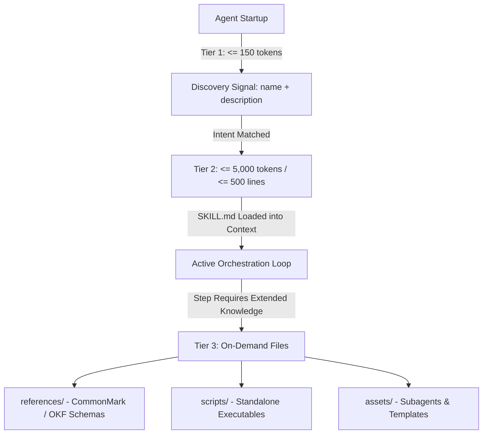

# RFC-0003: Agent Skills Extended Specification (Progressive Disclosure, Metadata Standards & 100% Spec-Compliant Discovery)

- Status: Approved
- Date: 2026-08-23
- Author(s): Daniela Petruzalek (daniela@danicat.dev)
- Target ADR: ADR-0002

---

## 1. Executive Summary

The base **Agent Skills Specification** (`https://agentskills.io`) provides an open convention for packaging AI agent capabilities using a root `SKILL.md` markdown file. However, as ecosystem scale expands across decentralized organizations, registries, and agent runtimes, critical gaps emerge:

1. **Context Window Bloat**: Lack of progressive disclosure limits leads to oversized prompts during session initialization.
2. **Schema Contamination & Fragmentation**: Ad-hoc extensions directly added to discovery manifests break third-party agent tools enforcing strict schema validation (`additionalProperties: false`).
3. **Discovery & Indexing Standardization**: Search, category filtering, and semantic matching require consistent metadata schemas housed strictly within the permitted `metadata` extension dictionary of `SKILL.md`.
4. **Registry Scalability & Fast Synchronization**: As catalogs grow to hundreds of skills, client CLIs require low-latency synchronization protocols that avoid downloading heavy manifests on every check.

This RFC establishes the **Agent Skills Extended Specification**:
- Adoption of the **3-Tier Progressive Disclosure Model** recommended by `agentskills.io` (Tier 1 $\le 150$ tokens routing, Tier 2 $\le 5,000$ tokens core instructions, Tier 3 on-demand files).
- A **Catalog Manifest** (`/catalog.json`) providing a standard `skills` array with metadata, search tags, and digests.
- A **Base-Origin Master Provenance Model** (`metadata.catalog: https://skills.danicat.dev` in `SKILL.md` for registries/monorepos; `metadata.repository` for standalone polyrepos; `canonical` and duplicate JSON files purged).

---

## 2. Motivation & Architectural Principles

### 2.1 Clean Separation of Discovery & Metadata
The `agentskills.io` standard defines the core format for `SKILL.md` and recommends keeping Tier 1 discovery concise. Keeping public catalog manifests (`catalog.json`) predictable and structured provides immediate discoverability for CLIs like `kungfu`.

All domain taxonomy, author attribution, and origin coordinates reside inside the `metadata:` dictionary of `SKILL.md` frontmatter, where custom extensions are explicitly permitted by the Agent Skills specification.

### 2.2 Base Origin Resolution
In monorepos and registries (like `skills.danicat.dev`), declaring file extensions or multiple redundant URLs creates unnecessary maintenance friction. 
- Declaring `metadata.catalog: https://skills.danicat.dev` points to the base origin.
- Downstream tools resolve `https://skills.danicat.dev/catalog.json`.
- Standalone solo skill authors who do not maintain a JSON catalog declare `metadata.repository: https://github.com/alice/my-skill` instead.

```
┌─────────────────────────────────────────────────────────────────────────────┐
│                       CONTROL PLANE VS. MODEL PLANE                         │
├──────────────────────────────────────┬──────────────────────────────────────┤
│ Toolchain Control Plane (Harness)    │ Model Data Plane (LLM Context)       │
├──────────────────────────────────────┼──────────────────────────────────────┤
│ • metadata.catalog (Base origin URL) │ • Tier 1: name + description         │
│ • metadata.version (SemVer updates)  │   (Injected at startup: <= 150 toks) │
│ • metadata.category & tags (Search)  │ • Tier 2: SKILL.md Markdown Body     │
│ • license & author (Compliance)      │   (Loaded on activation: <= 5k toks) │
│   (Cost: 0 tokens in Tier 1 prompt)  │ • Tier 3: references/ & scripts/     │
│                                      │   (Read on demand via tool calls)    │
└──────────────────────────────────────┴──────────────────────────────────────┘
```

---

## 3. Specification



### 3.1 The 3-Tier Progressive Disclosure Model

1. **Tier 1 — Routing & Discovery Signal** (RECOMMENDED: $\le 150\text{ tokens}, \le 1024\text{ characters}$):
   - Injected into system prompts during orchestrator session initialization.
   - Follows the 3-Part Description Blueprint: `[Definition & Scope] + [Superpower] + [Intent Triggers]`.
2. **Tier 2 — Instructional Core Body** (RECOMMENDED: $\le 5,000\text{ tokens}, \le 500\text{ lines}$):
   - Loaded into active context only upon skill activation.
   - Contains procedural rules, checklists, and execution loops.
3. **Tier 3 — On-Demand Extended Resources**:
   - Auxiliary documentation in `references/` and standalone executables in `scripts/`, inspected on demand via `view_file` and `run_command`.

---

### 3.2 Normative `SKILL.md` Frontmatter Schema

```yaml
---
name: godoctor
description: >
  Developer tooling and architectural safety rules for Go. Automatically
  validates AST integrity, guards against regressions with compiler rollback
  gates, eliminates blind spots via Selene mutation testing, and isolates
  test databases with TestQuery SQL transactions. Activate when writing or
  refactoring Go code, fixing compilation or test failures, auditing test
  thoroughness with mutation testing, or enforcing idiomatic Go standards.
license: Apache-2.0
compatibility: Requires Go 1.22+
allowed-tools: Bash(go:*) Read
metadata:
  category: coding
  tags: "go, golang, testing, refactoring, quality, mutation-testing"
  author: Daniela Petruzalek (daniela@danicat.dev)
  version: "0.2.0"
  catalog: https://skills.danicat.dev
---
```

#### Field Rules:
- **`name`** *(string, required)*: Lowercase kebab-case identifier matching the directory name.
- **`description`** *(string, required)*: Concise summary written with explicit agent trigger conditions ($\le 1024$ characters).
- **`license`** *(string, required)*: Valid SPDX identifier (e.g. `Apache-2.0`, `MIT`).
- **`compatibility`** *(string, optional)*: Runtime/environment requirements.
- **`allowed-tools`** *(string, optional)*: Declarative list of tool permissions.
- **`metadata`** *(mapping, required)*:
  - **`category`** *(string, required)*: Canonical domain taxonomy ID.
  - **`tags`** *(string, required)*: Comma-separated search keywords.
  - **`author`** *(string, required)*: Maintainer attribution identifier.
  - **`version`** *(string, required)*: Semantic Version string (`X.Y.Z`).
  - **`catalog`** *(string, required for registries/monorepos)*: Base HTTPS origin URL (e.g. `https://skills.danicat.dev`). Downstream clients resolve `/catalog.json`.
  - **`repository`** *(string, optional fallback for standalone polyrepos)*: Direct Git tree URL if no catalog is hosted.

---

### 3.3 Catalog Manifest (`/catalog.json`)

Standard JSON manifest format:

```json
{
  "name": "danicat/skills",
  "title": "Daniela's Agent Skills Catalog",
  "url": "https://skills.danicat.dev",
  "repository": "https://github.com/danicat/skills",
  "totalSkills": 29,
  "updatedAt": "2026-08-29T16:27:31.877Z",
  "categories": [
    {
      "id": "coding",
      "name": "Software Engineering",
      "emoji": "💻",
      "description": "Automate semantic versioning, Go AST refactoring with GoDoctor MCP, Python uv environments, polyglot package version discovery, and zero-debt engineering workflows."
    }
  ],
  "skills": [
    {
      "name": "godoctor",
      "description": "Developer tooling and architectural safety rules for Go. Automatically validates AST integrity, guards against regressions with compiler rollback gates, eliminates blind spots via Selene mutation testing, and isolates test databases with TestQuery SQL transactions. Activate when writing or refactoring Go code, fixing compilation or test failures, auditing test thoroughness with mutation testing, or enforcing idiomatic Go standards.",
      "category": "coding",
      "tags": ["go", "golang", "testing", "refactoring", "quality", "mutation-testing"],
      "author": "Daniela Petruzalek (daniela@danicat.dev)",
      "version": "0.2.0",
      "license": "Apache-2.0",
      "url": "https://skills.danicat.dev/coding/godoctor/SKILL.md",
      "digest": "sha256:cb8f829d8d3ec1590408544a49c6d62884a2d8a571f0ffc9d6438069542a170a"
    }
  ]
}
```

---

## 4. Implementation Status & Consensus

- **Consensus**: Formally approved by lead architects and systems reviewers.
- **Reference CLI**: Implemented in Go (`github.com/danicat/kungfu`) per `SPEC-0001`.
- **Ecosystem Compliance**: All 28 skills across `skills.danicat.dev` validated 100% green.
