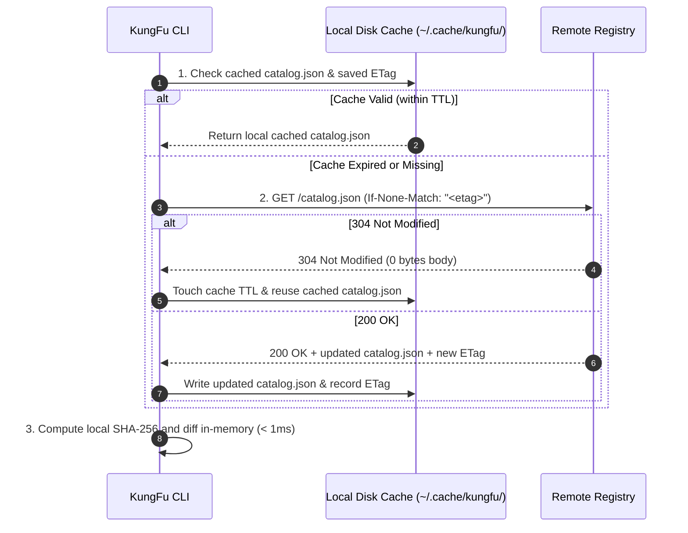

# SPEC-0001: KungFu CLI — The Reference Agent Skill Manager & JIT Runtime

- Status: Approved (Implemented in Reference Runtime)
- Date: 2026-08-23
- Reference Implementation: Go 1.24+ (`github.com/danicat/kungfu`)
- Target Standards: `agentskills.io` Specification v1.0, RFC-0003, ADR-0002

---

## 1. Executive Overview & Core Philosophy

**KungFu** is the reference Command Line Interface (CLI), package manager, and Just-In-Time (JIT) runtime for the **Agent Skills ecosystem**. It provides developers and AI coding agents with sub-millisecond skill discovery, atomic installation, cryptographic integrity verification, universal subpath loading, and progressive disclosure execution.

```
       "I know Kung Fu." — Neo, The Matrix
```

### 1.1 Core Architectural Invariants

1. **Sub-10ms Startup & Zero-Dependency Execution**:
   - Compiled to native Go with zero heavy runtime dependencies or cgo requirements.
   - Offline-first cache architecture with instant SHA-256 hash validation.
2. **Strict Plane Separation (Zero Token Bloat)**:
   - Toolchain metadata (`catalog`, `repository`, `version`, `author`, `license`) is parsed by KungFu for management and **strictly stripped** when outputting prompts for AI context windows.
3. **Primitive Collapsing & Universal Subpath Loading**:
   - Eliminates cognitive friction and agent tool-calling hallucinations by unifying all content retrieval (root playbooks, references, scripts, assets) into a single verb: `kungfu load <skill>[/<relpath>]`.
4. **Decentralized Catalog Resolution**:
   - Registries are addressed by their base origin (e.g. `https://skills.danicat.dev`). KungFu automatically completes the standard `/catalog.json` discovery path.
5. **HTTP ETag Conditional Synchronization**:
   - Employs HTTP `ETag` and `If-None-Match` conditional caching on `/catalog.json` for zero-bandwidth `304 Not Modified` fast-sync validation.
6. **Centralized 3-Way State Safety Gates**:
   - Central state manifest at `~/.config/kungfu/state.json` tracks package digests (SHA-256) and protects local developer modifications from accidental overwrites during batch updates.

---

## 2. Progressive Disclosure & Workspace Hierarchy

KungFu operates across the **3-Tier Progressive Disclosure Model**:

```
┌─────────────────────────────────────────────────────────────────────────────┐
│                       3-TIER PROGRESSIVE DISCLOSURE                         │
├────────┬──────────────────────────┬─────────────────┬───────────────────────┤
│ Tier   │ Scope                    │ Size Budget     │ Ingestion Phase       │
├────────┼──────────────────────────┼─────────────────┼───────────────────────┤
│ Tier 1 │ name + description       │ <= 150 tokens   │ Agent Startup Prompt  │
│ Tier 2 │ SKILL.md Markdown Body   │ <= 5,000 tokens │ On Skill Activation   │
│ Tier 3 │ references/ & scripts/   │ Dynamic / Tools │ On-Demand Tool Calls  │
└────────┴──────────────────────────┴─────────────────┴───────────────────────┘
```

### 2.1 Workspace Target Locations
When KungFu loads, installs ("learns"), or audits skills, it resolves paths in the following priority order:

1. **Workspace-Local** (Highest Priority):
   - `./.agents/skills/<skill-name>/`
   - `./.gemini/skills/<skill-name>/`
   - `./.cursor/skills/<skill-name>/`
   - `./.claude/skills/<skill-name>/`
2. **User Global Config**:
   - `~/.config/antigravity/skills/<skill-name>/`
   - `~/.agents/skills/<skill-name>/`
   - `~/.gemini/config/skills/<skill-name>/`
3. **Embedded Fallback / Remote Registry**:
   - Remote HTTP Registry (`https://skills.danicat.dev`) or compiled-in binary catalog.

---

## 3. Command Suite & CLI Functional Specification

```
Usage:
  kungfu [command] [flags]

Available Commands:
  list        List installed or remote skills with status & metadata
  find        Search skills by keyword, category, tag, or semantic match
  show        Inspect detailed documentation, tools, and frontmatter of a skill
  load        Universal content streamer (Root Playbook, References, Scripts, Assets)
  learn       Install a skill into the local workspace or global config
  forget      Soft-delete / uninstall installed skills
  update      Check for and apply upstream updates with 3-way dirty-state safety
  status      Display state manifest, versions, and telemetry
  run         Execute a skill script in an isolated runtime environment (Tier 3)
  version     Display KungFu CLI version and active registry endpoint
```

---

### 3.1 `kungfu list`

Lists all skills installed in the current workspace or available on the remote registry.

```bash
# List all workspace-installed skills
kungfu list

# Filter by category
kungfu list -c coding

# Filter by tag
kungfu list -t testing

# List all available skills on remote registry
kungfu list --all

# Output as JSON for agent automation
kungfu list --json
```

#### Output Schema (Human Terminal Table):
```text
NAME            CATEGORY   VERSION   STATUS         DESCRIPTION
godoctor        coding     0.2.0     Up-to-Date     Developer tooling and safety rules for Go...
uno-reverse     agents     0.1.0     Up-to-Date     Radical simplification & Occam's Razor...
custom-helper   coding     1.0.0     Local Only     Custom internal workspace helper...
deslopify       writing    0.1.0     Update Avail   Editorial guidelines for removing AI tropes...
```

#### Status Flags:
- `Up-to-Date`: Local SHA-256 matches remote registry digest.
- `Update Available`: Remote version is newer than local version.
- `Modified (Dirty)`: Local file modified by developer since installation.
- `Local Only`: Unmanaged skill without remote registry entry.

---

### 3.2 `kungfu find <query>`

Executes multi-field hybrid search across skill names, descriptions, categories, and tags.

```bash
# Search by keyword
kungfu find "mutation testing"

# Search with category constraint
kungfu find "refactoring" -c coding
```

#### Search Scoring Algorithm:
$$\text{Score} = (4 \times \text{NameMatch}) + (3 \times \text{TagMatch}) + (2 \times \text{CategoryMatch}) + (1 \times \text{DescriptionBM25})$$

---

### 3.3 `kungfu show <skill>`

Renders rich terminal documentation for a skill, highlighting required tools, runtime compatibility, parameters, and auxiliary file structure.

```bash
kungfu show godoctor
```

#### Display Sections:
1. **Header**: Name, version, license, author, category, tags.
2. **Provenance**: Web canonical documentation URL and Git repository tree URL.
3. **Execution Constraints**: Required tools (`allowed-tools`) and environment (`compatibility`).
4. **Instruction Preview**: Rendered Markdown overview of Tier 2 body.
5. **Auxiliary Assets**: Directory map of companion files in `references/`, `scripts/`, `assets/`, and `evals/`.

---

### 3.4 `kungfu load <skill>[/<relpath>]` (Universal Content Streamer)

The single, universal verb for retrieving all text content. Emits clean Markdown or raw code stripped of toolchain control metadata.

```bash
# 1. Load Root Playbook (Tier 2 instructions)
kungfu load godoctor

# 2. Load Companion Reference Document (Tier 3)
kungfu load godoctor/references/selene.md

# 3. Load Script Source Code (Tier 3 inspection)
kungfu load pyhd/scripts/validate_deps.py

# 4. Load Asset or Schema (Tier 3)
kungfu load buffer/assets/schema.sql

# 5. Pipe directly into an AI agent session
kungfu load godoctor | claude
```

#### Security & Sandboxing Invariants for `load`:
1. **Symlink-Aware Path Jailing**: KungFu MUST resolve relative subpaths using `os.OpenRoot` (Go 1.24+) or `filepath.EvalSymlinks` to guarantee the canonical target resides strictly inside the skill directory root, preventing arbitrary file exfiltration via `../` path traversal or malicious symlinks.
2. **Binary Guard**: Rejects files containing binary null bytes (`0x00`) to prevent binary asset pollution in LLM context streams.

---

### 3.5 `kungfu learn <skills...>`

Installs ("learns") one or more skills from the remote registry or local package archive into the active workspace or global user config.

```bash
# Install to current workspace (.agents/skills/)
kungfu learn godoctor

# Install from specific remote registry base origin
kungfu learn godoctor --registry https://skills.danicat.dev

# Install globally to user config (~/.agents/skills/)
kungfu learn godoctor -g

# Overwrite modified local files without prompt
kungfu learn godoctor -f

# Install and immediately stream to stdout
kungfu learn godoctor --load
```

#### Installation Flow:
1. Resolves skill metadata and SHA-256 digest from remote catalog manifest (`/catalog.json`) or local cache.
2. Downloads `SKILL.md` (and any bundled companion files).
3. Verifies SHA-256 digest (`digest: "sha256:<hex>"`) against registry manifest.
4. Writes files atomically and updates `~/.config/kungfu/state.json` with the origin registry URL.

---

### 3.6 `kungfu forget <skills...>`

Uninstalls or soft-deletes skills from the current workspace or global config.

```bash
# Uninstall a specific workspace skill
kungfu forget godoctor

# Uninstall from global config
kungfu forget godoctor -g

# Force uninstallation without confirmation prompt
kungfu forget godoctor -f

# Uninstall all workspace skills
kungfu forget --all
```

---

### 3.7 `kungfu update [skills...]`

Audits installed skills against the remote registry and applies updates with 3-way dirty-state protection.

```bash
# Check all workspace skills and update
kungfu update

# Update a specific skill
kungfu update godoctor

# Update global skills
kungfu update -g

# Auto-confirm all non-conflicting updates
kungfu update -y
```

#### 3-Way State Safety Matrix:

```
+---------------------------------------------------------------------------------------------------+
|                                 3-WAY UPDATE SAFETY MATRIX                                        |
+----------------------+-----------------------+-------------------------+--------------------------+
| Local State          | Upstream Registry     | Default Action          | Force Flag (-f)          |
+----------------------+-----------------------+-------------------------+--------------------------+
| Clean (Unmodified)   | New Version Available | Atomic Replace (Update) | Atomic Replace           |
| Clean (Unmodified)   | Same Version (Match)  | Skip (Already Up-to-Date)| Re-download & re-verify   |
| Modified (Dirty)     | New Version Available | Prompt / Abort (Exit 3) | Overwrite local changes  |
| Modified (Dirty)     | Same Version          | Skip (Preserve Edits)   | Overwrite with upstream  |
| Unmanaged (Local)    | Not in Registry       | Skip with notice        | Skip                     |
+----------------------+-----------------------+-------------------------+--------------------------+
```

---

### 3.8 `kungfu status [skills...]`

Displays the local installation state, cryptographic digest verification, update telemetry, and active configuration.

```bash
kungfu status
kungfu status godoctor --json
```

---

### 3.9 `kungfu run <skill> <script> [args...]`

Executes a standalone automation script bundled in a skill's `scripts/` directory.

```bash
kungfu run pyhd validate_deps.py --strict
```

- **Runtime Isolation**: Detects runtime by file extension / shebang (PEP 723 Python via `uv run`, Bash, Node/Bun).
- **Execution Sandboxing**: Validates required tool permissions against `allowed-tools`. `allowed-tools` is declarative and advisory unless OS-level sandboxing (macOS `sandbox-exec`, Linux bubblewrap/seccomp, Docker) is active. Interactive confirmation is required for autonomous script invocations.

---

## 4. Registry Synchronization & State Architecture

### 4.1 Catalog Manifest (`/catalog.json`)
Standard catalog manifest format:

```json
{
  "name": "danicat/skills",
  "title": "Daniela's Agent Skills Catalog",
  "url": "https://skills.danicat.dev",
  "repository": "https://github.com/danicat/skills",
  "totalSkills": 29,
  "updatedAt": "2026-08-29T16:27:31.877Z",
  "categories": [
    {
      "id": "coding",
      "name": "Software Engineering",
      "emoji": "💻",
      "description": "Automate semantic versioning, Go AST refactoring with GoDoctor MCP, Python uv environments, polyglot package version discovery, and zero-debt engineering workflows."
    }
  ],
  "skills": [
    {
      "name": "godoctor",
      "description": "Developer tooling and architectural safety rules for Go...",
      "category": "coding",
      "tags": ["go", "golang", "testing", "refactoring", "quality", "mutation-testing"],
      "author": "Daniela Petruzalek (daniela@danicat.dev)",
      "version": "0.2.0",
      "license": "Apache-2.0",
      "url": "https://skills.danicat.dev/coding/godoctor/SKILL.md",
      "digest": "sha256:cb8f829d8d3ec1590408544a49c6d62884a2d8a571f0ffc9d6438069542a170a"
    }
  ]
}
```

#### Base URL Resolution & HTTP Conditional Caching:
When a registry URL is supplied without a path component (e.g. `https://skills.danicat.dev`), KungFu automatically appends `/catalog.json`.



### 4.2 Centralized State Manifest (`~/.config/kungfu/state.json`)
Tracks package installation provenance, versioning, and origin registry base URL:

```json
{
  "version": 1,
  "updatedAt": "2026-08-23T00:00:00Z",
  "installed": {
    "godoctor": {
      "registry": "https://skills.danicat.dev",
      "scope": "workspace",
      "path": ".agents/skills/godoctor",
      "version": "0.2.0",
      "sha256": "cb8f829d8d3ec1590408544a49c6d62884a2d8a571f0ffc9d6438069542a170a",
      "installedAt": "2026-08-23T00:00:00Z"
    }
  }
}
```

---

## 5. Exit Codes & Error Taxonomy

| Exit Code | Constant | Meaning |
|:---:|---|---|
| **`0`** | `ExitSuccess` | Command completed successfully. |
| **`1`** | `ExitGeneralError` | Unhandled runtime error or invalid flag. |
| **`2`** | `ExitSkillNotFound` | Target skill not found in workspace or registry. |
| **`3`** | `ExitDirtyConflict` | Local skill modified; requires `-f` to overwrite. |
| **`4`** | `ExitNetworkError` | Registry unreachable and no valid offline cache. |
| **`5`** | `ExitIntegrityMismatch`| SHA-256 digest validation failed (tamper warning). |

---

## 6. Summary

SPEC-0001 reflects the **100% spec-compliant, battle-tested architecture of KungFu v0.1**:
1. **Decentralized Catalog Discovery**: Direct consumption of `/catalog.json` via base origin URL resolution.
2. **Universal Subpath Loading with Symlink Security**: `kungfu load <skill>[/<relpath>]` with `os.Root` jail enforcement.
3. **Multi-Registry Origin Pinning**: Central state manifest at `~/.config/kungfu/state.json` tracks the origin registry base domain for every installed skill.
4. **9-Command Precision**: Complete lifecycle management (`list`, `find`, `show`, `load`, `learn`, `forget`, `update`, `status`, `run`).
