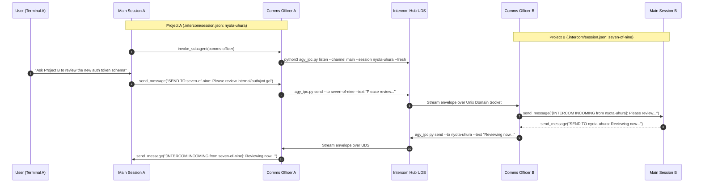

# Comms Officer Subagent Architecture & Operational Reference

This document provides a detailed operational reference for deploying and managing dedicated **Communications Officer Subagents** with the `intercom` mesh.

---

## 1. Why a Dedicated Comms Officer?

Running inter-session IPC directly inside the Main Session causes three critical failure modes:

| Failure Mode | Direct Main Session Execution | Dedicated Comms Officer Subagent |
| :--- | :--- | :--- |
| **Main Session Availability** | Blocked by synchronous listening or polling; unable to respond promptly to the user. | **100% Unblocked**. The main session pairs smoothly with the user while the comms officer handles network traffic. |
| **User Confirmation Spam** | Polling scripts or repeated shell commands prompt the user every few seconds for terminal approval. | **Zero Friction**. The listener background task is launched once by the subagent and runs quietly in the background. |
| **Context Contamination** | Socket logs, stream framing, and dead conversation history pollute the main conversation context window. | **Context Isolation**. Network traffic is parsed in the subagent; only high-signal messages are relayed to the main session. |

---

## 2. End-to-End Mesh Architecture



---

## 3. Sticky Project Identity & Collision Protection

Every project directory establishes **one and only one sticky Communications Officer identity**:

1. **Local State (`.intercom/session.json`)**:
   - Initialized via `python3 scripts/agy_ipc.py init --channel <channel>` or `python3 scripts/namegen.py --claim`.
   - Records the assigned officer identity (e.g., `nyota-uhura`), channel name, project path, and creation timestamp.
   - Automatically ignored by Git via `.gitignore` entry.
2. **Zero Impersonation Gate**:
   - Before binding an identity to a channel, the runtime inspects `peers.json` and probes active Unix Domain Sockets on the mesh.
   - If another running project is currently using that identity on the same channel, the runtime automatically assigns the next available officer from the roster, preventing cross-session impersonation.
3. **Session Reconnection**:
   - When restarting after a crash or tool restart, the project re-reads `.intercom/session.json` and resumes using its established identity.

---

## 4. Context Contamination Prevention & Clean Restarts

When spinning up a new session or restarting a terminated comms agent:

1. **Fresh Spool Reset (`--fresh`)**:
   - By default, `agy_ipc.py init` and `agy_ipc.py listen --fresh` advance the read offset or clear the session inbox spool.
   - This ensures historical messages from yesterday or previous debugging runs are not replayed into the LLM context.
2. **Live Peer Pruning**:
   - Broadcast messages (`--to "*"`) are routed exclusively to **active connected sockets** rather than scanning dead historical mailbox files.
3. **Stale State Garbage Collection**:
   - `python3 scripts/agy_ipc.py cleanup --stale` unlinks orphaned sockets and dead lockfiles left by terminated processes without interrupting active channels.

---

## 5. Main Agent Interaction Protocol

When orchestrating multi-project workflows, the **Main Agent** follows this simple protocol:

### Step 1: Initializing the Comms Officer
```python
# 1. Initialize project comms state
run_command("python3 scripts/agy_ipc.py init --channel collab")

# 2. Invoke the dedicated Comms Officer subagent
invoke_subagent(
    Subagents=[{
        "TypeName": "comms-officer",
        "Role": "Communications Officer",
        "Prompt": "You are our dedicated Comms Officer (nyota-uhura) for channel 'collab'. Start the persistent background listener and relay incoming messages to this main session."
    }]
)
```

### Step 2: Sending Messages via the Comms Officer
```python
send_message(
    Recipient="<comms_officer_conversation_id>",
    Message="SEND TO seven-of-nine: Test suite passed for auth package. Diff ready."
)
```

### Step 3: Handling Incoming Relays
When a message arrives from the Comms Officer (e.g. `[INTERCOM INCOMING from seven-of-nine]: ...`), the Main Agent processes the content, performs the requested development or review work, and responds back through the Comms Officer.
