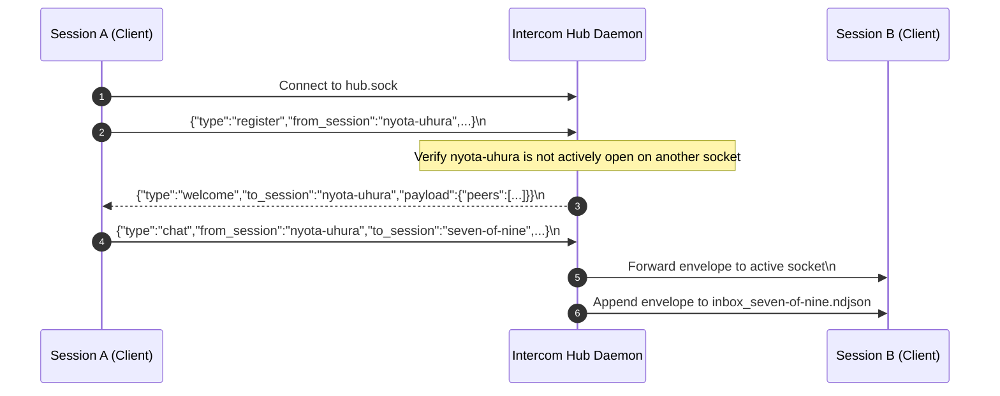

# Intercom Protocol & Framing Specification

This document details the low-level wire protocol, framing mechanics, sticky project identity model, mailbox persistence, and leader election state machine for the Intercom inter-session communication mesh.

---

## 1. Message Envelope Specification

All communications across the Intercom mesh use JSON Lines (NDJSON) framing. Every message exchanged over Unix Domain Sockets or persisted to disk conforms to the standard envelope schema:

```json
{
  "id": "msg_a1b2c3d4e5f6",
  "type": "chat",
  "from_session": "nyota-uhura",
  "to_session": "seven-of-nine",
  "channel": "collab",
  "reply_to": null,
  "payload": {
    "text": "Unit test suite completed with 0 failures.",
    "diff": "--- a/auth.go\n+++ b/auth.go\n@@ -10,2 +10,2 @@"
  },
  "timestamp": "2026-08-26T15:30:00.000000+00:00"
}
```

### Envelope Fields

| Field | Type | Description |
| :--- | :--- | :--- |
| `id` | `string` | Unique identifier prefixed with `msg_` (12-character hex). |
| `type` | `string` | Message purpose: `register`, `announce`, `welcome`, `chat`, `error`, `heartbeat`. |
| `from_session` | `string` | Sender session identifier (kebab-case slug). |
| `to_session` | `string` | Target session ID or `*` / `all` for channel-wide broadcast. |
| `channel` | `string` | Channel identifier (sanitized alphanumeric with hyphens/underscores). |
| `reply_to` | `string \| null` | Optional reference to a prior message `id`. |
| `payload` | `object` | Arbitrary JSON object containing `text` and structured metadata. |
| `timestamp` | `string` | ISO 8601 UTC timestamp with microsecond precision. |

---

## 2. Transport Framing & Socket Lifecycle

### Socket Endpoint
Each channel maintains an isolated Unix Domain Socket located at:
```text
${AGY_IPC_DIR:-/tmp/agy-ipc}/<channel_name>/hub.sock
```

### Connection Flow & Collision Avoidance



1. **Connection Establishment**: Client opens a stream connection to `hub.sock`.
2. **Registration & Collision Check**: Client transmits a `register` or `announce` envelope. If another active socket is already connected under the same `session_id`, the Hub rejects the duplicate connection with an error envelope (`SESSION_COLLISION`).
3. **Welcome Ack**: Hub responds with a `welcome` envelope enumerating active peers and updates `peers.json`.
4. **Message Routing**:
   - **Direct Message**: Delivered immediately to the target client socket if connected; spooled into `inbox_<to_session>.ndjson`.
   - **Broadcast**: Delivered to all currently connected active client sockets (except sender) and spooled into their respective inbox files. Broadcasts never route to dead historical inboxes.

---

## 3. Persistent Mailbox Spooling & Offset Tracking

To guarantee zero message loss when a subagent is busy executing long-running tool calls, Intercom maintains persistent disk spools:

### Filesystem Layout
```text
/tmp/agy-ipc/<channel>/
├── hub.sock                  # Active Unix Domain Socket (mode 0700)
├── hub.lock                  # Kernel advisory flock file for leader election
├── peers.json                # Live registry of connected session IDs
├── inbox_nyota-uhura.ndjson  # Append-only message log for Session A
├── offset_nyota-uhura.json   # Read pointer byte offset for Session A
├── inbox_seven-of-nine.ndjson
└── offset_seven-of-nine.json
```

### Advisory Locking (`fcntl.flock`)
- **Write Operations**: Hub and clients acquire `fcntl.LOCK_EX` before appending to `inbox_<session>.ndjson`.
- **Read Operations**: Polling/listening clients acquire `fcntl.LOCK_SH` while reading lines from the last known byte offset.
- **Offset Persistence**: Upon reading new messages, the client records `{"offset": <bytes_read>, "updated_at": <epoch_timestamp>}` in `offset_<session>.json`.
- **Fresh Session Reset (`--fresh`)**: When initializing a new session or running `listen --fresh`, `reset_inbox()` or `seek_to_end()` clears the backlog so old conversations never contaminate the context of a restarted agent.

---

## 4. Leader Election & Daemon Auto-Spawning

Intercom operates completely serverless without requiring a pre-existing background service:

1. **Socket Probe**: When any command (`send`, `poll`, `listen`, `init`) runs, `ensure_daemon_running()` attempts a zero-byte probe connection to `hub.sock`.
2. **Auto-Spawn**: If the socket is missing or refused, the process forks a background daemon via `subprocess.Popen(..., start_new_session=True)`.
3. **Kernel Mutex (`hub.lock`)**: The daemon attempts to acquire an exclusive non-blocking lock (`fcntl.LOCK_EX | fcntl.LOCK_NB`) on `hub.lock`.
   - **Leader**: First process acquires the lock, unlinks any stale socket, and binds `hub.sock`.
   - **Follower**: Concurrent processes fail to acquire the lock and exit cleanly (`sys.exit(0)`), falling back to client mode.
4. **Stale Recovery**: If the host crashes without unlinking `hub.sock`, subsequent client probes detect `ConnectionRefusedError`, unlink the dead socket, and safely elect a new Hub leader.
