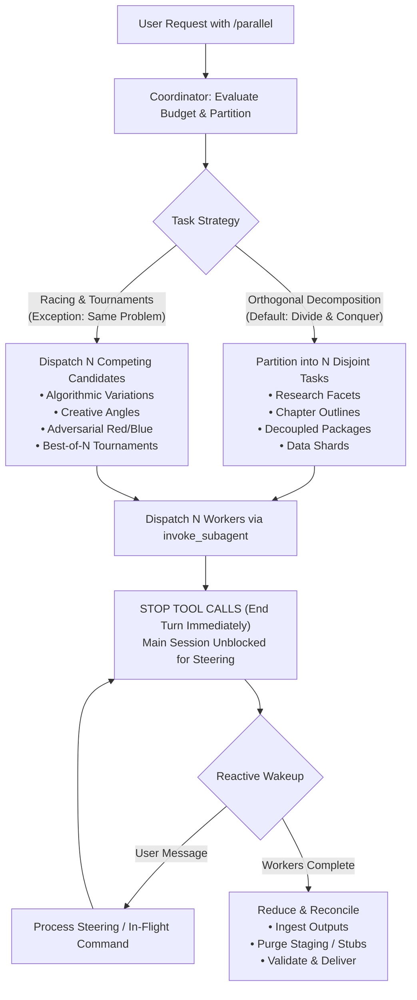

# Parallel: Task Concurrency & Agent Scaling Engine

`parallel` is a domain-agnostic task parallelization and agent scaling engine for Antigravity. It partitions complex objectives across concurrent subagents according to an explicit **Degree of Parallelism (DOP)** budget, guaranteeing complete context isolation, rapid execution, and maximum throughput.

Unlike domain-specific multi-agent frameworks, `parallel` scales **ANY** task: in-depth research, long-form writing, technical analysis, strategic planning, full-stack coding, multi-perspective reviews, ETL data processing, UI design, or model evaluation.

```
+-------------------------------------------------------------------------+
|                         PARALLEL TOPOLOGY                               |
|                                                                         |
|                          ROOT COORDINATOR                               |
|                 (Unblocked, Reactive, User-Facing)                      |
|                     /           |           \                           |
|                    v            v            v                          |
|             +------------+ +------------+ +------------+                |
|             |  Worker 1  | |  Worker 2  | |  Worker N  |                |
|             |  (Slice A) | |  (Slice B) | |  (Slice N) |                |
|             +------------+ +------------+ +------------+                |
|                    \            |            /                          |
|                     v           v           v                           |
|                        REDUCE & RECONCILE                               |
|               (Synthesize, Validate & Deliver to User)                  |
+-------------------------------------------------------------------------+
```

---

## ⚡ Core Principles & Operational Rules

### 1. Autonomous Activation Triggers & Syntax
Activate this skill immediately whenever the user requests parallel subagent execution or specifies a concurrency budget:
- `/parallel <DOP>` (e.g., `/parallel 5`, `/parallel 12`)
- `/parallel dop: <number>` (e.g., `/parallel dop: 8`)
- `/parallel budget <number>` (e.g., `/parallel budget 4`)
- **Multi-phase budgets** (e.g., `"use /parallel 5 for planning and /parallel 10 for implementation"`, `"phase 1: /parallel 3; phase 2: /parallel 6"`)
- **Natural language triggers** (e.g., *"parallelize this research across 6 agents"*, *"run this task in parallel with a budget of 4"*, *"swarm this audit with DOP 8"*)

### 2. Degree of Parallelism (DOP) & Budget Rules
- **Definition**: The **DOP** or **subagent budget** defines the maximum number of **active, concurrent subagents** executing simultaneously.
- **Budget Utilization**: It is strongly recommended (though not mandatory) to utilize the **full allocated budget** to maximize concurrency and accelerate completion.
- **Minimum Subagent Rule**: At minimum, the task must use at least **1 subagent**. Even with `DOP = 1`, work is delegated to a subagent so the coordinator upholds the non-blocking mandate.
- **Omission Default**: If the user asks for parallel execution without specifying a number, default to a sensible budget of **5** (or **10** for extensive codebase initiatives).
- **Active vs. Completed Capacity**: Completed or terminated workers release their concurrency slot immediately back to the budget pool.

### 3. Hard Constraint: Immediate Main Session Unblocking
The ROOT agent activating `/parallel` operates strictly as a **non-blocking Coordinator**:
- **Fire-and-Yield**: The Coordinator defines the task slices, invokes 1+ subagents via `invoke_subagent`, and **immediately stops calling tools to end its turn**.
- **Permanent Responsiveness**: The Coordinator MUST NEVER enter polling loops, sleep cycles, or synchronous wait states. It remains unblocked >= 99% of the time, ready to receive user steering commands, scope revisions, or status inquiries.
- **Non-Execution**: The Coordinator manages org structure, task allocation, and reconciliation. It NEVER performs direct heavy execution, long-running bash scripts, or code generation itself.

### 4. Topology: Flat by Default
- The default architecture is **Flat** (`Coordinator -> N Independent Workers`).
- Flat topologies eliminate bureaucratic overhead, minimize communication hops, and maximize parallelism for arbitrary tasks.
- Hierarchical sub-leads are reserved only for massive budgets (`DOP >= 20`) with multiple deeply nested technical subsystems.

### 5. Orthogonal & Independent Work Units
Unless explicitly racing, tasks must be sliced along **orthogonal, disjoint boundaries**:
- Each worker owns an exclusive file, topic facet, test module, or data chunk.
- **Single Writer Principle**: Only one subagent is granted write authority to any single file or resource.
- **Staging Pattern**: When outputs must combine into a single document or module, workers output to isolated staging files (`staging/chunk_*.md`), which the Coordinator reconciles during the Reduce step.

### 6. The Key Exception: Agent Racing & Tournaments
The singular exception to orthogonal partitioning is **Agent Racing**:
- When exploring high-ambiguity architecture, solving hard algorithmic puzzles, hunting zero-day bugs, or seeking creative diversity, run identical or perturbed variations of the same prompt across `N` parallel subagents.
- Evaluate candidates side-by-side using Best-of-N selection, automated test harnesses, or hybrid synthesis (merging the best elements from each runner).

### 7. Modern Subagent Standards & Model Selection
- **Model Selection**: ALWAYS set `Model: 'inherit'` in all subagent definitions and `invoke_subagent` calls. This ensures seamless inheritance of model capabilities and reasoning effort settings without configuration drift.
- **Customizations & MCP**: Subagents inherit workspace rules, tools, and MCP servers (`inheritCustomizations: true`, `inheritMcp: true`).
- **Disposable Workers**: Subagents are task-scoped and disposable. Spawning fresh workers with clean context windows avoids prompt pollution, tool bloat, and cognitive drift.

### 8. Strict Vertical Messaging (No Sibling Crosstalk)
- **Allowed**: `Coordinator <-> Worker` parent-child communication.
- **Forbidden**: `Worker <-> Worker` sibling communication. Workers execute independently and must not attempt lateral messaging.
- **User Escalation**: Workers do not possess `ask_question`. If a worker encounters an ambiguous requirement, it messages the Coordinator; the Coordinator consults the user via `ask_question` and relays the answer.

---

## 🎯 Universal Domain Decomposition Matrix

`/parallel` scales across any operational domain:



| Domain | Partitioning Dimension | Worker Assignment | Deliverable | Reduce Action |
| :--- | :--- | :--- | :--- | :--- |
| **Research** | Topic facet, search angle, competitor | Deep-dive on 1 specific subtopic | Research memo with cited sources | Synthesize into master briefing |
| **Writing** | Chapter, section, viewpoint | Draft 1 self-contained section | Staged draft section | Harmonize voice, flow, and TOC |
| **Coding** | Package, module, subsystem | Implement isolated component | Code files and local unit tests | Wire real modules, run integration tests |
| **Review / QA** | Security, performance, style, a11y | Audit codebase through 1 perspective | Categorized vulnerability / issue log | Deduplicate into prioritized matrix |
| **Data / ETL** | Date range, key partition, file chunk | Transform and analyze 1 data shard | Shard metrics and cleaned data | Aggregate metrics, generate summary |
| **Strategy** | Scenario, risk profile, persona | Model 1 scenario or stakeholder | Scenario impact paper | Build consolidated decision matrix |
| **Design** | User flow, viewport, design variant | Spec 1 user journey or wireframe | Layout spec and UI states | Unify design tokens and component lib |

---

## 📡 Non-Blocking Coordinator Protocol

The Coordinator guarantees user interactivity during intensive background processing:

```
+--------------------------------------------------------------------------+
|                     COORDINATOR LIFECYCLE PROTOCOL                       |
|                                                                          |
|  1. Parse DOP & Mode (Single or Multi-Phase)                             |
|  2. Define Disjoint Scopes & Output Contracts                            |
|  3. Call invoke_subagent(Subagents=[...])                                |
|  4. Brief User: "Dispatched N parallel workers. Standing by..."          |
|  5. HALT TOOL CALLS (Turn ends immediately)                              |
|                                                                          |
|     ... Main session remains fully interactive ...                       |
|     - User asks status: Coordinator runs manage_subagents (list)         |
|     - User steers: Coordinator sends message or kills workers            |
|     - Workers finish: Messaging system reactively wakes Coordinator      |
|                                                                          |
|  6. Execute Reduce & Deliver Verified Synthesis to User                  |
+--------------------------------------------------------------------------+
```

---

## 🔀 Multi-Phase Parallel Orchestration

When users supply multi-phase parallel budgets in a single instruction (e.g., *"use /parallel 4 for planning and /parallel 10 for implementation"*):

```
PHASE 1: Planning (DOP = 4)
Coordinator dispatches 4 planning workers -> YIELDS TURN IMMEDIATELY
All 4 workers finish -> Reactive wakeup
      |
      v
PHASE 1 REDUCE & BARRIER
Coordinator compiles unified specification (specs/plan.md)
(Optional human checkpoint / review)
      |
      v
PHASE 2: Implementation (DOP = 10)
Coordinator dispatches 10 implementation workers referencing specs/plan.md -> YIELDS TURN IMMEDIATELY
All 10 workers finish -> Reactive wakeup
      |
      v
FINAL REDUCE & DELIVERY
Coordinator integrates deliverables, executes validation, presents result
```

For complete multi-phase state machine specifications, consult [`references/multi_phase_orchestration.md`](references/multi_phase_orchestration.md).

---

## 🏁 The Racing Exception: Agent Racing & Tournaments

While orthogonal partitioning is the standard default, **Racing** intentionally invests parallel budget into competitive redundancy:

1. **Stochastic Racing**: Dispatch `N` identical prompts to explore diverse generative solutions for complex, open-ended problems.
2. **Perturbed Prompting**: Dispatch `N` workers with conflicting architectural constraints (e.g., low-latency vs high-durability vs fast-iteration).
3. **Adversarial Red-Blue Racing**: Pair builder workers against breaker/exploiter workers to surface edge-case vulnerabilities.
4. **Best-of-N Tournaments**: Collect `N` candidate solutions, rank them with automated benchmarks or judge rubrics, and merge or select the winner.

For full tournament brackets, evaluation rubrics, and synthesis patterns, consult [`references/racing_and_tournaments.md`](references/racing_and_tournaments.md).

---

## 🔄 The Reduce (Reconciliation) Pipeline

Parallel execution produces distributed artifacts. Before concluding, the Coordinator executes the **Reduce** phase:

1. **Ingestion & Completeness Audit**: Verify that all `N` workers reported deliverables without lingering placeholders (`TODO`, `FIXME`, temporary mock stubs).
2. **Reconciliation & Assembly**:
   - Merge staged markdown sections into the master manuscript.
   - Wire real code components together and purge stub adapters.
   - Aggregate disjoint data matrices into unified summaries.
3. **End-to-End Verification**:
   - Run compilation, linters, or package-level test suites.
   - Verify citation integrity and reference cross-links.
4. **Delivery Summary**: Present the final synthesized result with transparent execution metrics (workers deployed, tasks completed, trade-offs resolved).

---

## ⚠️ Gotchas & Antipatterns

1. **The Blocking Coordinator Trap**: Lingering in active execution, looping with `sleep`, or polling subagents. The Coordinator MUST yield immediately after `invoke_subagent`.
2. **The Coordinator-as-Worker Fallback Trap**: The Coordinator writing implementation code or performing search sweeps directly. The Coordinator delegates all execution to subagents.
3. **The Sibling Cross-Talk Trap**: Allowing subagents to communicate laterally. Workers must remain decoupled and message only the parent Coordinator.
4. **The Long-Lived Worker Context Bloat Trap**: Reusing subagents across disparate tasks. Spawn disposable, task-scoped workers with clean contexts.
5. **The Write Collision Trap**: Multiple workers writing to the same file concurrently. Enforce exclusive file ownership or use the staging directory pattern.
6. **The Leftover Staging Trap**: Forgetting to reconcile staged files or leaving temporary mock stubs in production paths. Always execute the Reduce phase.
7. **Under-Budgeting Mismatch**: Spawning fewer workers than the user's allocated budget when sufficient independent tasks exist. Always endeavor to utilize the full budget.

---

## 📚 Progressive Disclosure & References

- **Task Decomposition Guide**: [`references/task_decomposition.md`](references/task_decomposition.md) -- Partitioning strategies, domain matrices, staging patterns, and single-writer protocols.
- **Racing & Tournaments Guide**: [`references/racing_and_tournaments.md`](references/racing_and_tournaments.md) -- Stochastic races, perturbed constraints, adversarial tournaments, and best-of-N selection.
- **Multi-Phase Orchestration Guide**: [`references/multi_phase_orchestration.md`](references/multi_phase_orchestration.md) -- Staged pipelines, barrier synchronization, state handoffs, and in-flight steering.
- **Coordinator Playbook**: [`references/coordinator_playbook.md`](references/coordinator_playbook.md) -- Complete operational lifecycle, invocation parsing, dispatch standards, and reactive event handling.
