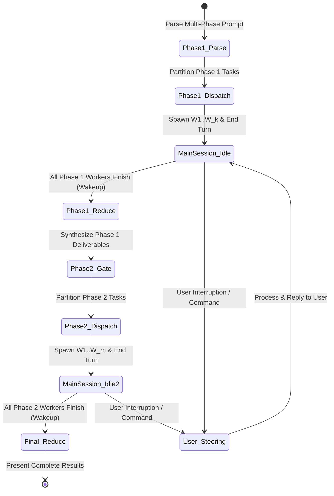

# Multi-Phase Parallel Orchestration Guide

This reference guide details how to plan, execute, and monitor **multi-phase parallel budgets** specified in a single prompt (e.g., *"use /parallel 5 for planning and /parallel 10 for implementation"*).

---

## 1. Multi-Phase Syntax & Concept

Users often demand different degrees of parallelism across consecutive stages of a pipeline. Early stages (ideation, planning, scoping) benefit from focused convergence with smaller budgets, while later stages (writing, implementation, data processing) scale up to high concurrency.

### Common Multi-Phase Invocations:
```
# Two-phase engineering pipeline
/parallel 4 for architecture and /parallel 10 for implementation

# Three-phase publishing pipeline
Phase 1: /parallel 3 (research); Phase 2: /parallel 6 (drafting); Phase 3: /parallel 2 (editing)

# Natural expression
Plan with DOP 3, then run execution with DOP 8
```

```
+-------------------------------------------------------------------------+
|                  MULTI-PHASE BARRIER SYNCHRONIZATION                    |
|                                                                         |
|  [PHASE 1: Planning]   Budget: 5 Workers                                |
|  Coordinator dispatches W1..W5 ===> YIELDS MAIN SESSION IMMEDIATELY    |
|  W1..W5 complete ===> Reactive wakeup of Coordinator                    |
|                                                                         |
|                       === PHASE 1 REDUCE BARRIER ===                    |
|                       Coordinator aggregates plan                       |
|                       (Optional Human Gate / Review)                    |
|                                                                         |
|  [PHASE 2: Execution]  Budget: 10 Workers                               |
|  Coordinator dispatches W1..W10 ===> YIELDS MAIN SESSION IMMEDIATELY   |
|  W1..W10 complete ===> Reactive wakeup of Coordinator                   |
|                                                                         |
|                       === FINAL REDUCE & DELIVERY ===                   |
+-------------------------------------------------------------------------+
```

---

## 2. The Non-Blocking Phase State Machine

To honor the **Hard Constraint** that the main session remains unblocked >= 99% of the time, the Coordinator must never run synchronous waiting loops across phases.



### Protocol Rules:
1. **Fire-and-Yield per Phase**: At every dispatch boundary, the Coordinator spawns the phase's subagents and **stops calling tools immediately**.
2. **Barrier Synchronization**: Phase `K + 1` cannot begin until all Phase `K` tasks reach completion and their deliverables are synthesized.
3. **No Busy-Wait Polling**: The Coordinator sleeps passively between dispatches; the messaging system reactively resumes execution when workers report back.
4. **Steering In-Flight**: If the user sends a message while Phase 1 is running, the Coordinator responds immediately, steering or killing workers as requested without disrupting phase tracking.

---

## 3. State Handoff Between Phases ("Document-First")

Never pass raw conversation transcripts or unbounded tool histories from Phase `K` into Phase `K + 1`.

### The Document-First Handoff Pattern:
1. **Consolidated Artifact**: When Phase 1 completes, the Coordinator writes a clean, consolidated specification document into the workspace (e.g., `specs/implementation_plan.md` or `briefs/master_research_brief.md`).
2. **Fresh Worker Contexts**: Phase 2 workers are spawned as fresh, disposable subagents. Their instructions point to the consolidated document path.
3. **Benefits**:
   - Zero context bloat (Phase 2 workers do not carry Phase 1 reasoning traces or dead-ends).
   - Traceability (Phase 1 decisions are recorded as persistent workspace artifacts).
   - Determinism (Phase 2 workers all reference the exact same authoritative contract).

---

## 4. Multi-Phase Pipeline Patterns

### Pattern A: Plan -> Build -> Verify (3-Tier Pipeline)
- **Phase 1: Planning (`DOP = 3`)**:
  - Worker 1: Architecture spec & data models.
  - Worker 2: API routes & endpoints.
  - Worker 3: Test matrix & edge case specifications.
  - *Barrier*: Coordinator merges into `docs/spec.md`.
- **Phase 2: Implementation (`DOP = 8`)**:
  - Workers 1 to 6: Implement 6 decoupled modules in parallel against `docs/spec.md`.
  - Workers 7 to 8: Author test suites for the modules.
  - *Barrier*: Coordinator runs integration verification.
- **Phase 3: Verification & Hardening (`DOP = 2`)**:
  - Worker 1: Security & vulnerability sweep.
  - Worker 2: Performance & load profiling.
  - *Final Reduce*: Deliver verified, production-ready system to user.

### Pattern B: Research -> Draft -> Review (Content Pipeline)
- **Phase 1: Research (`DOP = 4`)**:
  - Explore 4 distinct topic angles; output 4 research summaries.
  - *Barrier*: Coordinator generates unified chapter outline.
- **Phase 2: Drafting (`DOP = 6`)**:
  - Draft 6 chapters simultaneously in staging directory.
  - *Barrier*: Coordinator compiles complete draft.
- **Phase 3: Review (`DOP = 3`)**:
  - Worker 1: Fact-check and citation audit.
  - Worker 2: Voice, tone, and readability review.
  - Worker 3: SEO optimization and metadata.
  - *Final Reduce*: Polish and present publication-ready manuscript.

---

## 5. Handling Mid-Flight User Adjustments

Because the Coordinator remains unblocked, users may steer multi-phase pipelines dynamically:

1. **Phase Cancellation**: User says *"Stop planning, let's proceed with approach X immediately."*
   - Coordinator calls `manage_subagents(Action="kill", ConversationIds=[...])` to terminate active Phase 1 workers.
   - Coordinator synthesizes what was learned so far and immediately dispatches Phase 2.
2. **Budget Reallocation**: User says *"Increase implementation budget from 10 to 16."*
   - Coordinator logs the updated budget for Phase 2 without affecting currently running Phase 1 tasks.
3. **Injecting New Requirements**: User provides an additional constraint during Phase 1.
   - Coordinator incorporates the constraint directly into the Phase 1 synthesis document, ensuring Phase 2 automatically inherits it.
