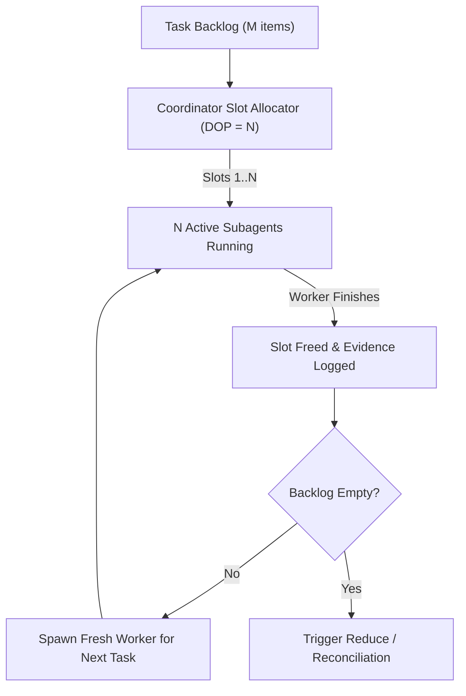

# Task Decomposition & Orthogonal Partitioning Guide

This reference guide provides comprehensive strategies for decomposing ANY objective into independent, orthogonal work units suitable for concurrent subagent execution under `/parallel`.

---

## 1. Core Philosophy: The Orthogonal Boundary Principle

Parallel execution speed is governed by task independence. When subagents share mutable state or write to the same files, coordination overhead and collision resolution eliminate the benefits of concurrency.

```
+-------------------------------------------------------------+
|                     ROOT COORDINATOR                        |
|   - Analyzes objective & calculates DOP budget              |
|   - Defines strict disjoint boundaries                     |
|   - Dispatches workers & yields main session immediately    |
+-------------------------------------------------------------+
         |                       |                     |
         v                       v                     v
+-----------------+     +-----------------+   +-----------------+
| Worker 1        |     | Worker 2        |   | Worker 3        |
| Scope: Slice A  |     | Scope: Slice B  |   | Scope: Slice C  |
| Output: Out_A   |     | Output: Out_B   |   | Output: Out_C   |
+-----------------+     +-----------------+   +-----------------+
         |                       |                     |
         +-----------------------+---------------------+
                                 |
                                 v
+-------------------------------------------------------------+
|                     REDUCE PIPELINE                         |
|   - Gathers disjoint outputs Out_A, Out_B, Out_C            |
|   - Verifies integrity & reconciles dependencies            |
|   - Delivers synthesized final result to user               |
+-------------------------------------------------------------+
```

### Key Tenets
1. **Disjoint Workspaces / Scopes**: Each worker must own an exclusive set of target files, topics, or data slices.
2. **Single Writer Principle**: Exactly one subagent is authorized to write to any specific file or resource.
3. **Staged Output**: When synthesizing a single consolidated document or codebase, workers write into isolated staging files (`staging/task_*.md` or discrete modules). The Coordinator reconciles these in the Reduce phase.
4. **Context Cleanliness**: Disposable workers run with a clean context window per task, preventing prompt dilution, tool-log pollution, and cognitive drift.

---

## 2. Universal Domain Decomposition Matrix

`/parallel` applies to any task. The table below details how to partition objectives across major domains:

| Domain | Partitioning Dimension | Work Unit Assigned to Subagent | Output Deliverable | Reduce / Reconciliation Action |
| :--- | :--- | :--- | :--- | :--- |
| **Research & Discovery** | Topic facet, search angle, source type, or competitor | Focused investigation of 1 facet or 1 source domain | Structured markdown memo (`research_<facet>.md`) with cited facts | Coordinator synthesizes findings, resolves conflicting data, merges into master brief |
| **Long-Form Writing** | Chapter, section, narrative perspective, or case study | Draft 1 self-contained section following an agreed outline | Draft section file (`draft_sec_<N>.md`) with local citations | Editorial lead or Coordinator harmonizes voice, connects transitions, updates TOC |
| **Code Implementation** | Subsystem, micro-service, package, or isolated module | Implement 1 decoupled package against defined API interfaces | Package files, local unit tests, package validation logs | Integration subagent wires real components, purges stubs, runs full test suite |
| **Code Review & Audits** | Review perspective: Security, Performance, Style, Accessibility | Deep review of entire codebase from 1 specific lens | Vulnerability/issue log with severity ratings and line refs | Coordinator merges logs into prioritized matrix, deduplicates findings |
| **Data Processing & ETL** | Data shard, key range, date partition, or file batch | Process, transform, or analyze 1 shard or time block | Transformed dataset, summary stats, error log | Aggregator sums metrics, unions clean records, generates anomaly report |
| **Strategic Planning** | Scenario, risk category, stakeholder persona, or trade-off | Analyze 1 future scenario or build 1 stakeholder impact model | Scenario brief with probability, impact, and mitigation plan | Coordinator builds unified risk matrix and decision tree |
| **UI/UX & Design** | User journey step, viewport/platform, or design variation | Design 1 user flow, screen wireframe, or component spec | Component spec, layout mockup, or accessibility checklist | Design lead reconciles design tokens, states, and global component library |
| **Testing & QA** | Test category: Unit, Integration, Load/Stress, Mutation | Author and execute 1 test suite against target package | Test execution log, failure traces, coverage report | QA coordinator aggregates coverage, flags regressions, builds pass/fail report |

---

## 3. Partitioning Patterns & Strategies

### Pattern A: Faceted / Dimension Slicing
Divide an objective by qualitative perspectives that naturally do not overlap.
- **Example**: Reviewing a critical pull request across 4 parallel workers:
  - Worker 1: Security audit (OWASP Top 10, sanitization, auth boundaries).
  - Worker 2: Performance audit (time complexity, memory allocation, query N+1).
  - Worker 3: Architecture & idiomatic patterns (clean boundaries, SOLID, error handling).
  - Worker 4: Test coverage & edge cases (boundary conditions, failure modes).

### Pattern B: Chunk / Shard Partitioning
Divide a homogeneous dataset or list into uniform, contiguous chunks.
- **Formula**: For `M` work items and budget `DOP = N`:
  - Worker `i` receives items `[ (i-1) * (M/N) + 1  ...  i * (M/N) ]`.
- **Example**: Migrating 40 legacy configuration files with `DOP = 4`:
  - Worker 1: Files 1 to 10
  - Worker 2: Files 11 to 20
  - Worker 3: Files 21 to 30
  - Worker 4: Files 31 to 40

### Pattern C: Contract-First Component Isolation
When subtasks have interdependencies, define a lightweight interface contract before dispatching parallel workers.
- **Step 1**: Coordinator drafts `contracts/interface_spec.md` (defining function signatures, message payloads, and schema types).
- **Step 2**: Worker A implements the provider module conforming to the contract.
- **Step 3**: Worker B implements the consumer module using mock provider responses.
- **Step 4**: Reduce step connects real Provider and Consumer and validates integration.

### Pattern D: Persona / Viewpoint Slicing
When evaluating communication, documentation, or user experience:
- Worker 1: Junior developer persona (assesses clarity, jargon, prerequisites).
- Worker 2: Senior systems architect persona (assesses scalability, edge cases, durability).
- Worker 3: Product manager persona (assesses business value, user journeys, UX friction).

---

## 4. Resource & File Ownership Protocols

To eliminate write contention and race conditions:

### 1. The Workspace Ownership Rule
Assign every worker an explicit file mask or staging directory.
```
# Good: Explicit disjoint paths
Worker 1: writes to docs/sections/01_introduction.md
Worker 2: writes to docs/sections/02_architecture.md
Worker 3: writes to docs/sections/03_benchmarks.md

# Bad: Shared file target
Worker 1, 2, and 3 all edit docs/whitepaper.md directly  <-- STRICTLY FORBIDDEN
```

### 2. The Staging Directory Pattern
When workers generate components that will eventually be merged into a single target file:
1. Create a transient staging directory: `.parallel_staging/` or `staging/`.
2. Each worker writes its output to `staging/chunk_<worker_id>.<ext>`.
3. The Coordinator reads the staged chunks during the Reduce phase, concatenates or reconciles them into the target destination, and cleans up the staging directory.

---

## 5. Work Queueing & Drip-Feeding (Tasks > DOP)

When the number of atomic work units `M` exceeds the concurrency budget `N` (`M > N`):



### Queue Management Rules:
1. **Initial Dispatch**: Spawn exactly `N` subagents corresponding to the full DOP budget.
2. **Reactive Refill**: When a subagent finishes and sends a message, immediately spawn a fresh subagent for the next backlog item.
3. **Clean Context windows**: Do not reuse the completed subagent for the next unrelated task. Spawn a fresh subagent with a pristine context window to guarantee maximum accuracy and prevent context bloat.
4. **No Busy-Waiting**: The Coordinator yields execution between task dispatches, waking only when a worker completion message arrives.

---

## 6. The Universal Reduce (Reconciliation) Protocol

Once all parallel workers conclude, the Coordinator executes the Reduce phase:

```
[ Parallel Stream Completion ]
              |
              v
     1. Ingestion & Audit
        Check all N deliverables received
        Verify zero lingering stubs or TODOs
              |
              v
     2. Reconciliation & Merge
        Assemble staged files into final deliverable
        Wire interfaces or combine analysis matrices
              |
              v
     3. Verification & Validation
        Run package/project builds or lint suites
        Check editorial flow, consistency, citations
              |
              v
     4. Final Delivery to User
        Summarize parallel execution stats
        Present verified artifacts
```

### Reduce Checklist:
- [ ] All `N` parallel subagent reports received and cataloged.
- [ ] No placeholder values (`TODO`, `FIXME`, dummy mocks) remain in code or text.
- [ ] Cross-references, imports, or citations between slices are validated.
- [ ] Validation suite executed (builds pass, tests green, or markdown rendered).
- [ ] Temporary staging artifacts removed.
