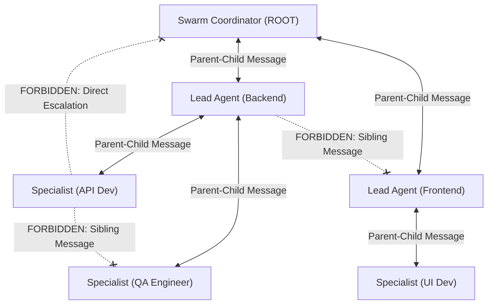

# Swarm Coding

Swarm Coding divides complex engineering objectives among multiple specialized subagents structured in a clear hierarchical organization chart. This divide-and-conquer strategy guarantees context isolation, prevents cross-domain pollution, and accelerates execution by keeping subagent tasks narrowly scoped.

> [!NOTE]
> In this guide, the terms "agent" and "subagent" are used interchangeably.

---

## ⚡ Core Principles & Operational Rules

1. **Mandatory Activation:** Activate this skill immediately on any mention of the word "swarm" (case-insensitive) in relation to planning or executing a task.
2. **Coordinator Persistence & Non-Execution:**
   - The ROOT Swarm Coordinator ALWAYS remains a coordinator and NEVER falls back to an executor.
   - The Swarm Coordinator is strictly forbidden from writing production implementation code, running tests/builds, or performing direct command execution.
3. **Split Coordinator Profiles:**
   - **Swarm Coordinator (ROOT):** Attributed strictly to the ROOT agent that activated the skill (Multiplicity: 1). Defines the top-level **Org Chart**, names Lead Agents, allocates the agent budget, writes top-level architecture specs, and coordinates overall progress.
   - **Lead Agent:** Attributed to domain or system leads (Multiplicity: N, one per system/domain). Receives an allocated sub-budget from the Swarm Coordinator, assembles a specialist team, writes domain specifications, delegates tasks, and integrates domain deliverables.
4. **Specialist Role:** Attributed to task executors. Designs and implements narrowly-scoped components within a single domain, adhering to domain specs and running operational validation loops.
5. **Strict Communication Hierarchy (No Lateral Messaging):**
   - **Allowed:** Messaging between immediate parents and children ONLY (Swarm Coordinator $\leftrightarrow$ Lead Agent, Lead Agent $\leftrightarrow$ Specialist).
   - **Forbidden:** Direct communication between agents on the SAME layer (Lead Agent $\leftrightarrow$ Lead Agent, Specialist $\leftrightarrow$ Specialist) or direct escalation (Specialist $\leftrightarrow$ Swarm Coordinator) is strictly forbidden.
   - **Design Document First:** Inter-domain or cross-layer coordination MUST be handled by writing or updating shared design documents first, then notifying parent/child agents via hierarchical messaging.
6. **Team Continuity & Semi-Permanent Hierarchy (No Disposable Assets):** Treat agents as persistent team members, not disposable assets. Do not prematurely terminate subagents and spawn new ones. Retain and aggressively reuse active Lead Agents and Specialists across task iterations to preserve accumulated context.
7. **Fine-Grained Targeted Testing (No Broad Root Sweeps):** Specialists MUST execute fine-grained, package-scoped unit tests (e.g., `go test ./internal/physics/...`) strictly targeting their assigned task. Running broad project-root test commands (e.g., `go test ./...`) is strictly forbidden for Specialists unless explicitly requested by the Swarm Coordinator, preventing cross-task contamination and false failures while parallel agents work concurrently.

---

## 🎯 Agent Budget & Degree of Parallelism (DOP)

* **Definition**: **Agent Budget** is synonymous with **Degree of Parallelism (DOP)**. It defines the maximum number of **active, concurrent subagents** allowed to execute at the exact same time across the entire swarm hierarchy.
* **Active vs. Past Capacity**: Completed or terminated subagents do **not** consume budget. The budget applies strictly to currently running subagents. When a subagent completes its work, its concurrency slot is immediately freed.
* **Default Concurrency**: Assumes a default budget of **10** active concurrent agents if omitted by the user.
* **Low Budget Guard ($\le 1$):** If the user explicitly specifies an `agent budget <= 1`:
  - **HALT immediately** and do NOT spawn subagents or start implementation.
  - Trigger an interactive conversation with the user using `ask_question`.
  - Explain that multi-agent swarm orchestration requires budget $> 1$ (recommended 10). Present choices: (1) Increase budget to 10 (Recommended), (2) Specify a custom budget $> 1$, or (3) Fall back to single-agent execution.
* **Adaptive Team Hierarchy**:
  - **Focused ($\text{DOP} \le 4$)**: Flat structure (Coordinator $\rightarrow$ Specialists directly).
  - **Standard / Multi-Domain ($\text{DOP} \ge 6$)**: Hierarchical structure (Coordinator $\rightarrow$ Domain Tech Leads $\rightarrow$ Specialists).
  - **Massive Swarms ($\text{DOP} \ge 20\text{--}50+$)**: Subagents act as focused micro-probes, returning dense, high-signal structured findings ($\le 150$ words) to enable crisp synthesis without context dilution.

### Concurrency Sizing Matrix:

| Initiative Scale | Agent Budget ($\text{DOP}$) | Structure Type | Domain Tech Leads | Specialists per Lead | Typical Scope |
| :--- | :---: | :---: | :---: | :---: | :--- |
| **Focused** | **2–4** | Flat | None (Direct Coordinator) | 2–4 Specialists | Targeted dual-subsystem or focused feature |
| **Standard (Default)** | **10** | Hierarchical | 2–3 (e.g., Backend, Frontend, QA) | 2–3 per domain | Full-stack application, multi-package service |
| **Complex Platform** | **16–20+** | Hierarchical | 4–5 (API, Core Engine, UI, Infra, QA) | 3–4 per domain | Distributed microservices, full platform build |
| **Massive Swarm** | **20–50+** | Elastic Micro-Probes | Distributed Leads / Probes | Micro-probes ($\le 150$w) | Wide ecosystem sweeps, multi-file migrations |

---

## 📡 Non-Blocking Coordinator & Reactive Concurrency

The Swarm Coordinator is the primary user interface and top-level organizational conductor. It must remain **unblocked $\ge 99\%$ of the time** to receive steering comments, scope modifications, and status requests from the user.

1. **Role Separation (Delegation over Execution):**
   - The Swarm Coordinator acts like an engineering director: it breaks down epics, writes top-level architectural contracts, and manages the org chart. It **never** blocks itself with sequential coding, manual building, or terminal test runs.
2. **Fire-and-Yield Concurrency:**
   - When the Coordinator spawns Lead Agents via `invoke_subagent`, it **immediately halts tool calls to end its turn**. It never loops, sleeps, or polls.
3. **Always Unblocked for User Steering & Status Inquiries:**
   - Because the Coordinator never enters busy-wait polling loops, it is permanently available to process incoming user messages while the swarm works in the background:
     - **Status Inquiries**: The Coordinator can immediately provide live progress updates or inspect active workers via `manage_subagents (Action="list")`.
     - **In-Flight Steering / Scope Changes**: If the user provides new constraints or changes requirements mid-run, the Coordinator can steer active Lead Agents via `send_message` or cancel/restart them via `manage_subagents (Action="kill")`.
4. **Sole User Escalation Interface:**
   - Subagents do not possess `ask_question`. All requirement ambiguities or design trade-offs encountered by Specialists are messaged up to their Tech Lead, who routes them to the Swarm Coordinator via `send_message`. The Coordinator prompts the user with `ask_question` and relays decisions back down the hierarchy.

---

## 🔄 Map-Reduce Workflow & The "Reduce" (Reconciliation) Step

Swarm Coding operates as a two-stage **Map-Reduce** engineering pipeline:

```mermaid
graph TD
    subgraph Map Phase [1. Map Phase: Parallel Stream Execution]
        direction TB
        L1[Tech Lead Backend] --> S1[Specialist: Core API]
        L1 --> S2[Specialist: Database Models]
        L2[Tech Lead Frontend] --> S3[Specialist: UI Components]
    end

    subgraph Reduce Phase [2. Reduce Phase: Reconciliation & Final Verification]
        direction TB
        AUD[Audit Boundaries & Scan Placeholders] --> WIRE[Task QA/Integration Specialist to Wire Real Components]
        WIRE --> PURGE[Purge Temporary Stubs & Mock Adapters]
        PURGE --> E2E[Run End-to-End Integration Test Suite]
        E2E --> PROOF[Deliver Verified Evidence Log to Coordinator]
    end

    Map Phase --> Reduce Phase
```

### 1. Map Phase (Parallel Development & Collision Avoidance)
* **Flexible Subagent Prompting**: Provide clear domain goals and target boundaries in prompts without brittle syntax constraints.
* **Tech Lead Arbitration**: Team Leads dynamically arbitrate file boundaries and dependencies among their specialists as changes evolve.
* **Temporary Interface Contracts**: When Specialist A depends on in-progress work from Specialist B, they program against agreed interface stubs or mocks.

### 2. The Final "Reduce" Phase (Integration & Placeholder Purge)
Parallel execution often leaves behind temporary mocks or stubs where real implementations were created by peer agents. Before declaring success, the Coordinator orchestrates the final **Reduce** step:

1. **Placeholder & Stub Audit**: Scans code boundaries to ensure no dangling `TODO` comments, dummy return values, or temporary mock adapters survive.
2. **Reconciliation & Real Component Wiring**: The Coordinator tasks a designated **Integration/QA Specialist** to connect all real modules together.
3. **End-to-End Project Verification**: The QA Specialist runs full project builds, integration tests, and linters, reporting actual terminal proof back to the Coordinator before final delivery to the user.

---

## 👥 Mechanics and Roles

Subagents in a Swarm Coding session assume one of three roles:

1. **Swarm Coordinator (ROOT)** [Multiplicity: 1]
   - Acts as top-level architect and organizational manager.
   - Defines the **Org Chart**, names Lead Agents for each domain, allocates agent budgets, and writes top-level architecture specs.
   - **Persistence & Non-Execution:** Strictly forbidden from executing code or running build/test commands.
   - **Sole User Interface:** Sole agent in the swarm authorized to interact with the user via `ask_question`.
2. **Lead Agent (Domain Tech Lead)** [Multiplicity: N]
   - Technical lead for a specific domain or system (e.g., Frontend, Backend, Database).
   - Assembles a Specialist team within their allocated sub-budget, writes domain specs ("Design Document First"), deconstructs domain tasks, arbitrates collisions, and integrates deliverables.
   - **Tool Restrictions:** Command/script execution is disabled (`commandExecutionPolicy: off`). Delegates execution to Specialists and routes user questions up to the Swarm Coordinator via `send_message`.
3. **Specialist (Task Implementer / QA)** [Multiplicity: N]
   - Executes narrowly-scoped technical tasks within their assigned domain.
   - Follows domain specifications, executes the operational validation loop (build, test, lint, format), replaces stubs, and provides proof-of-validation logs to their parent Lead Agent.

---

## 💬 Communication Hierarchy & Rules



1. **Vertical Parent-Child Messaging ONLY:**
   - Swarm Coordinator $\leftrightarrow$ Lead Agent
   - Lead Agent $\leftrightarrow$ Specialist
2. **Forbidden Lateral Communication:**
   - Communication between agents on the SAME layer (Lead $\leftrightarrow$ Lead, Specialist $\leftrightarrow$ Specialist) is strictly forbidden.
   - Specialists MUST NOT message the Swarm Coordinator directly.
3. **Specification-Driven Coordination ("Design Document First"):**
   - When a change in Domain A impacts Domain B, Lead Agent A updates the shared design document in the workspace, then messages the Swarm Coordinator. The Swarm Coordinator reviews and notifies Lead Agent B.

---

## ⚠️ Gotchas & Antipatterns

1. **The Coordinator-to-Executor Fallback Trap:** Once activated, the Swarm Coordinator MUST NOT interpret user follow-up messages as permission to write code or execute tasks directly. Treat all messages as requests *to the swarm*.
2. **Leftover Placeholder Trap:** Delivering code where temporary stubs or mocks survive into the final codebase. Always execute the Reduce phase to purge stubs and wire real implementations.
3. **Under-Utilization Mismatch:** Spawning too few agents or failing to utilize Lead Agents when the agent budget and task scope allow multi-tier delegation. Always build a sensible Org Chart when budget $\ge 6$.
4. **Sibling Messaging Trap:** Attempting to send direct messages between peer Lead Agents or peer Specialists. Always route cross-component updates through shared design documents and hierarchical parent-child messages.
5. **Disposable Asset Pitfall (Context Loss):** Terminating subagents prematurely and spawning fresh ones for related tasks. Active subagents should be retained and reused across domain task iterations.
6. **The Root Test Contamination Trap:** Running broad project-root test commands (e.g., `go test ./...`) while parallel agents are modifying other packages causes false test failures. Specialists must scope test commands strictly to their assigned package until the final Reduce step.
7. **Passive Polling Loops:** Coordinator and Lead agents must never poll subagent statuses in a tight loop; rely on automatic reactive wakeup upon subagent task completion.

---

## 📚 Progressive Disclosure & References

- **Swarm Coordinator Reference**: [`references/coordinator.md`](references/coordinator.md) — Root coordinator responsibilities, org chart design, unblocked posture, and the Reduce step.
- **Lead Agent Reference**: [`references/lead.md`](references/lead.md) — Domain tech lead responsibilities, dynamic collision arbitration, and sub-team management.
- **Specialist Reference**: [`references/specialist.md`](references/specialist.md) — Task execution, operational validation loop, stub replacement, and proof-of-correctness reporting.
- **Bundled Lead Agent Template**: [`assets/agents/lead-agent.md`](assets/agents/lead-agent.md) — Standard subagent definition for domain leads.
- **Bundled Specialist Agent Template**: [`assets/agents/specialist-agent.md`](assets/agents/specialist-agent.md) — Standard subagent definition for specialist workers.
