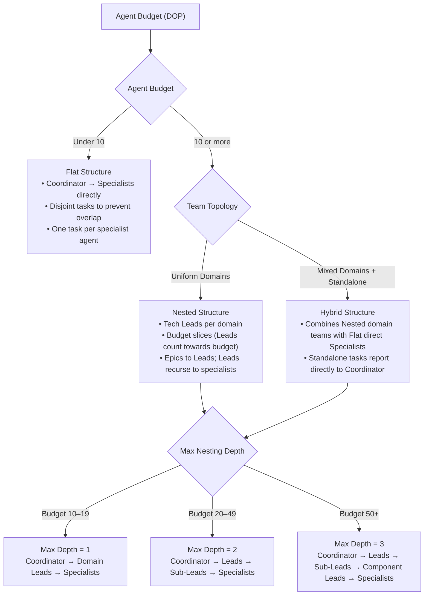
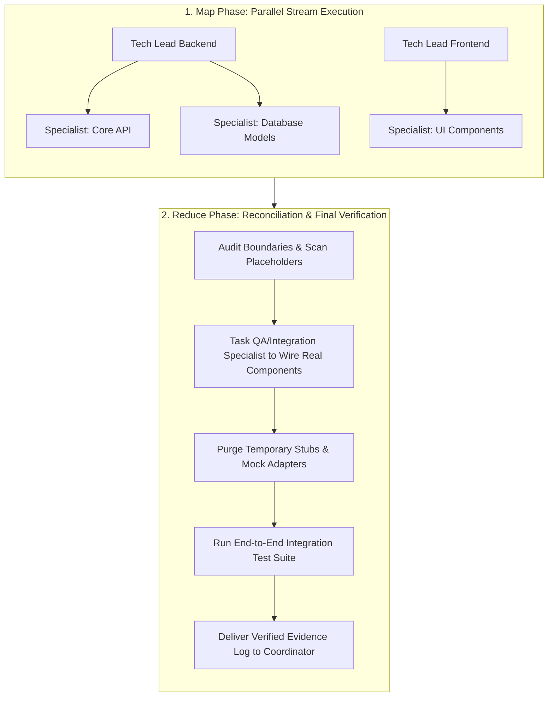
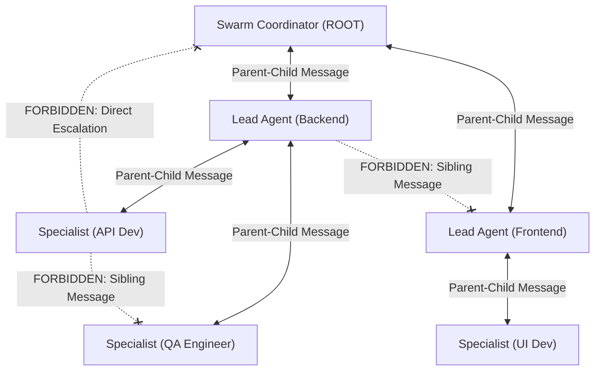

# Swarm Coding

Swarm Coding divides complex engineering objectives among multiple specialized subagents structured in a clear hierarchical organization chart. This divide-and-conquer strategy guarantees context isolation, prevents cross-domain pollution, and accelerates execution by keeping subagent tasks narrowly scoped.

> [!NOTE]
> In this guide, the terms "agent" and "subagent" are used interchangeably.

---

## ⚡ Core Principles & Operational Rules

1. **Mandatory Activation:** Activate this skill immediately on any mention of the word "swarm" (case-insensitive) in relation to planning or executing a task.
2. **Coordinator Persistence & Non-Execution:**
   - The ROOT Swarm Coordinator ALWAYS remains a coordinator and NEVER falls back to an executor.
   - The Swarm Coordinator is strictly forbidden from writing production implementation code, running tests/builds, or performing direct command execution.
3. **Split Coordinator Profiles:**
   - **Swarm Coordinator (ROOT):** Attributed strictly to the ROOT agent that activated the skill (Multiplicity: 1). Defines the top-level **Org Chart**, names Lead Agents, allocates the agent budget, writes top-level architecture specs, and coordinates overall progress.
   - **Lead Agent:** Attributed to domain or system leads (Multiplicity: N, one per system/domain). Receives an allocated sub-budget from the Swarm Coordinator, assembles a specialist team, writes domain specifications, delegates tasks, and integrates domain deliverables.
4. **Specialist Role:** Attributed to task executors. Designs and implements narrowly-scoped components within a single domain, adhering to domain specs and running operational validation loops.
5. **Strict Communication Hierarchy (No Lateral Messaging):**
   - **Allowed:** Messaging between immediate parents and children ONLY (Swarm Coordinator $\leftrightarrow$ Lead Agent, Lead Agent $\leftrightarrow$ Specialist; or Swarm Coordinator $\leftrightarrow$ Specialist in flat/hybrid structures).
   - **Forbidden:** Direct communication between agents on the SAME layer (Lead Agent $\leftrightarrow$ Lead Agent, Specialist $\leftrightarrow$ Specialist) or direct escalation (Specialist $\leftrightarrow$ Swarm Coordinator bypassing an intermediate Lead Agent) is strictly forbidden.
   - **Design Document First:** Inter-domain or cross-layer coordination MUST be handled by writing or updating shared design documents first, then notifying parent/child agents via hierarchical messaging.
6. **Fine-Grained Targeted Testing (No Broad Root Sweeps):** Specialists MUST execute fine-grained, package-scoped unit tests (e.g., `go test ./internal/physics/...`) strictly targeting their assigned task. Running broad project-root test commands (e.g., `go test ./...`) is strictly forbidden for Specialists unless explicitly requested by the Swarm Coordinator, preventing cross-task contamination and false failures while parallel agents work concurrently.

---

## 🎯 Agent Budget & Degree of Parallelism (DOP)

* **Definition**: **Agent Budget** is synonymous with **Degree of Parallelism (DOP)**. It defines the maximum number of **active, concurrent subagents** allowed to execute at the exact same time across the entire swarm hierarchy.
* **Active vs. Past Capacity**: Completed or terminated subagents do **not** consume budget. The budget applies strictly to currently running subagents. When a subagent completes its work, its concurrency slot is immediately freed.
* **Default Concurrency**: Assumes a default budget of **10** active concurrent agents if omitted by the user.
* **Low Budget Guard ($\le 1$):** If the user specifies an `agent budget <= 1`, multi-agent orchestration is disabled. Automatically fall back to direct single-agent execution without spawning subagents, notifying the user: *"Agent budget is set to $\le 1$; running in direct single-agent execution mode. To enable swarm parallelism, specify an agent budget $> 1$ (default: 10)."*
* **Swarm Shapes (Flat, Nested, Hybrid)**:
  - **Flat**: Swarm Coordinator coordinates Specialists directly (no intermediate Tech Leads). Used when agent budget $< 10$.
  - **Nested**: Swarm Coordinator assigns Tech Leads per domain and allocates each a slice of the agent budget. Leads recursively break down epics into specialist tasks. Used when agent budget $\ge 10$.
  - **Hybrid**: Combines nested domain teams with flat direct specialists reporting to the Coordinator for standalone or cross-cutting tasks.

### 🌲 Swarm Sizing Decision Tree

#### Decision Rules:

1. **Agent Budget $< 10 \rightarrow$ Flat Structure**:
   - Coordinator coordinates Specialists directly (all specialists, no intermediate Tech Leads).
   - Break down tasks so that agents do not step on each other, and assign one task to each agent.
2. **Agent Budget $\ge 10 \rightarrow$ Nested Structure**:
   - Assign Tech Leads per domain and give them a slice of the agent budget (**Tech Leads also count towards the budget**).
   - Break down the task into "epics" and give them to the Leads.
   - Leads recursively break down epics into granular tasks for specialists (or subordinate leads).
   - **Nesting Level (Max Depth below Coordinator)**:
     - **Budget $< 20$** ($10\text{--}19$): `max depth == 1` (Coordinator $\rightarrow$ Domain Tech Leads $\rightarrow$ Specialists).
     - **Budget between 20 and 49**: `max depth == 2` (Coordinator $\rightarrow$ Domain Tech Leads $\rightarrow$ Sub-Leads $\rightarrow$ Specialists).
     - **Budget $\ge 50$** (or $> 50$): `max depth == 3` (Coordinator $\rightarrow$ Domain Tech Leads $\rightarrow$ Sub-Leads $\rightarrow$ Component Leads $\rightarrow$ Specialists).
     > [!NOTE]
     > The tree does not need to be perfectly balanced; different branches can have different depths based on domain complexity.
3. **Hybrid Structure (Mixed Workloads)**:
   - Use when an initiative contains both complex multi-agent domains requiring Tech Leads and focused, standalone, or cross-cutting tasks (e.g., dedicated QA/Integration, architecture spike, or isolated single-task component) that report directly to the Swarm Coordinator without an intermediate Tech Lead.
   - Nested branches follow the depth rules above, while direct specialists consume 1 concurrency slot each.

---

## 📡 Non-Blocking Coordinator & Reactive Concurrency

The Swarm Coordinator is the primary user interface and top-level organizational conductor. It must remain **unblocked $\ge 99\%$ of the time** to receive steering comments, scope modifications, and status requests from the user.

1. **Role Separation (Delegation over Execution):**
   - The Swarm Coordinator acts like an engineering director: it breaks down epics, writes top-level architectural contracts, and manages the org chart. It **never** blocks itself with sequential coding, manual building, or terminal test runs.
2. **Fire-and-Yield Concurrency:**
   - When the Coordinator spawns Lead Agents via `invoke_subagent`, it **immediately halts tool calls to end its turn**. It never loops, sleeps, or polls.
3. **Always Unblocked for User Steering & Status Inquiries:**
   - Because the Coordinator never enters busy-wait polling loops, it is permanently available to process incoming user messages while the swarm works in the background:
     - **Status Inquiries**: The Coordinator can immediately provide live progress updates or inspect active workers via `manage_subagents (Action="list")`.
     - **In-Flight Steering / Scope Changes**: If the user provides new constraints or changes requirements mid-run, the Coordinator can steer active Lead Agents via `send_message` or cancel/restart them via `manage_subagents (Action="kill")`.
4. **Sole User Escalation Interface:**
   - Subagents do not possess `ask_question`. All requirement ambiguities or design trade-offs encountered by Specialists are messaged up to their Tech Lead, who routes them to the Swarm Coordinator via `send_message`. The Coordinator prompts the user with `ask_question` and relays decisions back down the hierarchy.

---

## 🔄 Map-Reduce Workflow & The "Reduce" (Reconciliation) Step

Swarm Coding operates as a two-stage **Map-Reduce** engineering pipeline:

### 1. Map Phase (Parallel Development & Collision Avoidance)
* **Flexible Subagent Prompting**: Provide clear domain goals and target boundaries in prompts without brittle syntax constraints.
* **Tech Lead Arbitration**: Team Leads dynamically arbitrate file boundaries and dependencies among their specialists as changes evolve.
* **Temporary Interface Contracts**: When Specialist A depends on in-progress work from Specialist B, they program against agreed interface stubs or mocks.

### 2. The Final "Reduce" Phase (Integration & Placeholder Purge)
Parallel execution often leaves behind temporary mocks or stubs where real implementations were created by peer agents. Before declaring success, the Coordinator orchestrates the final **Reduce** step:

1. **Placeholder & Stub Audit**: Scans code boundaries to ensure no dangling `TODO` comments, dummy return values, or temporary mock adapters survive.
2. **Reconciliation & Real Component Wiring**: The Coordinator tasks a designated **Integration/QA Specialist** to connect all real modules together.
3. **End-to-End Project Verification**: The QA Specialist runs full project builds, integration tests, and linters, reporting actual terminal proof back to the Coordinator before final delivery to the user.

---

## 👥 Mechanics and Roles

Subagents in a Swarm Coding session assume one of three roles:

1. **Swarm Coordinator (ROOT)** [Multiplicity: 1]
   - Acts as top-level architect and organizational manager.
   - Defines the **Org Chart**, names Lead Agents for each domain, allocates agent budgets, and writes top-level architecture specs.
   - **Persistence & Non-Execution:** Strictly forbidden from executing code or running build/test commands.
   - **Sole User Interface:** Sole agent in the swarm authorized to interact with the user via `ask_question`.
2. **Lead Agent (Domain Tech Lead)** [Multiplicity: N]
   - Technical lead for a specific domain or system (e.g., Frontend, Backend, Database).
   - Assembles a Specialist team within their allocated sub-budget, writes domain specs ("Design Document First"), deconstructs domain tasks, arbitrates collisions, and integrates deliverables.
   - **Tool Restrictions:** Command/script execution is disabled (`commandExecutionPolicy: off`). Delegates execution to Specialists and routes user questions up to the Swarm Coordinator via `send_message`.
3. **Specialist (Task Implementer / QA)** [Multiplicity: N]
   - Ephemeral and task-scoped (disposable worker). Operates with a clean, focused context window dedicated strictly to its assigned task.
   - Follows domain specifications, executes the operational validation loop (build, test, lint, format), replaces stubs, and provides proof-of-validation logs to their parent Lead Agent, then completes.

### 🛠️ Modern Subagent Configuration & Inheritance

When defining subagents (`agent.md` or via `define_subagent`), adhere to modern Antigravity configuration standards:
* **Customization & Skill Inheritance (`inheritCustomizations: true`)**:
  Subagents should declare `inheritCustomizations: true`. This ensures the subagent seamlessly adopts all parent and workspace customizations (skills like `kungfu` and domain linters, rules, plugins, and custom configurations) without synchronization drift.
* **MCP Integration (`inheritMcp: true`)**:
  Passes through external MCP tool servers (e.g., database tools, devtools, knowledge servers) so subagents have access to necessary development tools.
* **Model Configuration (`model: inherit`)**:
  Always use `inherit` (in agent definitions and `invoke_subagent`). Subagents automatically adopt the parent session's model configuration and reasoning effort (`/effort`), ensuring complete behavioral consistency across the swarm hierarchy without model-routing overhead.
* **Execution Boundary (`commandExecutionPolicy`)**:
  - `commandExecutionPolicy: off`: Applied to Lead Agents to enforce a pure orchestration posture.
  - `commandExecutionPolicy: sandbox`: Applied to Specialists to permit safe build, test, and formatting execution.

---

## 💬 Communication Hierarchy & Rules

1. **Vertical Parent-Child Messaging ONLY:**
   - Swarm Coordinator $\leftrightarrow$ Lead Agent
   - Lead Agent $\leftrightarrow$ Specialist
2. **Forbidden Lateral Communication:**
   - Communication between agents on the SAME layer (Lead $\leftrightarrow$ Lead, Specialist $\leftrightarrow$ Specialist) is strictly forbidden.
   - Specialists MUST NOT message the Swarm Coordinator directly.
3. **Specification-Driven Coordination ("Design Document First"):**
   - When a change in Domain A impacts Domain B, Lead Agent A updates the shared design document in the workspace, then messages the Swarm Coordinator. The Swarm Coordinator reviews and notifies Lead Agent B.

---

## ⚠️ Gotchas & Antipatterns

1. **The Coordinator-to-Executor Fallback Trap:** Once activated, the Swarm Coordinator MUST NOT interpret user follow-up messages as permission to write code or execute tasks directly. Treat all messages as requests *to the swarm*.
2. **Leftover Placeholder Trap:** Delivering code where temporary stubs or mocks survive into the final codebase. Always execute the Reduce phase to purge stubs and wire real implementations.
3. **Under-Utilization Mismatch:** Spawning too few agents or failing to utilize Lead Agents when the agent budget and task scope allow multi-tier delegation. Always build a sensible Org Chart when budget $\ge 10$.
4. **Sibling Messaging Trap:** Attempting to send direct messages between peer Lead Agents or peer Specialists. Always route cross-component updates through shared design documents and hierarchical parent-child messages.
5. **The Long-Running Agent Context-Pollution Trap:** Retaining subagents indefinitely across multiple distinct tasks accumulates noisy tool logs, failed attempts, and token bloat. Specialists should be disposable and task-scoped—spawn fresh workers with clean context windows per task for maximum precision and speed.
6. **The Root Test Contamination Trap:** Running broad project-root test commands (e.g., `go test ./...`) while parallel agents are modifying other packages causes false test failures. Specialists must scope test commands strictly to their assigned package until the final Reduce step.
7. **Passive Polling Loops:** Coordinator and Lead agents must never poll subagent statuses in a tight loop; rely on automatic reactive wakeup upon subagent task completion.

---

## 📚 Progressive Disclosure & References

- **Swarm Coordinator Reference**: [`references/coordinator.md`](references/coordinator.md) — Root coordinator responsibilities, org chart design, unblocked posture, and the Reduce step.
- **Lead Agent Reference**: [`references/lead.md`](references/lead.md) — Domain tech lead responsibilities, dynamic collision arbitration, and sub-team management.
- **Specialist Reference**: [`references/specialist.md`](references/specialist.md) — Task execution, operational validation loop, stub replacement, and proof-of-correctness reporting.
- **Bundled Lead Agent Template**: [`assets/agents/lead-agent.md`](assets/agents/lead-agent.md) — Standard subagent definition for domain leads.
- **Bundled Specialist Agent Template**: [`assets/agents/specialist-agent.md`](assets/agents/specialist-agent.md) — Standard subagent definition for specialist workers.
