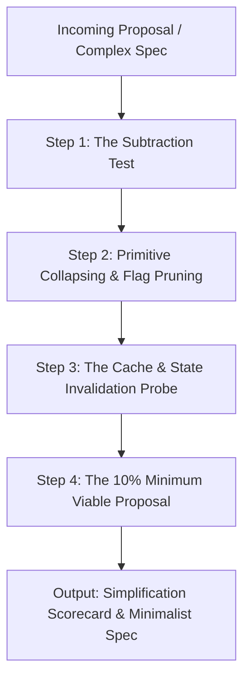

# Uno-Reverse: Radical Simplification & Red-Teaming

> *"Perfection is achieved, not when there is nothing more to add, but when there is nothing left to take away."* — Antoine de Saint-Exupéry

The `uno-reverse` skill provides a rigorous **contrarian simplification and red-teaming framework**. While standard engineering processes naturally drift toward feature accretion, defensive layering, and speculative generalization, `uno-reverse` forces the opposite trajectory: **aggressive subtraction, primitive collapsing, and minimum viable execution**.

---

## 🎯 The 4 Inversion Principles

```
  ┌─────────────────────────────────────────────────────────────┐
  │                    THE UNO-REVERSE RAZOR                    │
  ├─────────────────────────────────────────────────────────────┤
  │ 1. Subtraction Before Addition: "Can we delete our way out?" │
  │ 2. Primitive Collapsing: "Can 1 composable primitive do 5 jobs?"│
  │ 3. Zero-Speculation (YAGNI): "Are we solving an imagined problem?"│
  │ 4. Failure-Surface Inversion: "How will this complexity break?" │
  └─────────────────────────────────────────────────────────────┘
```

1. **Subtraction Before Addition**: Before designing a new subsystem, caching layer, or protocol, ask: *What existing assumption or artificial constraint can be deleted to make this entire feature unnecessary?*
2. **Primitive Collapsing**: Engineers frequently add flags, endpoints, and micro-abstractions for every sub-case. Identify the single underlying mathematical or conceptual primitive that subsumes all sub-cases without bespoke code.
3. **Zero-Speculation (Strict YAGNI)**: Reject all "future-proofing", pluggable abstraction layers for single implementations, and configurable policies where a single sensible constant or deterministic convention works.
4. **Failure-Surface Inversion**: Evaluate a system by its total attack, bug, and maintenance surface:
   $$\text{Reliability} \propto \frac{1}{\text{Moving Parts}^2}$$
   Every added cache, lock, daemon, state file, and flag represents a new failure mode and cognitive tax.

---

## 🚩 Speculative Language Red-Flag Filter (PRDs & Specs)

When auditing technical proposals or PRDs, immediately flag these weasel phrases:

| Speculative Phrase ❌ | Underlying Reality | Uno-Reverse Action ✅ |
| :--- | :--- | :--- |
| *"Future-proof design"* | Unused code and speculative abstractions today | Delete the abstraction; write the concrete implementation. |
| *"Pluggable provider model"* | Only 1 provider exists | Hardcode the single provider until a 2nd concrete provider is built. |
| *"Flexible policy engine"* | Author avoided making a design decision | Pick the single sensible default convention. |
| *"Event-driven microservices"* | Synchronous calls disguised as message queues | Use direct in-process function calls. |
| *"Highly configurable"* | Shifting architectural choices to end-users | Ship zero flags; make opinionated choices. |
| *"Generic abstraction layer"* | Premature DRY before seeing 3 distinct patterns | Duplicate the 5 lines of code; wait for Rule of Three. |

---

## 🔬 Accidental Complexity Code Smells (Codebase Audits)

When reviewing code, actively hunt down and prune these structural anti-patterns:

1. **Single-Implementation Interfaces**:
   * *Smell*: An interface `FooService` with only one concrete struct `fooServiceImpl`.
   * *Fix*: Delete the interface. Export the concrete struct directly. Introduce interfaces only when consumers need mocking at architectural boundaries.
2. **Passthrough Wrapper Functions**:
   * *Smell*: Function `GetUserData(id)` that does nothing except call `db.FetchUser(id)`.
   * *Fix*: Eliminate the middleman. Call the underlying operation directly.
3. **State Machine Inflation**:
   * *Smell*: A 7-state lifecycle machine (`PENDING_APPROVAL`, `READY_FOR_QUEUE`, `QUEUED`, ...) with 15 transition validation functions.
   * *Fix*: Collapse to 2 boolean flags or an active/done state.
4. **Relational Over-Normalization for Small Datasets**:
   * *Smell*: A 6-table normalized schema with foreign keys and joins for $< 10,000$ total records.
   * *Fix*: Store as a single flat SQLite table, JSON document, or in-memory map.

---

## 🤖 The Agent & AI Workflow Razor

AI systems are especially prone to multi-agent and prompt bloat. Apply these rules:

| Bloated Agent Pattern ❌ | Collapsed Alternative ✅ | Rationale |
| :--- | :--- | :--- |
| **5-Agent Swarm for sequential task** | Single agent with 1 clear prompt | Multi-agent handoffs add latency, token cost, and lossy context degradation. |
| **Intermediate Summarizer Agents** | Direct downstream consumption | "Telephone game" summarization strips critical nuance. |
| **Micro-Tool Sprawl (10 single-action tools)** | 1 Polymorphic Tool with clear args | Decreases tool selection entropy and LLM routing hallucinations. |
| **Autonomous Loop without Guardrails** | Deterministic script + LLM leaf node | Use code for control flow and LLMs only for fuzzy transformation. |

---

## 🔍 The 4-Step Uno-Reverse Audit Workflow

When invoked on a design document, PRD, or proposed codebase change, execute this 4-step inversion protocol:



### Step 1: The Subtraction Test (The 3 Deadly Questions)
Apply these questions to every component in the proposal:
1. **The Ghost Problem Test**: If we do *nothing* and ship zero lines of code, what *actually* breaks in production today?
2. **The 90/10 Rule**: What 10% of this proposal delivers 90% of the actual user value? Can we discard the remaining 90% of the spec?
3. **The Accidental Complexity Probe**: Is this feature solving a real user problem, or is it solving a problem introduced by an earlier bad abstraction?

### Step 2: Primitive Collapsing & Surface Pruning
Collapse multiple flags, commands, or data structures into single composable primitives:

| Bloated Pattern (Before ❌) | Collapsed Primitive (After ✅) | Rationale |
| :--- | :--- | :--- |
| `--page`, `--section`, `--index`, `--toc`, `#slug` | Positional URI path `doc[#section]` | Unified resource addressability replaces 5 separate flags. |
| Separate `read`, `load`, `refs`, `peek` commands | Single polymorphic `load <target>` | Reduces agent decision entropy and CLI verb sprawl. |
| Configuration file + 12 env vars + CLI flags | Deterministic convention over configuration | Eliminates configuration drift and precedence bugs. |
| In-memory LRU cache + Disk cache + Remote sync | Fast on-the-fly streaming | Raw operations in RAM (< 1 ms) make caching slower than compute. |

### Step 3: The Cache & State Invalidation Probe
Whenever a proposal introduces caching, local state files, or background workers:
- **Calculate the Cache Paradox**: Measure the cost of on-the-fly computation vs. cache serialization, disk I/O, hash verification, and invalidation race conditions.
- **Enforce Ephemeral Execution**: If in-memory computation takes $< 1\text{ ms}$, **strictly forbid persistent caching layers**.

### Step 4: The 10% Minimum Viable Proposal (MVP)
Draft an alternative "Uno-Reverse Specification" that:
- Achieves the core objective in $\le 20\%$ of the proposed lines of code.
- Uses zero external dependencies or heavy frameworks.
- Requires zero background daemons, zero state migrations, and zero cache management.

---

## 🛡️ Chesterton’s Fence: When NOT to Simplify

Radical simplification is **not** reckless deletion. Before eliminating a mechanism, identify whether it represents **Essential** or **Accidental** complexity:

```
┌───────────────────────────────────────┬───────────────────────────────────────┐
│     NEVER PRUNE (Essential Safety)    │    ALWAYS PRUNE (Accidental Bloat)    │
├───────────────────────────────────────┼───────────────────────────────────────┤
│ • Concurrency locks & race guards     │ • Unbenchmarked caching layers        │
│ • Authentication & permission checks  │ • Generic abstract factories          │
│ • Input validation & sanitization     │ • Pluggable drivers for 1 provider    │
│ • Idempotency tokens & rollbacks      │ • Config flags for internal decisions │
│ • Explicit error handling boundaries  │ • Micro-agent coordination swarms     │
└───────────────────────────────────────┴───────────────────────────────────────┘
```

> **The Chesterton Gate**: *If you cannot explain why a defensive check or data field was originally added, you are forbidden from deleting it until you understand its failure mode.*

---

## 📋 The Simplification Audit Scorecard

Deliver all audit results in this standardized, high-signal markdown format:

```markdown
# 🔄 Uno-Reverse Simplification Audit: [Topic / Proposal]

## 1. Executive Inversion Summary
- **Proposed Complexity**: [Summary of moving parts, services, and flags in original design]
- **Recommended Verdict**: [Prune / Collapse / Re-architect]
- **Potential Code Reduction**: ~X% (from ~Y LOC to ~Z LOC)

## 2. The Cut List (Items to Eliminate Immediately)
| Proposed Feature / Component | Reason for Elimination | What Happens Without It |
| :--- | :--- | :--- |
| [Feature A] | Speculative generalization | Nothing; solve with a single constant |
| [Feature B] | Cache paradox (I/O > Compute) | Scan on the fly in < 0.1 ms |

## 3. Collapsed Primitives
- **Instead of**: [List of disparate flags / commands]
- **Use**: [Single elegant primitive]

## 4. The Minimalist Reference Design
[Concrete, ultra-compact specification / code snippet implementing the 10% MVP]

## 5. Chesterton Boundary Assessment
- **Essential Complexity Retained**: [Security, safety, or concurrency checks kept intact]
- **Risk & Trade-off Assessment**: [Edge cases intentionally omitted and why the trade-off is sound]
```

---

## 🚫 Common Engineering Traps to Call Out

1. **"What if the user wants X?" (Speculative Customization)**:
   - *Uno-Reverse Response*: "Wait until 3 distinct users actively request it in production before writing code for it."
2. **"We might support other backends later" (Premature Extensibility)**:
   - *Uno-Reverse Response*: "Implement the concrete backend directly. Refactoring clean concrete code is 10x faster than maintaining unused abstractions."
3. **"Let's add a cache for performance" (Unbenchmarked Caching)**:
   - *Uno-Reverse Response*: "Benchmark the raw in-memory operation first. If it takes $< 5\text{ ms}$, a cache is tech debt, not an optimization."
4. **"Let's add a configuration flag" (Passing Design Decisions to Users)**:
   - *Uno-Reverse Response*: "Make the right design decision in the code. Every configuration flag is an abdication of architectural responsibility."
5. **"Let's spawn an agent swarm for this" (Multi-Agent Vanity)**:
   - *Uno-Reverse Response*: "If the steps are sequential, write a 15-line deterministic script. Keep agents for non-deterministic reasoning."
