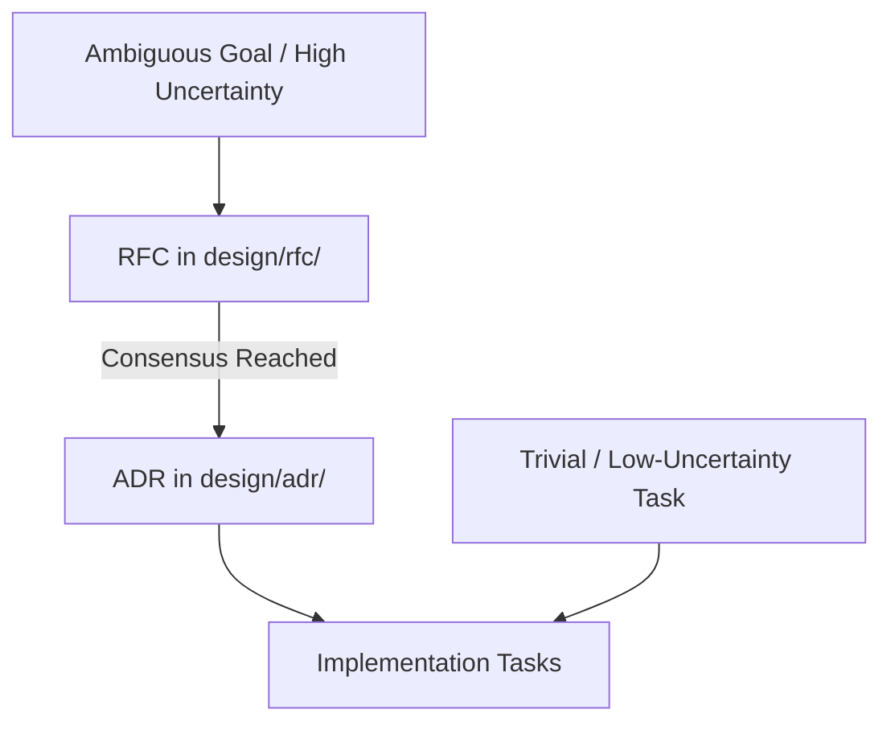

# Engineering Flow

Engineering standards, decision pipelines, and code hygiene rules.

---

## Delivery Principles

Ship working software in small, verifiable increments:
- Keep changes scoped to a single logical objective.
- Avoid speculative abstractions and overengineering.
- Implement thin, vertical slices from entrypoint to persistence.
- Verify each slice with automated tests and compiler checks before proceeding.

---

## Design Pipeline: RFCs and ADRs

Separate exploration from permanent architectural choices:



- RFCs (`design/rfc/`): Use during exploration when requirements are ambiguous, trade-offs need debate, or multiple viable architectures exist. RFCs are fluid working documents.
- ADRs (`design/adr/`): Use to record finalized decisions. ADRs are immutable historical logs capturing context, chosen architecture, and accepted trade-offs.
- Tasks: Break ADR conclusions into concrete checklist items with clear acceptance criteria.

---

## Task Prioritization

Categorize work by technical certainty and business value:

| | High Technical Certainty | Low Technical Certainty |
| :--- | :--- | :--- |
| **High Value** | **Direct execution**: Implement interactively with compiler feedback and tight test loops. | **Research & Spikes**: Do not write production code yet. Run throwaway spikes in `scratch/` or draft an RFC. |
| **Low Value** | **Delegate**: Offload to background tasks or subagents. | **Defer / Discard**: Drop or postpone until certainty increases or value is demonstrated. |

---

## Research & Evidence Hierarchy

Do not guess APIs, package syntax, or model behaviors. Ground technical decisions in primary sources:

```text
[1] Source Code (highest authority)
  └── [2] Official Documentation & API Reference
        └── [3] Official Release Notes & Announcements
              └── [4] Industry Expert Articles (< 3 months old)
                    └── [5] Community Posts (< 3 months old)
                          └── [6] Stale Articles (> 3 months old — discard)
                                └── [7] Social Media (unverified — cross-check first)
```

Research rules:
- Test APIs and compiler behavior with throwaway scripts in `scratch/` before modifying production code.
- Discard community posts older than 3 months for fast-moving packages and AI tooling.
- Always include clickable URLs when citing documentation or external examples.

---

## Dependency Version Verification

Never guess version numbers, dependency syntax, or model names:
- Inspect local project manifests (`go.mod`, `package.json`, `pyproject.toml`) for existing pinned constraints.
- Consult the `latest-version` skill or query registries directly (`npm view <pkg> version`, `go list -m -versions <pkg>`, `pip index versions <pkg>`).
- Verify Gemini model names against current Google GenAI documentation before updating API calls.

---

## Semantic Versioning & 0.x Zero-Debt Rule

Follow Semantic Versioning (`MAJOR.MINOR.PATCH`):
- Increment `MAJOR` (`X.0.0`) for backwards-incompatible API changes.
- Increment `MINOR` (`x.Y.0`) for backwards-compatible new features.
- Increment `PATCH` (`x.y.Z`) for backwards-compatible bug fixes.

### The 0.x Zero-Debt Policy
- In `0.x` development, never attempt backwards compatibility.
- Do not add compatibility shims, deprecation wrappers, alias redirects, or fallback branches to support previous `0.x` shapes. Refactor callers and interfaces directly.

---

## Broken Window Code Hygiene

Enforce clean code standards across every edit:
- Delete dead code, unreachable branches, unused variables, and stale comments immediately.
- Implementation comments must explain current logic only. Never write comments detailing how earlier versions worked or why code was rewritten; historical context belongs exclusively in ADRs and RFCs.
- Keep names clean, unambiguous, and consistent across variables, types, and files.
- Handle every error explicitly at the origin point. Never discard errors (e.g., `_ = err`, empty `catch`, or unhandled promises).
- Never suppress linter errors with ignore directives (`//nolint`, `# noqa`, `eslint-disable`). Fix the underlying code.
- Logging is not error handling. An error must be handled, propagated to the caller, or aborted with a clean exit.

---

## Pre-Release Quality Gate

Before staging, committing, or pushing code:
- Run the full build, format, lint, and test suite.
- Run the `ready-for-release-check` skill if present.
- Never commit or push with failing tests, broken formatting, or active lint errors.
