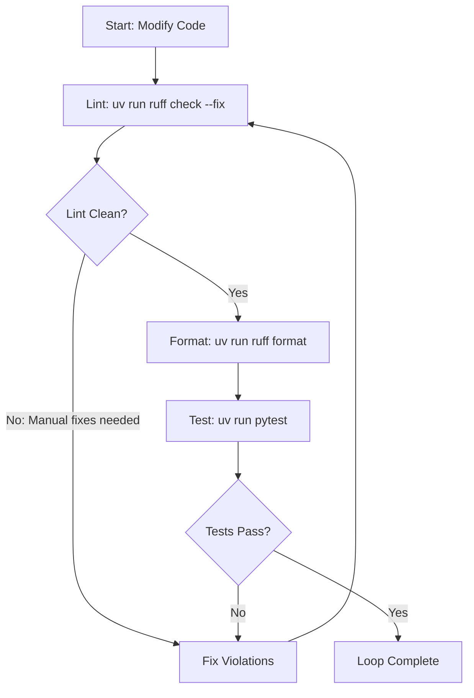

# Modern Python Development (Pyhd)

This guide establishes the standard development workflow, project structure, and code quality gates for Python projects using `uv` for fast environment and dependency management, `ruff` for linting and formatting, and `pytest` for test verification.

---

## 1. Project Scaffolding & Architecture

Prefer the standard `src/` layout for Python packages to avoid accidental imports of uninstalled local code and ensure test parity with installed packages.

### Standard Project Layout

```text
my-project/
├── .venv/                   # Managed isolated virtual environment (gitignored)
├── pyproject.toml           # Unified project metadata, dependencies, and tool config
├── README.md                # Project documentation
├── src/
│   └── my_package/
│       ├── __init__.py      # Package export root
│       ├── core.py          # Domain logic
│       └── py.typed         # PEP 561 marker for type checkers
└── tests/
    ├── conftest.py          # Shared test fixtures and pytest hooks
    ├── unit/                # Fast, isolated unit tests
    └── integration/         # Multi-module integration tests
```

### Dependency Management with `uv`

Manage dependencies deterministically using `uv` commands:

```bash
# Initialize a new application or library project
uv init --app my-project       # For standalone applications
uv init --lib my-library       # For reusable packages with src/ layout

# Add production dependencies
uv add requests pydantic

# Add development / testing dependencies
uv add --dev ruff pytest pytest-cov

# Synchronize local .venv with pyproject.toml and lockfile
uv sync

# Update lockfile without modifying dependencies
uv lock
```

### Self-Contained Scripts (PEP 723)

For standalone automation or utility scripts, declare dependencies directly inline using PEP 723 script metadata:

```python
# /// script
# requires-python = ">=3.11"
# dependencies = [
#     "httpx",
#     "rich",
# ]
# ///

import httpx
from rich import print

response = httpx.get("https://httpbin.org/get")
print(response.json())
```

Execute single-file scripts with automated dependency isolation:
```bash
uv run script.py
```

---

## 2. Plan-Validate-Execute (Refactoring)

When performing complex or multi-file Python refactoring:

1. **Plan**: Scan the workspace with `grep_search` to identify all call-sites, import statements, and references to target symbols.
2. **Validate**: Verify compatibility of planned changes against dependent modules and type signatures.
3. **Execute**: Modify files incrementally, running the **Code Verification Loop** after each change.

---

## 3. Code Verification Loop

After modifying any Python file, execute this verification loop before completing tasks:



### Step-by-Step Verification Commands

1. **Lint & Auto-Fix**: Resolve syntax, style, and import sorting issues:
   ```bash
   uv run ruff check --fix
   ```
2. **Format Code**: Ensure consistent code style:
   ```bash
   uv run ruff format
   ```
3. **Run Unit & Integration Tests**: Verify zero regressions:
   ```bash
   # Run all tests
   uv run pytest

   # Run targeted test file or function
   uv run pytest tests/unit/test_core.py -k "test_process_data"
   ```

---

## 4. Virtual Environment Isolation

> [!IMPORTANT]
> **Virtual Environment Isolation**: Always prefix Python commands, test runners, and formatting tools with `uv run` (e.g. `uv run python script.py`, `uv run ruff check`, `uv run pytest`). This guarantees execution within the local `.venv/` interpreter, preventing system package contamination and missing import errors.

---

## 5. Gotchas & Edge Cases

* **Circular Imports in Type Annotations**: When module `A` imports type `B` purely for type annotations, prevent runtime import cycles by using `typing.TYPE_CHECKING`:
  ```python
  from __future__ import annotations
  from typing import TYPE_CHECKING

  if TYPE_CHECKING:
      from my_package.service import DatabaseService
  ```
* **Mutable Default Arguments**: Never use mutable objects (`list`, `dict`, `set`) as default parameter values. Use `None` as a sentinel:
  ```python
  # ❌ Bug: Shared list across calls
  def append_item(item: str, target: list[str] = []) -> list[str]:
      target.append(item)
      return target

  # ✅ Correct: Fresh container per invocation
  def append_item(item: str, target: list[str] | None = None) -> list[str]:
      if target is None:
          target = []
      target.append(item)
      return target
  ```
* **Explicit Exception Chaining**: When catching and re-raising errors as domain-specific exceptions, preserve root-cause tracebacks using `from err`:
  ```python
  try:
      data = parse_payload(raw)
  except json.JSONDecodeError as err:
      raise ValidationError("Malformed JSON payload") from err
  ```
* **Modern Python 3.10+ Typing**: Use built-in generics (`list[str]`, `dict[str, Any]`) and union syntax (`str | None`, `int | float`). Avoid importing legacy types from `typing` (`List`, `Dict`, `Union`, `Optional`).

---

## 6. 📚 Progressive Disclosure & References

- **Python Best Practices Guide**: [`references/best_practices.md`](references/best_practices.md) — Idiomatic Python patterns, type annotations, Ruff configuration, and pytest fixture guidelines.
