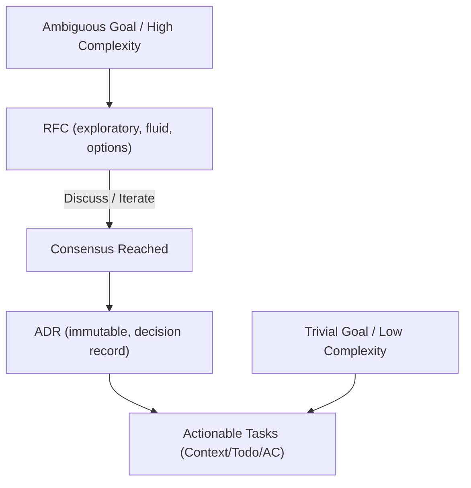

# Codebase Engineering Workflow Standards

This skill establishes the engineering standards, decision frameworks, and research rules for developing the target codebase. It defines how we prioritize tasks, structure technical decisions, and systematically eliminate uncertainty via grounded research to ensure high-quality software delivery.

---

## 1. Prime Directive: Delivery of Business Value

The ultimate goal of all software engineering is solving real-world problems to deliver business value. Avoid unstructured "vibe coding".

To maximize effectiveness:
- Keep changes small and focused.
- Eliminate overengineering.
- Maintain thin, vertical slices of functionality.
- Ensure every change has a clear path to production verification.

---

## 2. Planning & Technical Decision Pipeline

Manage codebase changes through a clear planning process:



- RFC (Request for Comments): Use when the problem is ambiguous, has high technical uncertainty, or requires design feedback. RFCs live in `design/rfc/`.
- ADR (Architecture Decision Record): Use to permanently record a concrete architectural decision. ADRs are immutable logs of the project's state. ADRs live in `design/adr/`.

---

## 3. Prioritization Process: The 2x2 Matrix

Prioritize all work using the 2x2 matrix based on business value and technical certainty:

| | **High Technical Certainty** | **Low Technical Certainty** |
| :--- | :--- | :--- |
| **High Business Value** | **Synchronous (Hands-on):**<br>Execute immediately using high-control interactive tools (such as GoDoctor's `smart_edit` and `smart_build` if available). Stay "in the loop" to maintain absolute control. | **Asynchronous Research & Spikes:**<br>Do not write production code yet. Run research, build prototypes, or write an RFC to establish certainty. |
| **Low Business Value** | **Asynchronous Delegation:**<br>Delegate these "nice-to-have" tasks to background coding agents or subagents to free up principal developer time. | **Avoid or Defer:**<br>Do not spend time here. If absolutely necessary, delegate to background agents for low-priority execution after attempting to increase certainty. |

---

## 4. Technical Uncertainty Reduction (The Research Process)

For low technical certainty tasks, reduce uncertainty before writing production code:

- Build a spike: Create a temporary, throwaway implementation in the `scratch/` directory to test APIs, libraries, and compiler compatibility.
- Conduct grounded research: Gather facts using the evidence hierarchy to prevent version hallucinations.
- Cite direct sources: When presenting research, always include clickable HTTP links to the exact documentation or repository. Never state a technical fact without its source URL.

---

## 5. The 7-Tier Evidence Hierarchy (NEVER GUESS)

Ground all technical research on verified evidence to bypass training cutoffs and prevent library hallucinations. Prioritize source validity using this hierarchy:

```text
[1] SOURCE CODE (Strongest)
  └── [2] OFFICIAL DOCUMENTATION
        └── [3] OFFICIAL PRODUCT BLOGS
              └── [4] LEADER BLOG POSTS (<3 Months)
                    └── [5] REPUTABLE COMMUNITY POSTS (<3 Months)
                          └── [6] BLOGS (>3 Months)
                                └── [7] SOCIAL MEDIA (Weakest)
```

1. Source code: Read the actual source files, package declarations, and dependency codebases. This is the ultimate source of truth.
2. Official documentation: Consult authoritative manuals, API specs, and package docs (e.g., pkg.go.dev, docs.npmjs.com, or official repository readmes).
3. Official blog posts: Look at official product owner announcements and core team updates.
4. Professional posts: Read articles by industry leaders and recognized experts dated less than 3 months old, unless evergreen.
5. Community posts: Read blog posts less than 3 months old on platforms like dev.to or Medium.
6. Blog posts older than 3 months: Avoid. Outdated posts frequently reference obsolete patterns or deprecated packages.
7. Social media: Treat as starting points only. Verify any claims against official documentation.

---

## 6. Real-Time Version Verification

AI training limits cause errors when identifying software packages, library versions, or newer LLM models. Follow this mandatory protocol to verify versions:

### The Real-Time Truth Gate
- Never assume versions: Do not hardcode or propose a dependency or LLM model based on internal weights.
- Inspect files locally: When verifying project dependencies or configuration, use GoDoctor's `smart_read` tool if available in the workspace to inspect local code and prevent hallucinations.
- Use real-time tools: When adding dependencies, configuring APIs, or referencing LLM models, actively consult the `latest-version` skill.
- Query live registries: Run package registry queries (e.g., package manager commands like `npm view`, `go list -m -versions`, or proxy queries) to verify the latest stable releases.

---

## 7. Safe Release Protocol

Verify release quality before running Git commits, tags, or pushes.

### The Git Boundary
- Run pre-release checks: Before staging files or committing, execute the `ready-for-release-check` skill.
- Zero-bypass policy: Do not interact with Git if any pre-release quality gates (compilation, tests, linting, security reviews) remain unverified.
