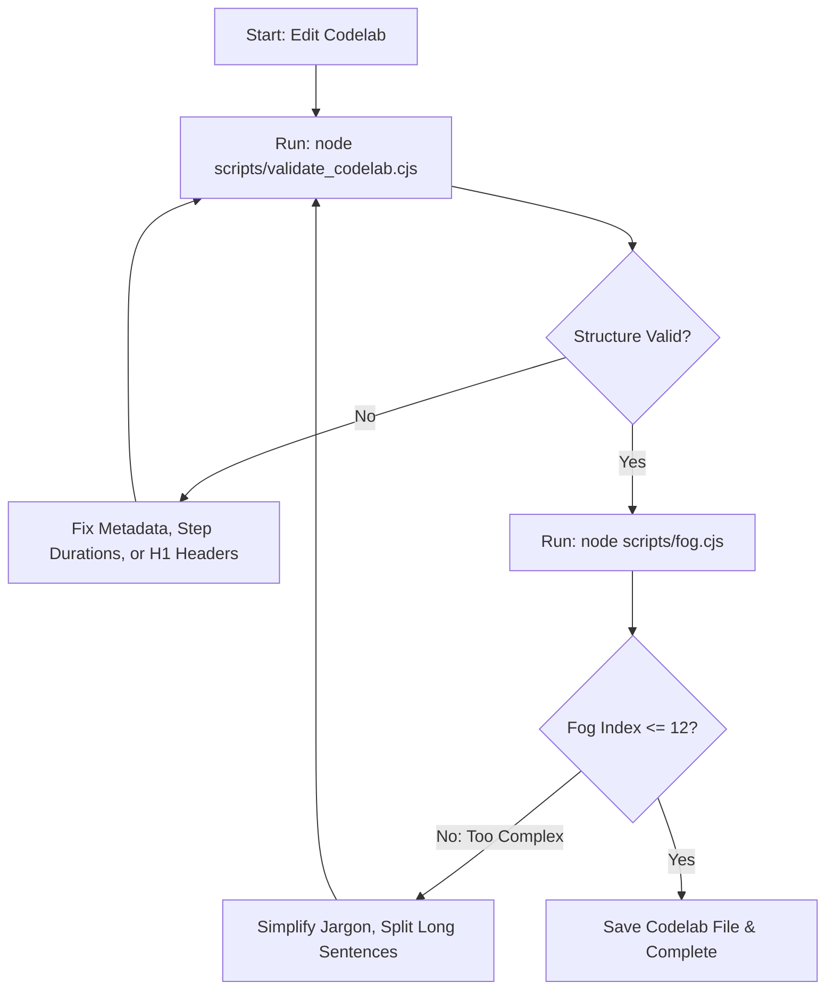

# Google Codelab Authoring

Use this skill to write high-quality Google Codelabs (`.lab.md`).

## Core Rules
1. **Target Readability**: Keep the Gunning Fog Index below 12. Run `scripts/fog.cjs` to check it.
2. **Validate Structure**: Run `scripts/validate_codelab.cjs` before you finish.
3. **Use Simple Words**: Avoid jargon. See `references/style_guide/jargon.md` and `references/style_guide/inclusive-documentation.md`.
4. **Action-Oriented Steps**: Give clear, active steps. Do not use words like "just" or "simply".

---

## Workflow

### 1. Plan
**Before you write:**
1. **Scope**: Check `references/content_recommendations.md`.
2. **Audience**: See `references/writing_guide.md` for tone.
3. **Language**: Choose **Polyglot** (best) or **Block Includes**. See `references/polyglot.md`.

### 2. Start
1. **Template**: Read `assets/template.lab.md`.
2. **Create File**: Write your `.lab.md` using that template.
3. **Metadata Alignment**: Ensure your frontmatter strictly includes the required keys: `id`, `description`, `authors`, and `layout`.

### 3. Write
Follow Google Developer style guides.
* **Layout**: Follow `references/formatting_guide.md` for titles and step times (`Duration: MM:SS`).
* **Style Guide Navigation**: There are 87 specific style files under `references/style_guide/`. To locate specific styles efficiently and save context tokens, use `grep_search` inside `references/style_guide/` targeting specific syntax terms (e.g. search for 'lists' in `lists.md`, 'tables' in `tables.md`, 'formatting' in `formatting.md`).
* **Markup**: Use `> aside positive` (tips/positive alerts) or `> aside negative` (warnings/negative alerts).
* **Terminal**: Use fenced code blocks with the `console` language.

### 4. Verify & Iterate Validation Loop
You must execute this recursive loop before declaring a codelab complete:

1. **Check Structure**: Run `node scripts/validate_codelab.cjs <file>`. Address any issues relating to missing step durations, duplicate H1 headers, or invalid aside boxes.
2. **Check Fog Index**: Run `node scripts/fog.cjs <file>`.
3. **Refine Readability**: If Gunning Fog is above 12, split compound sentences, remove weak filler words (e.g., "just", "simply", "easy"), and replace complex jargon.
4. **Repeat**: Re-run both checkers until all errors are cleared and readability standards are met.

---

## Common Tasks

- **Step Time**: Put `Duration: MM:SS` right after a `## Step Title`.
- **Alerts**: Use `> aside positive` (tips) or `> aside negative` (warnings).
- **Terminal**: Use fenced code blocks with the `console` language.
- **Code**: Use standard fenced code blocks (e.g., `java`, `python`).

---

## Files
- **Template**: `assets/template.lab.md`
- **Checkers**: 
  - `scripts/validate_codelab.cjs` (Structure)
  - `scripts/fog.cjs` (Readability)
- **Guides**:
  - `references/formatting_guide.md` (Syntax)
  - `references/writing_guide.md` (Tone)
  - `references/style_guide/` (Google Style Guide)
  - `references/review.md` (Review Lists)
  - `references/polyglot.md` (Multi-language)