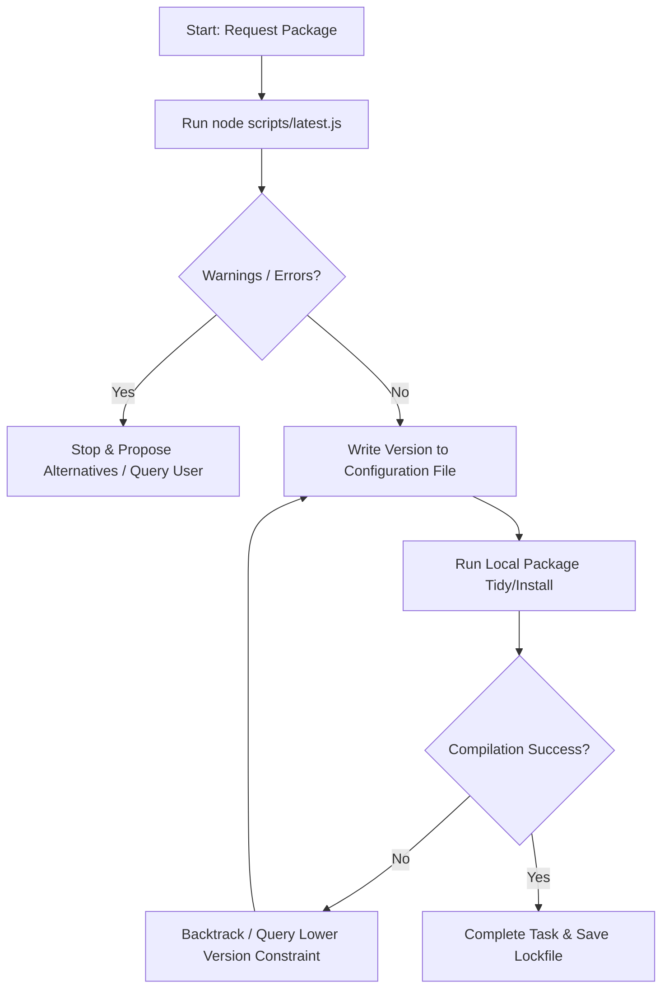

# Latest Software Version (latest-version)

Queries official registries to find stable package versions. Do not guess versions or rely on outdated knowledge.

## How to Use

### 1. Find the Ecosystem
We support these registries:
* `npm`: Node.js/JS
* `pypi`: Python
* `go`: Go
* `cargo`: Rust
* `gem`: Ruby
* `gemini`: Gemini models (use 'latest', 'flash', 'pro', or brand names as the name)

### 2. Run the Command
Execute the script using one or more package names. You can append the `--json` flag to receive structured JSON results:
```bash
node scripts/latest.js <ecosystem> <package-name1> [package-name2]... [--json]
```

### 3. Save the Version
Write the returned version constraint to your configuration file (such as `package.json`, `requirements.txt`, etc.).

---

## Gotchas & Edge Cases

* **Go Proxy Capitalization (Severe)**: The standard Go module proxy (`proxy.golang.org`) is case-sensitive and requires uppercase letters in module paths (e.g. `Sirupsen`) to be encoded with exclamation marks (`!sirupsen`). While the script handles this automatically, remain alert to this rule when auditing manual package layouts.
* **Scoped NPM Packages**: NPM scoped packages (e.g., `@types/node` or `@google/genai`) must include the `@` symbol when passed as command arguments.
* **PyPI Name Normalization**: PyPI treats underscores and hyphens interchangeably in registry lookups (e.g., `pip-install` vs `pip_install`), but Python code `import` statements must strictly match the code namespace. Ensure you do not write invalid Python import syntax.

---

## Warning Action Rules

When a dependency is flagged with warnings by `latest.js` (e.g., deprecated, yanked, retracted, or archived):
1. **Halt Execution**: Stop the writing process immediately.
2. **Report Details**: Present the exact deprecation, retraction, or yanked reason returned by the script directly to the user.
3. **Propose Alternatives**: Query registry alternatives or request user instructions before writing any flagged or insecure packages to project configurations.

---

## Validation Loop

When updating dependencies, follow this strict loop to prevent breaking the build:


