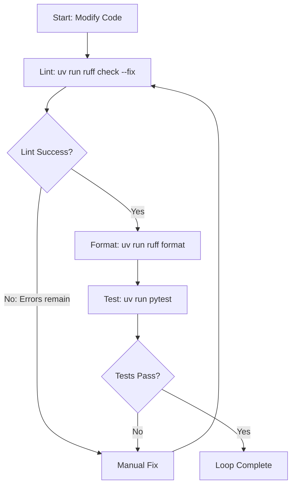

# Pyhd (Python Development)

This workflow outlines the standard development process for Python projects using Ruff to format and lint code and uv to manage the local environment.

## 1. Plan-Validate-Execute (Refactoring)

When performing complex or multi-file Python refactorings, follow this pattern:
1. **Plan**: Scan the workspace with `grep_search` to identify all call-sites, import statements, and references to the target code.
2. **Validate**: Verify compatibility of the planned changes against the rest of the codebase and any external library APIs.
3. **Execute**: Modify the files incrementally, running the **Code Verification Loop** below after each file change.

---

## 2. Code Verification Loop

After making any code modification, run this loop recursively before submitting:



1. **Incremental Changes**: Make modular edits to target files.
2. **Lint & Auto-Fix**: Run `uv run ruff check --fix <filename>` to resolve formatting and style warnings automatically.
3. **Formatter**: Run `uv run ruff format <filename>` to format the code structure cleanly.
4. **Local Verification**: Manually resolve any remaining syntax or semantic errors flagged by Ruff.
5. **Run Test Suite**: Run `uv run pytest` from the root of the project to verify that changes have not broken existing functionality. Do not report success with failing tests or unresolved linter errors.

---

## 3. Environment Isolation Rules

> [!IMPORTANT]
> **Virtual Environment Isolation**: Always run your Python commands, test suites, or formatting scripts prefixed with `uv run` (e.g. `uv run python <script.py>` or `uv run pytest`). This ensures the packages and interpreters resolve correctly to the local `.venv/` directory, preventing global system interpreter contamination or dependency resolution failures.

---

## 4. API Documentation

Verify package APIs before writing or modifying code.

- **Online search**: Use search tools to find the official documentation. Helpful search queries include `python <package_name> documentation` or `python <package_name> <function_name>`.
- **Local inspection**: If the package is already installed, inspect its source files under `.venv/lib/python3.x/site-packages/<package>`.
- **Interactive help**: Run a short command to read the Python help docstring:
  ```bash
  uv run python -c "import <package>; help(<package>.<symbol>)"
  ```

---

## 5. Best Practices

Detailed coding standards and idiomatic Python patterns are located in [best_practices.md](references/best_practices.md).
