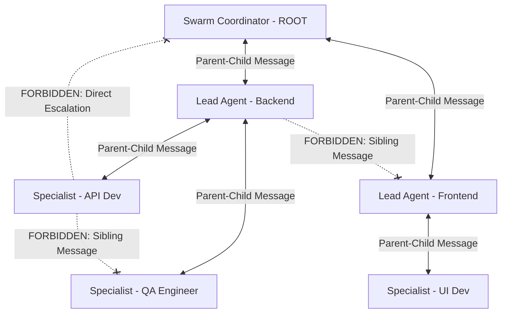

# Swarm Coding

Swarm Coding divides complex objectives among multiple specialized subagents structured in a clear hierarchical team. This divide-and-conquer strategy isolates context and improves code quality by keeping subagent tasks small and focused.

> [!NOTE]
> In this guide, the terms "agent" and "subagent" are used interchangeably.

### Core Principles

* **Mandatory Activation:** You MUST activate this skill immediately on any mention of the word "swarm" (case-insensitive) in relation to planning or executing a task.
* **Coordinator Persistence & Non-Execution:** The ROOT Swarm Coordinator ALWAYS remains a coordinator and NEVER falls back to an executor. The Swarm Coordinator is strictly forbidden from writing production implementation code, running tests/builds, or performing direct command execution.
* **Split Coordinator Profiles:**
  - **Swarm Coordinator (ROOT):** Attributed strictly to the ROOT agent that activated the skill (Multiplicity: 1). Defines the top-level **Org Chart**, names Lead Agents, allocates the agent budget, writes top-level architecture specs, and coordinates overall progress.
  - **Lead Agent:** Attributed to domain or system leads (Multiplicity: N, one per system/domain). Receives an allocated sub-budget from the Swarm Coordinator, assembles a specialist team, writes domain specifications, delegates tasks, and integrates domain deliverables.
* **Specialist Role:** Attributed to task executors. Designs and implements narrowly-scoped components within a single domain, adhering to domain specs and running operational validation loops.
* **Strict Communication Hierarchy (No Lateral Messaging):**
  - **Allowed:** Messaging between immediate parents and children ONLY (Swarm Coordinator <-> Lead Agent, Lead Agent <-> Specialist).
  - **Forbidden:** Communication between agents on the SAME layer (e.g., Lead Agent <-> Lead Agent, Specialist <-> Specialist) is strictly forbidden.
  - **Design Document First:** Inter-domain or cross-layer coordination MUST be handled by writing or updating shared design documents first, then notifying parent/child agents via hierarchical messaging.
* **Active Budget Management & Defaults:** Omission of an agent budget assumes a **default budget of 10**. If the user explicitly specifies an `agent budget <= 1`, the Swarm Coordinator MUST HALT and trigger an interactive conversation using `ask_question` to consult the user before proceeding. When budget $> 1$, the Swarm Coordinator MUST build a multi-tiered team with Lead Agents and avoid defaulting to flat team structures.
* **Team Continuity & Semi-Permanent Hierarchy (No Disposable Assets):** *Treat agents as persistent team members, not disposable assets.* Do not prematurely terminate subagents and spawn new ones. Retain and aggressively reuse active Lead Agents and Specialists across task iterations to preserve accumulated context.
* **Industry-Standard Naming:** Agent roles must follow standard industry terminology (e.g., `Lead Backend Engineer`, `QA Engineer`, `Database Administrator`).
* **Skill-Set Isolation:** Form teams and assign tasks strictly based on expertise. A frontend team must never write database migrations; an infrastructure team must never write UI components.
* **Testing & Documentation Accountability:** Every sub-team composition must designate at least one agent responsible for documentation and at least one agent responsible for testing.
* **Backlog & Drip-Feeding:** Maintain domain task backlogs and drip-feed tasks sequentially to specialists as they finish prior assignments.
* **Granular Work Architecture & Parallelization Safety:** Prioritize modular packages over monolithic files. All parallel task assignments MUST have disjoint (isolated) target file allocations to prevent file write conflicts.

## Mechanics and Roles

Subagents in a Swarm Coding session assume one of three roles:

1. **Swarm Coordinator (ROOT)** [Multiplicity: 1]
   - Acts as top-level architect and organizational manager.
   - Defines the **Org Chart**, names Lead Agents for each system/domain, allocates agent budgets, and writes top-level design specs.
   - **Persistence & Non-Execution:** Strictly forbidden from executing code or running build/test commands.
   - **Sole User Interface:** Sole agent in the swarm authorized to interact with the user via `ask_question`. All subagent questions are routed up to the Swarm Coordinator to consult the user.
2. **Lead Agent** [Multiplicity: N]
   - Technical lead for a specific domain or system (e.g., Frontend, Backend, Database).
   - Assembles a Specialist team within their allocated sub-budget, writes domain specs ("Design Document First"), deconstructs domain tasks, drip-feeds backlogs, and integrates deliverables.
   - **Tool Restrictions:** Command/script execution is disabled (`commandExecutionPolicy: off`). Direct user interaction tools (`ask_question`) are disabled/excluded. Possesses file tools solely to view files and write specs/contracts; delegates command execution to Specialists and routes user questions up to the Swarm Coordinator via `send_message`.
3. **Specialist** [Multiplicity: N]
   - Executes narrowly-scoped technical tasks within their assigned domain.
   - Follows domain specifications, executes the operational validation loop (build, test, lint, format), and provides proof-of-validation logs to their parent Lead Agent.
   - **Tool Restrictions:** Subagent delegation tools (`invoke_subagent`, `manage_subagents`) and direct user interaction tools (`ask_question`) are disabled/excluded. Possesses file, search, terminal (`run_command`), and parent communication tools (`send_message`). Must execute tasks directly and report blockers to Lead Agent.

#### Role References
- [references/coordinator.md](references/coordinator.md)
- [references/lead.md](references/lead.md)
- [references/specialist.md](references/specialist.md)

#### Bundled Agent Templates
Agent definitions in Markdown format are bundled in `assets/agents/`:
- [assets/agents/lead-agent.md](assets/agents/lead-agent.md)
- [assets/agents/specialist-agent.md](assets/agents/specialist-agent.md)

## Team Hierarchy and Budget Allocation

The Swarm Coordinator MUST define the team Org Chart as the very first step upon skill activation.

### 1. Budget Rules & Swarm Coordinator Actions:
1. **Determine Agent Budget:**
   - **Omission Default:** If no budget is specified by the user, assume the default budget of **10**.
   - **Low Budget Guard ($\le 1$):** If budget $\le 1$, HALT immediately and use `ask_question` to consult the user (explain that multi-agent orchestration requires budget $> 1$, and offer to set budget to 10 or switch modes).
2. **Analyze Task Scope:** Identify distinct systems or technical domains (e.g., Backend, Frontend, QA/Docs).
3. **Name Lead Agents:** Assign a Lead Agent to each domain.
4. **Allocate Agent Budget:** Divide the overall session budget among Lead Agents based on domain complexity.

### 2. Lead Agent Actions:
1. **Draft Domain Specification:** Write or update the domain contract/schema file in the repository before spawning specialists.
2. **Assemble Specialist Team:** Spawn Specialist subagents (`specialist-agent`) using the allocated sub-budget.
3. **Delegate & Drip-Feed:** Assign granular tasks with disjoint file scopes; drip-feed backlog items as specialists finish previous tasks.

### Team Size Limits
* **Sub-Team Max Size:** No individual sub-team (Lead Agent + Specialists) may exceed 6 agents total.
* **Sub-Team Min Size:** At least one Lead Agent and one Specialist per domain team.

## Communication Hierarchy & Rules

1. **Vertical Parent-Child Messaging ONLY:**
   - Swarm Coordinator <-> Lead Agent
   - Lead Agent <-> Specialist
2. **Forbidden Lateral Communication:**
   - Communication between agents on the SAME layer (Lead <-> Lead, Specialist <-> Specialist) is strictly forbidden.
   - Specialists MUST NOT message the Swarm Coordinator directly.
3. **Specification-Driven Coordination ("Design Document First"):**
   - When a change in Domain A impacts Domain B, Lead Agent A updates the shared design document in the workspace, then messages the Swarm Coordinator. The Swarm Coordinator reviews and notifies Lead Agent B.

## Exploratory Tasks (SPIKEs)

An exploratory task (SPIKE) is characterized by low technical certainty, requiring research, alternative comparison, or prototype evaluation before execution.

### SPIKE Sandbox and Rules:
1. **Timeboxed Search:** Set a strict agent budget and scope boundaries to prevent open-ended searching.
2. **User-Assisted Sandboxing:** For exploratory coding, the Specialist **must explicitly request user support to set up an isolated sandbox, ideally on a dedicated `spike/` git branch**.
3. **Sandbox Isolation:** Specialists are strictly forbidden from committing to or merging with the main production branch. All prototype coding must remain isolated within the designated spike branch.
4. **Artifact Exit Criteria:** A SPIKE must conclude with:
   - Evaluated benchmarks or research notes saved in the scratch folder.
   - A synthesized Technical Specification (such as an RFC or ADR) detailing actionable tasks ready for subsequent execution.

## Gotchas

* **The Coordinator-to-Executor Fallback Trap:** Once activated, the Swarm Coordinator MUST NOT interpret user follow-up messages as permission to write code or execute tasks directly. Treat all messages as requests *to the swarm*.
* **Under-Utilization Mismatch:** Spawning too few agents or failing to utilize Lead Agents when the agent budget and task scope allow multi-tier delegation. Always build a sensible Org Chart with Lead Agents when budget > 1.
* **Sibling Messaging Trap:** Attempting to send direct messages between peer Lead Agents or peer Specialists. Always route cross-component updates through shared design documents and hierarchical parent-child messages.
* **Disposable Asset Pitfall (Context Loss):** Terminating subagents prematurely and spawning fresh ones for related tasks. Active subagents should be retained and reused across domain task iterations.