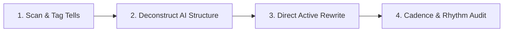

# Deslopify: AI Slop & Trope Removal

Procedures, editorial standards, and de-slopification workflows for purging text of recognizable Large Language Model (LLM) structural patterns, formulaic clichés, and conversational tropes to make technical writing sound authentically human, grounded, and engaging.

---

## Reference Catalog of AI Tells

Consult [`references/tropes.md`](references/tropes.md) for the exhaustive catalog of AI tells, syntactic anti-patterns, and overused vocabulary.

### Quick Reference: Common AI Tells & Direct Alternatives

| Category | Overused AI Pattern | Human-Sounding Alternative |
| :--- | :--- | :--- |
| **Magic Adverbs** | *quietly*, *deeply*, *fundamentally*, *remarkably*, *arguably* | Cut entirely or replace with concrete metrics and verified facts. |
| **Pompous Vocabulary** | *delve*, *tapestry*, *landscape*, *robust*, *seamless*, *leverage*, *harness*, *testament* | Use simple, concrete words: *explore*, *look at*, *system*, *reliable*, *fast*, *use*. |
| **The "Serves As" Dodge** | *serves as a reminder*, *stands as a testament*, *marks a pivotal moment* | Use direct copulas: *is*, *reminds us*, *shows*, *routes*, *was built in*. |
| **Negative Parallelism** | *"It's not X — it's Y"*, *"Not because X, but because Y"* | State the point directly without staging a theatrical contradiction. |
| **Dramatic Countdowns** | *"Not a bug. Not a feature. A design flaw."* | Combine into a single direct statement: *"This is a design flaw."* |
| **Self-Answering Rhetoric** | *"The result? Devastating."*, *"The scary part? Nobody noticed."* | State facts without self-answering drama: *"Nobody noticed the failure."* |
| **Filler Transitions** | *"It's worth noting that..."*, *"Importantly..."*, *"Notably..."* | Cut the preamble. If it's worth noting, state the fact directly. |
| **Pedagogical Tones** | *"Let's break this down"*, *"Here's the thing"*, *"Here's the kicker"* | Eliminate teacher-mode signposting; present the technical facts directly. |
| **Fractal Summaries** | Summarizing every section at the end of the section | Let the section content speak for itself; eliminate redundant sub-conclusions. |

---

## Before & After Transformation Matrix

Use these concrete technical writing transformations to convert formulaic AI slop into crisp, peer-to-peer engineering prose:

| AI Slop Anti-Pattern | Raw AI Draft (Slop) | Human Engineering Rewrite | Key Editorial Changes |
| :--- | :--- | :--- | :--- |
| **Pompous Vocabulary + Adverbs** | *"The system quietly leverages a robust orchestration pipeline to seamlessly deliver unprecedented throughput across the entire distributed landscape."* | *"The system uses a distributed pipeline to process 50,000 requests per second."* | Cut buzzwords (*quietly*, *leverages*, *robust*, *seamlessly*, *landscape*); added verified metrics. |
| **Negative Parallelism + Self-Answering Drama** | *"It's not just a caching layer — it's a fundamental reimagining of state. The result? Instantaneous queries."* | *"Keeping index pages in memory reduced query latency from 80ms to 2ms."* | Removed theatrical negation (*"not just X — it's Y"*) and rhetorical drama (*"The result?"*); stated technical cause and effect directly. |
| **Dramatic Countdown** | *"Not a slow disk. Not network jitter. A deadlock in the connection pool."* | *"A connection pool deadlock stalled all worker threads."* | Eliminated faux-suspense countdown; stated root cause upfront. |
| **Pedagogical Preambles & Fillers** | *"It's worth noting that before we delve into the implementation, let's break down why this matters."* | *"Here is the connection pool architecture:"* | Cut teacher-mode signposting (*"delve"*, *"let's break down"*, *"it's worth noting"*). |
| **The "Serves As" Dodge** | *"The proxy server serves as a crucial gateway, standing as a testament to modular design."* | *"The proxy routes incoming traffic and terminates TLS."* | Replaced pompous copulas (*serves as*, *stands as a testament*) with active technical verbs (*routes*, *terminates*). |
| **Superficial Present-Participle Analysis** | *"We enabled HTTP/3, highlighting the team's forward-looking approach and underscoring our commitment to performance."* | *"Enabling HTTP/3 eliminated head-of-line blocking on packet loss."* | Cut hollow puffery (*"highlighting...", "underscoring..."*); explained concrete technical benefit. |

---

## 4-Stage Deslopification Workflow

Follow this procedure when reviewing or rewriting any text:

### 1. Stage 1: Scan & Tag Tells
- Scan the input text against the patterns in [`references/tropes.md`](references/tropes.md).
- Tag every occurrence of:
  - Magic adverbs (*quietly*, *deeply*, *fundamentally*).
  - Pompous vocabulary (*delve*, *tapestry*, *landscape*, *robust*, *seamless*).
  - Rhetorical questions and false suspense (*The catch?*, *Here's the kicker*).
  - Negative parallelism (*It's not just X, it's Y*).

### 2. Stage 2: Deconstruct AI Structure
- Strip out formulaic LLM structures:
  - **Fractal summaries**: Delete sub-conclusions under intermediate headings (e.g., *"In summary, this step showed..."*).
  - **Signposted conclusions**: Replace "In conclusion", "Wrapping up", and "The bottom line" with direct summaries or actionable next steps.
  - **Bold-first bullet fatigue**: Convert long lists of bold-leaded pseudo-bullets into connected, narrative paragraphs where appropriate.
  - **Excessive em-dashes**: Limit em-dashes to at most one per document; use parentheses, commas, or separate sentences instead.

### 3. Stage 3: Direct Active Rewrite
- **Replace inflated vocabulary**: Simplify grandiose descriptors to plain, active verbs and concrete nouns.
- **Break formulaic symmetry**: Vary sentence lengths dramatically. Follow a long, nuanced sentence with a short, punchy one.
- **Remove false suspense**: State the takeaway upfront (Inverted Pyramid style) rather than holding back information for a staged reveal.
- **Ground claims in specifics**: Replace vague hype (*"provides an incredibly powerful mechanism"*) with concrete technical specifics (*"executes within 5ms on a single core"*).

### 4. Stage 4: Cadence & Rhythm Audit
- Read the final draft to verify:
  - Does it sound like a knowledgeable human engineer speaking with a peer?
  - Are there any lingering rule-of-three triplets (tricolons)?
  - Is the sentence length varied naturally rather than stuck in uniform 15-word rhythms?
  - Is the tone authentic, conversational, and grounded in real-world engineering nuance?
