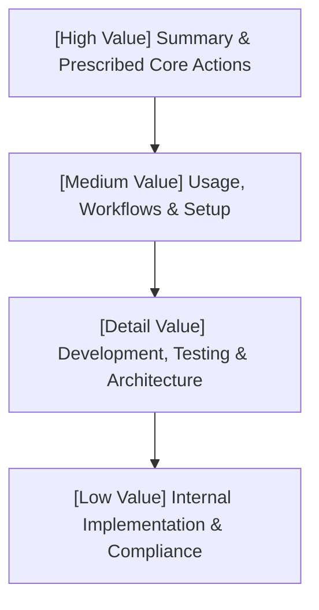

# Inverted Pyramid Documentation Model

Editorial guidelines and structural standards for authoring technical articles, README files, API references, and developer documentation using the **Inverted Pyramid** model—ensuring readers extract immediate, actionable value above the fold while details cascade progressively downward.

---

## 1. Core Philosophy: Information Cascading

The **Inverted Pyramid** model organizes content by reader utility rather than author chronology:

### The 3 Reader Archetypes
Every technical document must cater to three distinct reading depths:
1. **The Scanner (5–10 seconds)**: Reads the headline, grabs the installation/execution command, and starts working immediately.
2. **The Operator (2–5 minutes)**: Reads usage tables, CLI flags, workflow checklists, and common recipes.
3. **The Contributor / Architect (10+ minutes)**: Explores internal architecture, build pipelines, design decisions, and compliance boundaries.

---

## 2. Standard Document Structures

### A. README & Project Documentation Hierarchy

User-facing project documentation **must** follow this strict structural sequence:

1. **Title & High-Impact Summary**:
   - Short, active one-sentence hook explaining what the project is, what problem it solves, and why it exists.
2. **Prescribed Actions (Immediate Quickstart)**:
   - Copy-paste installation command (`npx ...`, `go install ...`, `pip install ...`, `cargo install ...`).
   - Single highest-value initial command to verify setup or produce output.
3. **Usage Guides & Workflows**:
   - Common CLI flags, arguments, configuration options, and copy-pasteable recipes.
   - Output examples and expected terminal responses.
4. **Developer & Contributor Instructions**:
   - How to clone, build locally, execute test suites, run linters, and verify builds.
5. **Technical Architecture & Internals**:
   - Subsystem designs, data schemas, module boundaries, and trade-off rationales.
6. **Legal & Compliance**:
   - License identifier, copyright, contributing links, and security policies.

---

### B. Technical Article & Blog Post Hierarchy

1. **Above the Fold (Lead Block - First 150 words)**:
   - State the core thesis, metric improvement, or direct answer immediately.
   - Do not open with generic throat-clearing (*"In today's fast-paced world of technology..."*).
2. **The Visual / Working Example**:
   - Provide a working code snippet or architectural diagram within the first two scrolls.
3. **Step-by-Step Breakdown & Nuance**:
   - Implementation steps, edge cases, configuration details, and benchmarking data.
4. **Actionable Takeaways & Next Steps**:
   - Concrete next actions, repository links, and references.

---

## 3. Structural Rules & Editorial Principles

- **Lead with Action**: Never bury installation commands behind paragraphs of architectural theory. Let the user run the tool first.
- **Sentence-Case Headings**: Keep headings clear, concise, and sentence-cased, leading with high-value nouns or active verbs.
- **Table Density**: Use tables for CLI flags, tool comparisons, and option summaries rather than loose bullet lists.
- **Copy-Paste Code Blocks**: Every command block must be complete and ready to execute without editing placeholders unless explicitly highlighted.
