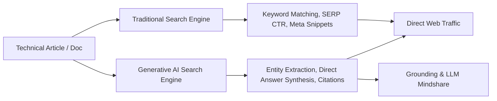
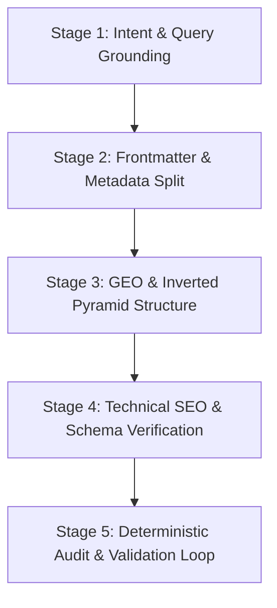

# SEO & Generative Engine Optimizer (GEO)

Procedures, technical standards, and validation workflows for optimizing technical publications, developer documentation, and engineering blogs for traditional search ranking and AI-driven generative search engines, rooted directly in official Google Search Central guidelines.

---

## Skill Architecture & Progressive Disclosure

To minimize context overhead, `SKILL.md` defines core workflows, operational checklists, and decision trees. Load detailed reference modules and execute audit scripts on demand:

- **Official Google Search GenAI Standards**: Read [references/google_search_genai_guidelines.md](references/google_search_genai_guidelines.md) for Google's official stance on AI Overviews, RAG grounding, query fan-out, non-commodity content, and mythbusting.
- **Meta Tags & Robots Specifications**: Read [references/meta_tags_and_robots_spec.md](references/meta_tags_and_robots_spec.md) for supported vs. unsupported meta tags, indexing directives (`nosnippet`, `max-snippet`, `max-image-preview:large`), and `data-nosnippet`.
- **Multilingual & International SEO**: Read [references/multilingual_international_seo.md](references/multilingual_international_seo.md) for `hreflang` rules, bidirectional parity, URL architecture, and avoiding IP auto-redirect pitfalls.
- **AI Search & GEO Standards**: Read [references/geo_and_ai_search.md](references/geo_and_ai_search.md) when optimizing for multi-engine AI discovery (Google AI Overviews, ChatGPT Search, Perplexity, Claude) and `llms.txt`.
- **Technical SEO Checklist**: Read [references/technical_seo_checklist.md](references/technical_seo_checklist.md) when auditing titles, descriptions, headings, outbound link qualifications (`rel="sponsored"`, `rel="ugc"`, `rel="nofollow"`), and image accessibility.
- **Frontmatter & Taxonomy**: Read [references/frontmatter_standards.md](references/frontmatter_standards.md) when splitting human-facing `summary` from search-facing `description`, or formatting tag taxonomy.
- **Schema.org Structured Data**: Read [references/schema_markup_guide.md](references/schema_markup_guide.md) when generating or validating JSON-LD (`TechArticle`, `BreadcrumbList`, `HowTo`).
- **Site Migrations & Status Codes**: Read [references/site_migrations_and_status_codes.md](references/site_migrations_and_status_codes.md) for HTTP status codes, domain migrations, Change of Address workflows, crawl budget, and crawlable link architecture.
- **Search Appearance & SERP Features**: Read [references/search_appearance_and_serp_features.md](references/search_appearance_and_serp_features.md) for SERP visual elements, site names, favicon technical requirements, featured snippets (Position 0 direct answers), byline date parity, Google Discover standards, organic sitelinks, and paywalled content (Flexible Sampling).
- **Evergreen Content Refreshes**: Read [references/content_refresh_guide.md](references/content_refresh_guide.md) when updating decaying legacy articles, retitling posts, or resolving search query cannibalization.

---

## Core SEO & GEO Philosophy

Modern technical discoverability operates across two complementary surfaces:



### 1. Substance Over Commodity Fluff
Search engines and generative AI models prioritize **non-commodity content with high Information Gain**—unique architectural diagrams, original code examples, verified benchmark data, and authoritative personal experience. Commodity summaries are filtered out.

### 2. The Inverted Pyramid & Value-First Answering
Every technical post must answer the primary search intent **above the fold (within the first 2 paragraphs)** before detailing implementation specifics, historical context, or configuration options.

### 3. Dual-Purpose Metadata Split
Never reuse the same text string for human preview cards and search engine indexing:
- **`summary` (For Humans)**: A provocative, curiosity-inducing editorial hook displayed on homepage feeds, category lists, and related-article cards (80–180 characters).
- **`description` (For Search & LLM Engines)**: A factual, high-density, keyword-grounded direct answer used in `<meta name="description">`, OpenGraph tags, and Schema.org `description` (120–160 characters). Note that `<meta name="keywords">` is unsupported and ignored.

---

## 5-Stage SEO & GEO Optimization Workflow

Follow this procedure when auditing or authoring content:



### Stage 1: Intent & Query Grounding
1. Identify the **Primary Target Intent**:
   - *Informational*: Developer wants to understand a concept (e.g., "how do antigravity subagents work").
   - *Procedural/Tutorial*: Developer wants step-by-step instructions (e.g., "build mcp server in go").
   - *Diagnostic/Troubleshooting*: Developer has a specific error or configuration challenge.
2. Formulate the **Core Search Query** and ensure the article provides an unambiguous, definitive answer.

### Stage 2: Frontmatter & Metadata Split
Verify and craft distinct metadata fields:
```yaml
---
title: "Building an MCP Server with Gemini CLI and Go"
summary: "Turn any Go CLI into a native tool for AI agents with just 50 lines of code."
description: "Step-by-step tutorial on building a Model Context Protocol (MCP) server in Go for Gemini CLI. Covers JSON-RPC handlers, tool discovery, and local debugging."
categories: ["Software Engineering"]
tags: ["apis", "golang", "mcp", "tutorial"]
---
```
- Title: 40–60 characters. Clear, high-signal, active phrasing.
- Description: 120–160 characters. Concise, keyword-rich, direct.
- Tags: Alphabetically sorted, lowercase kebab-case, no category duplication.

### Stage 3: GEO & Inverted Pyramid Structure
1. **The Lead Block**: Place the definitive takeaway, core metric, or architectural summary in the opening 150 words.
2. **Scannable Headings**: Use action-oriented `H2` and `H3` headings. Frame complex sections around real developer questions.
3. **Data & Fact Density**: Use tables for comparisons, bold key technical terms on first introduction, and provide copy-pasteable fenced code blocks with language identifiers.
4. **Quotability**: Write clear 1–2 sentence definitions that LLMs can extract verbatim as citations.

### Stage 4: Technical SEO & Schema Verification
1. **Single H1**: Exactly one `H1` tag per document (typically supplied by template frontmatter title).
2. **Heading Depth**: Never skip levels (e.g., `H2` directly to `H4`).
3. **Image Accessibility**: Every image must have descriptive `alt` text explaining the diagram or architecture (never generic names like `image.png` or empty `alt=""`).
4. **Outbound Link Qualification**: Use `rel="sponsored"`, `rel="ugc"`, or `rel="nofollow"` where appropriate.
5. **Internal Cross-Linking**: Include 2–4 contextual internal links to related articles using descriptive anchor text (never "click here" or "this post").
6. **JSON-LD Schema**: Ensure the template emits valid `TechArticle` or `Article` structured data.

### Stage 5: Deterministic Audit & Validation Loop
Execute the bundled audit tools and iterate until all issues are resolved:

1. **If Speedgrapher MCP is available**:
   - Run `speedgrapher.analyze_seo` on the target URL or Markdown draft.
   - Run `speedgrapher.fog` to ensure technical readability index is between **11.0 and 15.0**.
   - Run `speedgrapher.slop` to ensure AI cliché score is $< 25$.

2. **Run Bundled SEO Audit Script**:
   ```bash
   python3 scripts/audit_seo.py <path-to-markdown-file>
   ```
   For machine-readable JSON output:
   ```bash
   python3 scripts/audit_seo.py <path-to-markdown-file> --json
   ```

3. **Check `llms.txt` Synchronization**:
   When adding or restructuring articles, verify that the site's `/llms.txt` index is updated:
   ```bash
   python3 scripts/generate_llmstxt.py --content-dir content/posts --output static/llms.txt
   ```

---

## Validation Rules & Gotchas

> [!WARNING]
> **Common SEO & GEO Gotchas:**
> 1. **Duplicate Summary/Description**: Using identical strings for `summary` and `description` triggers a warning. `summary` is for human conversion; `description` is for search snippet extraction.
> 2. **Generic Alt Text**: Alt text like `screenshot` or `diagram` provides zero semantic value to image search and multi-modal AI crawlers. Use descriptive explanations like `Architecture diagram showing Antigravity CLI communication with SQLite memory bank`.
> 3. **Skipping Heading Levels**: Going from `## Heading` directly to `#### Sub-heading` breaks document outline parsing in search crawlers.
> 4. **Vague Anchor Text**: Never link with `[link]()` or `[here]()`. Always use the localized target article title or descriptive topic name.
> 5. **Unqualified Outbound Links**: Commercial/affiliate links should be qualified with `rel="sponsored"`, user comments with `rel="ugc"`.
> 6. **Keywords Meta Tag**: Do not add `<meta name="keywords">`; Google ignores it.

---

## Resources & Tooling Map

- **Scripts**:
  - `scripts/audit_seo.py`: Automated CLI for technical SEO, metadata split, and GEO readiness auditing.
  - `scripts/generate_llmstxt.py`: Generator for standard `llmstxt.org` index files.
- **References**:
  - `references/google_search_genai_guidelines.md`: Official Google Search Central AI search guidelines.
  - `references/meta_tags_and_robots_spec.md`: Google supported meta tags, robots directives, and HTTP headers.
  - `references/multilingual_international_seo.md`: Multilingual and international SEO with `hreflang`.
  - `references/geo_and_ai_search.md`: AI search engines, citation factors, and information gain.
  - `references/technical_seo_checklist.md`: Core meta tags, headings, link qualification, and accessibility.
  - `references/frontmatter_standards.md`: Taxonomy, tagging, and summary/description specification.
  - `references/schema_markup_guide.md`: Schema.org JSON-LD templates and property rules.
  - `references/site_migrations_and_status_codes.md`: HTTP status codes, full site migrations, crawl budget, and crawlable links.
  - `references/search_appearance_and_serp_features.md`: SERP anatomy, site names, favicons, featured snippets, Discover standards, and paywalls.
  - `references/content_refresh_guide.md`: Evergreen updates and search query decay mitigation.
- **Assets**:
  - `assets/seo_audit_template.md`: Standard audit report format.
  - `assets/llms_txt_template.txt`: Standard `llms.txt` template.
