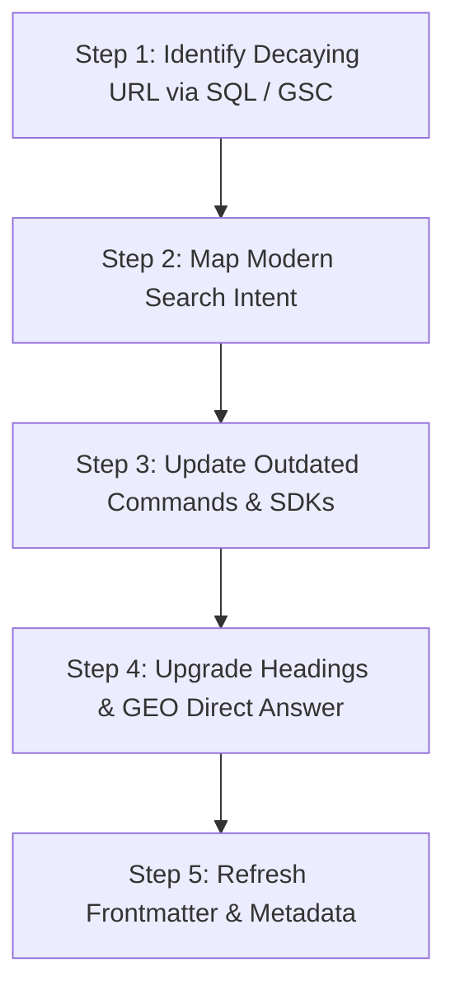

# Evergreen Content Refresh & Decay Mitigation Guide

A systematic procedure for diagnosing organic search decay, refreshing legacy high-value articles, and resolving keyword cannibalization.

---

## 1. Diagnosing Content Decay

Technical content naturally decays over 6–18 months as APIs evolve, CLI tool names change (e.g. `gemini` $\rightarrow$ `agy`), and SDK syntax advances.

### Signs of Decay in Search Analytics:
- **Impression Cliff**: Search impressions drop $>40\%$ over 90 days.
- **Position Slip**: Average rank drops from Top 3 to Positions 8–15.
- **CTR Decay**: High impressions but low CTR due to outdated year in title (e.g., "in 2024").

---

## 2. 5-Step Content Refresh Workflow



### Step 1: Identify Targets
Query your local search analytics database (or Search Console):
```sql
SELECT page, SUM(clicks) as clicks, AVG(position) as avg_pos
FROM search_performance
WHERE date >= date('now', '-90 days')
GROUP BY page
ORDER BY clicks DESC;
```

### Step 2: Map Modern Search Intent
Identify how user queries evolved:
- Are developers searching for newer versions (e.g., Go 1.26, Gemini 2.5/3, Antigravity CLI)?
- Has the community terminology shifted from "vibe coding" to "agentic coding"?

### Step 3: Update Technical Commands & Code Snippets
- Replace deprecated CLI flags or obsolete package names.
- Verify that all code blocks compile against current stable runtimes.
- Add callout alerts for breaking changes (`> [!NOTE]`).

### Step 4: Upgrade Headings & GEO Direct Answers
- Ensure every `H2` is descriptive and action-oriented.
- Insert a bolded 1–2 sentence direct answer immediately below the primary conceptual heading.
- Add a summary table comparing older approaches with modern solutions.

### Step 5: Refresh Metadata
- Update frontmatter `title` if search terminology changed.
- Split `summary` and `description` to ensure high CTR and rich snippet generation.
- Add `lastmod` or update publication timestamp so search engines recognize fresh updates.

---

## 3. Resolving Keyword Cannibalization

**Keyword Cannibalization** occurs when two or more articles on your site compete for the same search query, diluting domain authority.

### Resolution Options:
1. **Differentiate & Specialize**: Refocus Article A on *foundational concepts* and Article B on *advanced production architecture*. Explicitly cross-link between them.
2. **Consolidate & 301 Redirect**: Merge the thinner article into the comprehensive pillar article and set up a redirect from the old slug to the new URL.
3. **Canonical Pointing**: Add a canonical URL pointing from the secondary derivative post to the master pillar post.
