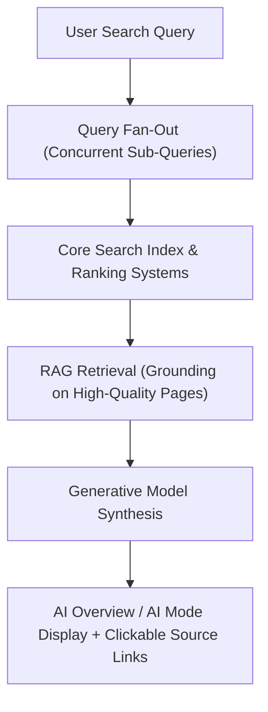
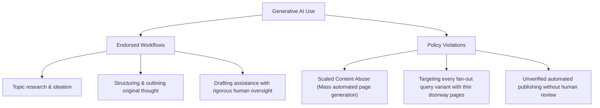
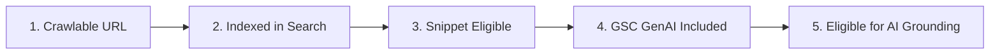
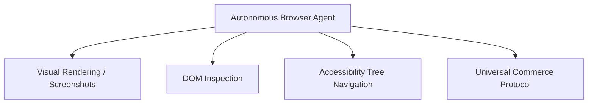

# Official Google Search guidelines for generative AI features

An authoritative reference and implementation standard for optimizing websites for generative AI experiences in Google Search (such as AI Overviews and AI Mode), synthesizing official Google Search Central documentation, Quality Rater Guidelines, and Merchant Center policies.

---

## 1. Executive summary: Foundational SEO in the generative AI era

Generative AI experiences on Google Search are **direct extensions of core Google Search ranking, indexing, and quality systems**—not independent search engines with distinct algorithmic ranking levers.

Optimizing for generative AI search is synonymous with optimizing for the overall search experience (**foundational SEO**). Sites succeed in generative AI features not through superficial "GEO/AEO hacks," but by providing crawlable, non-commodity, people-first content that search ranking systems can confidently retrieve, evaluate, and ground into user-facing answers.



---

## 2. Core generative AI architecture in Google Search

Generative AI features in Search rely on two foundational AI techniques powered by Google's core index:

### Retrieval-augmented generation (RAG / Grounding)
- **Mechanism**: Rather than relying on static parametric model knowledge or unvetted third-party scraping, Google's generative features use **Retrieval-Augmented Generation (RAG)** grounded directly in the live Google Search index.
- **Verification & Citations**: Core Search ranking algorithms retrieve relevant, fresh, authoritative web pages. The generative model evaluates specific passages from these retrieved pages to synthesize an accurate response and displays prominent, clickable links to the supporting source URLs.

### Query fan-out
- **Mechanism**: When processing complex or multi-faceted queries, the generative model executes **query fan-out**—generating a concurrent set of related sub-queries to fetch diverse results across multiple aspects of the topic simultaneously.
- **Example**: For the query *"how to fix a lawn that's full of weeds"*, the model's fan-out sub-queries might include:
  - *"best herbicides for lawns"*
  - *"remove weeds without chemicals"*
  - *"how to prevent weeds in lawn"*

> [!IMPORTANT]
> **The reality of "AEO" and "GEO"**:
> "Answer Engine Optimization" (AEO) and "Generative Engine Optimization" (GEO) are industry marketing terms. From Google Search's perspective, optimizing for generative AI search is simply optimizing for the search experience—foundational SEO. Be cautious when evaluating third-party tools or agencies claiming proprietary access or secret ranking levers for Google's AI systems.

---

## 3. Content strategy: Creating non-commodity, people-first content

Content originality and utility influence long-term visibility in generative AI search more than any technical shortcut.

### The user satisfaction litmus test
When making any editorial or architectural decision, apply Google's core principle:

> **"Is this content that my visitors would find satisfying?"**
>
> If yes, your content aligns with Google's retrieval and ranking objectives, which are calibrated to connect users with genuinely helpful information.

### Commodity vs. non-commodity content

```
+----------------------------------------------------+----------------------------------------------------+
| Commodity Content (Filtered / Low Citation)        | Non-Commodity Content (High Grounding / Cited)     |
+----------------------------------------------------+----------------------------------------------------+
| "7 Tips for First-Time Homebuyers"                 | "Why We Waived the Inspection & Saved Money:       |
|                                                    |  A Look Inside the Sewer Line"                     |
| - Generic advice based on common knowledge         | - Unique, first-hand expert or experiential take   |
| - Restates what is already widely available        | - Original data, real numbers, and edge cases      |
| - Easily synthesizable by any baseline LLM         | - Irreplaceable insights beyond common knowledge   |
| - Impersonal and boilerplate structure             | - Defensible, authentic point of view              |
+----------------------------------------------------+----------------------------------------------------+
```

### Core pillars of non-commodity content
1. **Unique point of view**: Provide first-hand reviews, production post-mortems, proprietary benchmarks, or specialized trade-offs. Do not recycle internet consensus.
2. **Clear information structure**: Structure pages with logical paragraphs, clear descriptive headings (`H2`, `H3`), and scannable comparison tables.
3. **Multimodal integration**: Support written content with original, high-quality images and video. Following standard [Image SEO](https://developers.google.com/search/docs/appearance/google-images) and [Video SEO](https://developers.google.com/search/docs/appearance/video) guidelines directly prepares your assets for multimodal generative grounding.
4. **Transparency and context**: Where automated tools assist in creation, provide transparent disclosures to your audience explaining how automation was used.

---

## 4. Search Quality Evaluator Guidelines (QRG) & AI spam policies

Google's [Search Quality Evaluator Guidelines (QRG)](https://static.googleusercontent.com/media/guidelines.raterhub.com/en//searchqualityevaluatorguidelines.pdf) instruct human raters on assessing search result quality.

> [!NOTE]
> **Quality Raters role**: Quality Raters do **not** directly assign rankings to individual websites. Their ratings serve as calibration data to evaluate and validate the performance of Google's automated search ranking algorithms.

### Key QRG sections regarding AI content

| QRG Section | Title | Rater Evaluation Standard |
| :--- | :--- | :--- |
| **Section 4.6.5** | **Scaled Content Abuse** | Pages created primarily to manipulate search rankings rather than help users, often characterized by automated generation of high volumes of non-original content. Rated **Lowest**. |
| **Section 4.6.6** | **Low Effort / Low Originality / No Added Value** | Main Content (MC) created with little to no human effort, research, originality, or added value. Content that simply restates widely known facts without unique analysis or perspective. Rated **Lowest**. |

### Endorsed vs. violating generative AI workflows



> [!WARNING]
> **Warning against fan-out doorway pages**:
> Generating dozens of near-identical pages targeting every permutation of a fan-out query (e.g., separate pages for *"best herbicide"*, *"weed removal no chemicals"*, *"prevent weeds"*) violates Google's **Scaled Content Abuse spam policy**.
>
> Google's deep language understanding models (such as BERT and subsequent semantic systems) understand query intent and topical relevance without requiring separate pages for keyword variations.

---

## 5. Technical requirements & indexing eligibility

To appear in Google Search generative AI features (AI Overviews and AI Mode), a page must satisfy foundational technical criteria:



### 1. Search technical requirements
- **Crawlability**: URL must not be blocked by `robots.txt` and must return HTTP `200 OK`.
- **Indexability**: The page must be indexed and have no `noindex` directive.
- **Snippet eligibility**: The page must be eligible to show snippets (not blocked by `nosnippet` or `max-snippet:0`).

### 2. Search Console GenAI feature inclusion
- Sites must be included in [Search generative AI features in Search Console](https://support.google.com/webmasters/answer/16908024).

> [!CAUTION]
> **Official indexing disclaimer**:
> *"Just because a page meets all requirements, best practices, and complies with the policies, doesn't mean that Google will crawl, index, or serve its content. Indexing and serving aren't guaranteed."*

### 3. Crawl budget & technical hygiene
- **Crawl budget optimization**: For large or frequently updated websites, ensure crawl efficiency so Googlebot can discover updated content rapidly, keeping AI grounding fresh.
- **JavaScript SEO**: Content rendered via client-side JavaScript must be fully discoverable and not blocked by resources or execution timeouts. Ensure clean DOM rendering.
- **Semantic HTML & readability**: Write well-formed, human-readable HTML. Valid heading structures (`H1` through `H4`) and landmark elements (`<main>`, `<article>`, `<nav>`) enable both screen readers and AI parsers to cleanly isolate Main Content (MC) from boilerplate.
- **Duplicate content elimination**: Consolidate canonical variants to prevent search bots from wasting crawl budget on duplicate parameters.

---

## 6. Autonomous browser agents & emerging agentic protocols

As AI transitions from informational synthesis to autonomous task execution (e.g., booking reservations, comparing product specifications, completing transactions), websites must prepare for agentic navigation:



### Agentic website best practices
- **Accessibility Tree as an Agent Interface**: Browser agents rely heavily on the browser's **Accessibility Tree** (accessible names, roles, ARIA attributes) to interpret interactive elements, form fields, and buttons. Ensuring WCAG compliance and semantic markup directly improves AI agent navigation. See Google's guide on [agent-friendly website best practices](https://web.dev/articles/ai-agent-site-ux).
- **Universal Commerce Protocol (UCP)**: Emerging open standards like [Universal Commerce Protocol](https://ucp.dev/latest/) (UCP) enable Search agents to interact with e-commerce systems, negotiate product details, and initiate checkout flows autonomously.

---

## 7. E-commerce, Merchant Center & business profiles

Generative AI responses frequently integrate structured business listings, local inventory, and transactional widgets.

### Google Merchant Center AI rules
For e-commerce merchants using generative AI in product feeds:

1. **IPTC image metadata**:
   - AI-generated product images **must** include standard IPTC `DigitalSourceType` metadata set to:
     ```
     https://cv.iptc.org/newscodes/digitalsourcetype/trainedAlgorithmicMedia
     ```
   - This ensures transparent origin tracking across Google Search and Google Shopping surfaces.
2. **AI-generated product text**:
   - Product attributes (such as `title` and `description`) generated by AI must be specified separately and labeled as AI-generated in feed attributes.
3. **Structured product feeds**:
   - Maintain accurate [Merchant Center product feeds](https://support.google.com/merchants/answer/11586438) with real-time stock, pricing, and variant availability.

### Google Business Profiles & Business Agent
- **Business Profile verification**: Keep business hours, address, phone, and service categories up to date on [Google Business Profile](https://business.google.com/).
- **Business Agent**: Consider enabling [Business Agent](https://support.google.com/brandprofile/answer/16410382), a conversational experience on Google Search allowing customers to chat directly with your brand within the Search interface.

---

## 8. Snippet controls & generative AI extraction directives

Site owners maintain granular control over how Google Search uses their text and media in snippets and generative AI features:

| Directive / Attribute | Scope | Effect on Generative AI Features |
| :--- | :--- | :--- |
| `nosnippet` | Page-level `<meta>` or HTTP Header | Completely disables text snippets and excludes page text from direct AI Overview synthesis. |
| `max-snippet:[number]` | Page-level `<meta>` or HTTP Header | Limits snippet text length to *[number]* characters for standard search and AI features. (`-1` = unlimited). |
| `max-image-preview:[large\|standard\|none]` | Page-level `<meta>` or HTTP Header | Controls preview image thumbnail dimensions in Search and AI features (`large` recommended). |
| `data-nosnippet` | HTML element attribute | Excludes specific HTML sections (`<div data-nosnippet>`, `<span>`, `<section>`) from search snippets and AI synthesis. |

### Example implementation:
```html
<!-- Page-level robots meta tag -->
<meta name="robots" content="max-snippet:-1, max-image-preview:large, max-video-preview:-1">

<!-- Granular element exclusion -->
<section>
  <h2>Public Technical Overview</h2>
  <p>This paragraph is eligible for standard snippet extraction and generative grounding.</p>
  <div data-nosnippet>
    <p>This proprietary benchmark data is excluded from snippet previews and AI Overviews.</p>
  </div>
</section>
```

---

## 9. Mythbusting generative AI search

| Myth / Misconception | Google Search Reality | Recommended Action |
| :--- | :--- | :--- |
| **`llms.txt` is required for Google AI** | **False.** Google Search ignores `llms.txt` and markdown mirror files. Google relies on standard HTML crawling. | Maintain `llms.txt` if useful for third-party LLMs, but understand it has zero impact on Google Search. |
| **Content must be "chunked" into micro-sections** | **False.** Google models understand multi-topic nuance and extract relevant passages naturally. | Write natural, coherent documents formatted for human flow with logical headings. |
| **Keyword rewriting / phrasing for AI** | **False.** Semantic models (BERT/MUM/Gemini) understand synonyms, context, and intent without keyword gymnastics. | Write in natural, clear, authoritative technical language. Avoid unnatural keyword injection. |
| **Purchasing inauthentic PR citations** | **False.** Spam and link quality systems filter manufactured mentions. | Focus on genuine community distribution, reputable open-source code, and technical merit. |
| **Proprietary schema markup unlocks AI** | **False.** There is no secret "GenAI Schema." Standard Schema.org markup (`TechArticle`, `Product`) is for rich results. | Implement standard Schema.org markup for rich result eligibility without expecting AI-specific tricks. |
| **Mass doorway pages for fan-out queries** | **False.** Creating mass automated variants triggers Scaled Content Abuse penalties. | Consolidate comprehensive coverage into authoritative, non-commodity articles. |

---

## 10. Performance measurement & Search Console reporting

### Search Console Generative AI performance report
To track how searchers discover your content through AI Overviews and AI Mode:
- Access the **Generative AI performance report** in [Google Search Console](https://support.google.com/webmasters/answer/16984139).
- Analyze impressions, clicks, CTR, and landing URLs specifically generated by AI features on Google Search and Discover.

> [!CAUTION]
> **Third-party tool disclaimer**:
> No third-party tool or service has access to Google's internal ranking algorithms, model weights, or proprietary evaluation data. Always evaluate third-party recommendations against official [Google Search Central documentation](https://developers.google.com/search/docs/fundamentals/third-party-seo).

---

## 11. Official Google Search Central resources

Stay updated on algorithm updates, documentation revisions, and policy updates through official Google Search channels:

| Resource | Description | Official URL |
| :--- | :--- | :--- |
| **Search Central Blog** | Official announcements on AI features, core updates, and Search Console tools. | [developers.google.com/search/blog](https://developers.google.com/search/blog) |
| **Social Channels** | Direct announcements from the Search relations team. | [LinkedIn](https://www.linkedin.com/showcase/googlesearchcentral/) • [X (@googlesearchc)](https://twitter.com/googlesearchc) |
| **Help Community** | Technical Q&A with Google Product Experts and Googlers. | [support.google.com/webmasters/community](https://support.google.com/webmasters/community) |
| **YouTube Channel** | Video breakdowns, Search Off the Record podcasts, and technical SEO tutorials. | [youtube.com/c/GoogleSearchCentral](https://www.youtube.com/c/GoogleSearchCentral) |
| **Search Essentials** | Fundamental technical, spam, and quality requirements. | [developers.google.com/search/docs/essentials](https://developers.google.com/search/docs/essentials) |
| **AI Content Guidance** | Official guidance on using generative AI content. | [developers.google.com/search/docs/fundamentals/using-gen-ai-content](https://developers.google.com/search/docs/fundamentals/using-gen-ai-content) |
