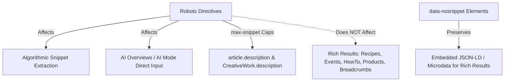

# Google Search Meta Tags, Robots Directives, and Outbound Link Qualification Specification

A comprehensive technical reference for HTML `<meta>` tags, robots indexing and serving directives, HTTP `X-Robots-Tag` headers, text-level snippet exclusion (`data-nosnippet`), and outbound link qualification (`rel` attributes) based on official Google Search Central standards.

---

## 1. Executive Summary & Quick Reference

### The Gold Standard `<head>` Template

```html
<!DOCTYPE html>
<html lang="en">
<head>
  <!-- Character Encoding: UTF-8 recommended, must be within the first 1024 bytes -->
  <meta charset="utf-8">
  
  <!-- Responsive Viewport: Required for mobile friendliness & mobile-first indexing -->
  <meta name="viewport" content="width=device-width, initial-scale=1">
  
  <!-- Search Engine Verification (Exact case required) -->
  <meta name="google-site-verification" content="+nxGUDJ4QpAZ5l9Bsjdi102tLVC21AIh5d1Nl23908vVuFHs34=">
  
  <!-- Document Title & Meta Description -->
  <title>Building Scalable Agent Skills | Danicat Engineering</title>
  <meta name="description" content="Technical guide on authoring, evaluating, and deploying high-performance agent skills with strict progressive disclosure.">
  
  <!-- Robots Directives: Open indexing with rich visual & textual snippet controls -->
  <meta name="robots" content="index, follow, max-image-preview:large, max-snippet:-1, max-video-preview:-1">
</head>
<body>
  <!-- Page Content -->
</body>
</html>
```

### Core Tenets of Google Robots Parsing

1. **Default State**: In the absence of robots tags or headers, the default state is `index, follow` (equivalent to `all`).
2. **Precedence & Restrictiveness**: When conflicting rules appear, the **most restrictive directive always wins** (e.g., `nosnippet` overrides `max-snippet:50`; `noindex` overrides `index`).
3. **Crawlability Prerequisite**: Googlebot must be allowed to fetch a URL in `robots.txt` to read meta tags and `X-Robots-Tag` headers. Disallowing a URL in `robots.txt` blinds Googlebot to `noindex` and `nosnippet` directives.
4. **Case Sensitivity**: All tags, directives, and HTTP headers are case-insensitive, with the single exception of `google-site-verification` token values.

---

## 2. Supported `<meta>` Tags Reference

Google Search parses a limited subset of `<meta>` tags in the HTML `<head>` (and `<body>` when necessary). All unsupported tags are ignored.

| Meta Tag | Canonical Syntax | Purpose & Parsing Behavior |
| :--- | :--- | :--- |
| **`description`** | `<meta name="description" content="...">` | Provides a concise summary of the page (typically 120–160 characters). Google may use this text as the search result snippet when it offers a more relevant preview than body text. |
| **`robots`** | `<meta name="robots" content="...">` | Governs crawling, indexing, and snippet generation across **all** conforming search engine crawlers. |
| **`googlebot`** | `<meta name="googlebot" content="...">` | Applies crawling, indexing, and serving rules specifically to Google's text web search crawler (`Googlebot`). Overrides general `robots` directives when more restrictive or specifically targeted. |
| **`googlebot-news`** | `<meta name="googlebot-news" content="...">` | Controls crawling and snippet display specifically within **Google News** surfaces. |
| **`google-site-verification`** | `<meta name="google-site-verification" content="...">` | Verifies site ownership in Google Search Console. **Critical**: Values in `name` and `content` must match the verification token with **exact character casing**. Works identically in HTML or XHTML. |
| **`notranslate`** | `<meta name="googlebot" content="notranslate">` | Informs Google not to offer an automated translated title link and snippet in search results for queries in other languages. |
| **`nopagereadaloud`** | `<meta name="google" content="nopagereadaloud">` | Blocks Google text-to-speech (TTS) services and the Read Aloud user agent from reading the page content aloud. |
| **`charset`** | `<meta charset="utf-8">` | Declares character encoding. Unicode/UTF-8 is strongly recommended. Place within the first 1024 bytes of the document. |
| **`Content-Type`** | `<meta http-equiv="Content-Type" content="text/html; charset=utf-8">` | Legacy HTTP-equivalent character set declaration. **Syntax Rule**: The entire `content` attribute value must be quoted, or the `charset` parameter may fail to parse. |
| **`viewport`** | `<meta name="viewport" content="width=device-width, initial-scale=1">` | Directs the browser's viewport sizing for responsive layouts. Required for mobile-friendly evaluation. |
| **`rating`** | `<meta name="rating" content="adult">`<br>`<meta name="rating" content="RTA-5042-1996-1400-1577-RTA">` | Flags a page as containing sexually explicit or adult content to ensure filtering by SafeSearch. Accepts either `"adult"` or the `"RTA-5042-1996-1400-1577-RTA"` token. |
| **`refresh`** *(Anti-Pattern)* | `<meta http-equiv="refresh" content="5;url=https://example.com">` | Meta-refresh client redirect. **Discouraged**: Violates W3C WCAG accessibility standards and breaks browser navigation history. Use server-side `301` or `308` HTTP redirects. |

---

## 3. Valid Indexing & Serving Directives Matrix

Directives can be specified in `<meta name="robots" content="...">`, `<meta name="googlebot" content="...">`, or HTTP `X-Robots-Tag` headers. Multiple directives may be comma-separated.

| Directive | Specification & Parameters | SERP & Snippet Behavior | Impact on Generative AI & AI Overviews |
| :--- | :--- | :--- | :--- |
| **`all`** | `content="all"` | Default setting. No restrictions on indexing, snippet generation, or asset previews. | Full eligibility for grounding, search summaries, and AI Overviews. |
| **`noindex`** | `content="noindex"` | Excludes the page, media, or resource from appearing in all Google Search surfaces. | Completely excludes URL from search indexing and AI generation inputs. |
| **`nofollow`** | `content="nofollow"` | Instructs Googlebot not to crawl outbound links discovered on this page. Does not prevent indexing of the page itself. | Page text remains eligible for indexing; link equity is not forwarded. |
| **`none`** | `content="none"` | Shortcut equivalent to `noindex, nofollow`. | URL and outbound links are excluded from indexing and crawling. |
| **`nosnippet`** | `content="nosnippet"` | Disallows all textual snippets and video previews in search results. A static image thumbnail may still appear if available. | **Blocks the content from being used as direct input or training text for AI Overviews and AI Mode.** |
| **`max-snippet:[number]`** | `content="max-snippet:N"`<br>• `0`: Equivalent to `nosnippet`<br>• `-1`: Unlimited character length<br>• `N`: Integer limit in characters | Restricts SERP textual snippets to a maximum of `N` characters. Ignored if `N` is not an integer. | Limits the volume of content that may be extracted as direct input for AI Overviews. Does not restrict structured data. |
| **`max-image-preview:[setting]`** | `content="max-image-preview:setting"`<br>• `none`: No image preview<br>• `standard`: Default thumbnail size<br>• `large`: Viewport-width thumbnail | Controls preview thumbnail dimensions across Search, Discover, and Assistant. | Governs visual asset extraction and high-resolution thumbnail cards. |
| **`max-video-preview:[number]`** | `content="max-video-preview:N"`<br>• `0`: Static thumbnail only<br>• `-1`: Unlimited duration<br>• `N`: Maximum duration in seconds | Limits animated video snippet previews to `N` seconds. | Restricts video excerpt duration across Search, Google Videos, and Discover. |
| **`notranslate`** | `content="notranslate"` | Prevents automated translation of title links and snippets in multilingual search results. | AI and search results retain original source language without automated proxy translation. |
| **`noimageindex`** | `content="noimageindex"` | Prevents images hosted on or embedded in this page from appearing in Google Images results. | Excludes page images from visual search indexing; textual content remains indexable. |
| **`unavailable_after:[date/time]`** | `content="unavailable_after: 2026-12-31T23:59:59Z"`<br>Accepts RFC 822, RFC 850, or ISO 8601 | Automatically de-indexes the page after the specified timestamp. Googlebot reduces crawl frequency significantly after expiration. | Terminates search visibility and AI Overview retrieval after the scheduled expiration date. |
| **`indexifembedded`** | `content="noindex, indexifembedded"` | Allows Google to index content when embedded within another parent page (via `<iframe>`, `<embed>`, or `<object>`), despite an explicit `noindex` on the standalone URL. | Must be paired with `noindex`. Enables embeddable widgets and players to contribute to parent page indexing. |

---

## 4. Directive Precedence, Combining Rules & Conflict Resolution

### The Most Restrictive Rule Wins

When conflicting directives are present across single or multiple tags, Google resolves conflicts by applying the most restrictive instruction:

```html
<!-- Example 1: nosnippet is more restrictive than max-snippet:50. Result: nosnippet -->
<meta name="robots" content="max-snippet:50, nosnippet">

<!-- Example 2: noindex is more restrictive than index. Result: noindex -->
<meta name="robots" content="index">
<meta name="robots" content="noindex">
```

### Multi-Crawler Directives & "Sum of Negative Rules"

When combining generic `robots` tags with crawler-specific tags (`googlebot`, `googlebot-news`), Google calculates the **union of all negative directives**:

```html
<!-- robots specifies nofollow; googlebot specifies noindex -->
<meta name="robots" content="nofollow">
<meta name="googlebot" content="noindex">
```

**Resolution for Googlebot**: Interpreted as `noindex, nofollow`.

### Targeting Specific Crawlers vs Non-Search Crawlers

Google supports two primary user-agent tokens within the HTML robots meta tag:
1. `name="googlebot"`: Targets general web search indexing.
2. `name="googlebot-news"`: Targets Google News indexing.

```html
<!-- Allow standard web snippet, but suppress snippet in Google News -->
<meta name="googlebot" content="max-snippet:-1">
<meta name="googlebot-news" content="nosnippet">
```

> [!WARNING]
> **Non-Search Crawlers (e.g., `AdsBot-Google`)**:
> General `<meta name="robots" content="noindex">` rules apply only to search engine indexers. To block advertising or quality evaluation crawlers, you must target the specific user agent:
> ```html
> <meta name="AdsBot-Google" content="noindex">
> ```

---

## 5. The `robots.txt` Crawlability Prerequisite (The Critical Trap)

Robots meta tags and HTTP `X-Robots-Tag` headers are discovered **during crawl execution**. 

> [!CAUTION]
> **The `robots.txt` Block Trap**:
> If a URL is disallowed in `robots.txt`, Googlebot **cannot fetch the page or read its headers**. Consequently:
> 1. Googlebot will **never discover** a `noindex`, `nosnippet`, or `unavailable_after` directive on that page.
> 2. If external or internal backlinks point to the disallowed URL, Google may still index the URL bare in search results (displaying only the URL and anchor text, with no snippet).
>
> **Rule**: To remove a page from the index via `noindex`, the URL **must remain crawlable** in `robots.txt`.

```
# INCORRECT: Googlebot cannot see the noindex tag on /admin/page.html
User-agent: Googlebot
Disallow: /admin/

# CORRECT WORKFLOW:
# 1. Allow crawl in robots.txt
# 2. Add <meta name="robots" content="noindex"> to /admin/page.html
# 3. Wait for Googlebot to crawl, discover noindex, and drop the URL from SERPs
```

---

## 6. Text-Level Exclusion: The `data-nosnippet` Specification

The `data-nosnippet` attribute allows granular, element-level exclusion of text fragments from search snippets and AI Overviews without suppressing the rest of the document.

### Strict Element Whitelist

`data-nosnippet` is valid **only on three HTML elements**:
- `<span>`
- `<div>`
- `<section>`

```html
<!-- VALID: Applied to span, div, section -->
<p>Public tutorial text <span data-nosnippet>confidential API key example</span> continues here.</p>

<div data-nosnippet>
  <p>Proprietary configuration block excluded from search snippets.</p>
</div>

<section data-nosnippet>
  <h2>Internal Disclaimers</h2>
  <p>Text excluded from SERP snippets and AI direct input.</p>
</section>

<!-- INVALID: Ignored by Googlebot on p, article, custom elements -->
<p data-nosnippet>This attribute will be IGNORED because it is on a p tag.</p>
<article data-nosnippet>IGNORED: Must wrap inner content in a div or section.</article>
<custom-widget data-nosnippet>IGNORED: Wrap with div or span.</custom-widget>
```

### Boolean Attribute Mechanics

`data-nosnippet` is a standard HTML boolean attribute. **Any assigned value is ignored**:

```html
<div data-nosnippet>Snippet excluded</div>
<div data-nosnippet="true">Snippet excluded</div>
<div data-nosnippet="false">Snippet STILL EXCLUDED (value is ignored)</div>
```

### The Unclosed Tag Hazard

Because parsers treat unclosed elements as extending to the end of the container, an unclosed `<div data-nosnippet>` or `<span data-nosnippet>` will **exclude all subsequent DOM content** on the entire page from search snippets:

```html
<!-- DANGEROUS SYNTAX ERROR -->
<div data-nosnippet>Exempt text
<!-- Missing </div> tag here -->
<p>This entire paragraph and all following content will accidentally be omitted from snippets!</p>
```

### JavaScript DOM Hydration & Rendering Rules

Googlebot extracts `data-nosnippet` annotations both before and after JavaScript rendering.
1. **Never mutate existing nodes**: Do not add or remove `data-nosnippet` on existing DOM nodes via JavaScript after page load (timing differences cause unpredictable snippet generation).
2. **Attach on insertion**: If dynamically creating DOM elements via client-side JavaScript, inject the `data-nosnippet` attribute simultaneously when creating the element before mounting it to the DOM.
3. **Web Components / Custom Elements**: Always wrap custom elements with a standard `<div data-nosnippet>` or `<section data-nosnippet>`.

---

## 7. Interaction with Schema.org Structured Data

Robots meta directives govern automatic textual and media extraction by Google's algorithms. They do **not** disable explicit Schema.org structured data provided for Rich Results, with one specific exception:



1. **`max-snippet` Scope**: `max-snippet` caps textual preview lengths from raw page text as well as `article.description` and `description` fields on `CreativeWork` types.
2. **Rich Results Independence**: Other structured data entities (such as `Recipe`, `Product`, `Event`, `HowTo`, `FAQPage`, `BreadcrumbList`) remain fully eligible for rich carousels and badges even when `nosnippet` or `max-snippet:0` is set.
3. **Structured Data Inside `data-nosnippet`**: Declaring Schema.org JSON-LD or Microdata inside a `<div data-nosnippet>` element **remains valid** and will be parsed by Google for Rich Results.

---

## 8. Server-Side HTTP Headers (`X-Robots-Tag`)

The `X-Robots-Tag` HTTP response header allows applying any robots directive at the web server level. This is essential for non-HTML assets such as PDFs, raw images, audio, video, and data files (`.json`, `.xml`).

### Header Syntax & User-Agent Targeting

```http
HTTP/1.1 200 OK
Date: Tue, 18 Aug 2026 18:00:00 GMT
Content-Type: application/pdf
X-Robots-Tag: noindex, nofollow
X-Robots-Tag: unavailable_after: 2026-12-31 23:59:59 PST
```

User-agent specific headers can be defined by prefixing the directive:

```http
X-Robots-Tag: googlebot: nofollow
X-Robots-Tag: otherbot: noindex, nofollow
```

### Production Web Server Configurations

#### NGINX Server Configuration (`nginx.conf`)

```nginx
# 1. Block indexing and link following on all PDF documents
location ~* \.pdf$ {
    add_header X-Robots-Tag "noindex, nofollow" always;
}

# 2. Allow large image previews for static visual assets
location ~* \.(png|jpe?g|gif|webp|svg)$ {
    add_header X-Robots-Tag "max-image-preview:large" always;
}

# 3. Block search indexing for an individual private file
location = /downloads/internal-whitepaper.pdf {
    add_header X-Robots-Tag "noindex, noarchive" always;
}

# 4. Set temporary availability expiration on promotional PDFs
location ~* ^/offers/.*\.pdf$ {
    add_header X-Robots-Tag "unavailable_after: 2026-10-31 23:59:59 UTC" always;
}
```

#### Apache Web Server Configuration (`.htaccess` / `httpd.conf`)

```apache
# 1. Global PDF indexing restriction
<Files ~ "\.pdf$">
    Header set X-Robots-Tag "noindex, nofollow"
</Files>

# 2. Global image indexing and preview controls
<Files ~ "\.(png|jpe?g|gif|webp)$">
    Header set X-Robots-Tag "max-image-preview:large"
</Files>

# 3. Restrict specific static document in local directory
<Files "unicorn.pdf">
    Header set X-Robots-Tag "noindex, nofollow"
</Files>

# 4. Target Googlebot specifically with conditional headers
<Files ~ "\.docx$">
    Header set X-Robots-Tag "googlebot: noindex, nofollow"
</Files>
```

---

## 9. Qualifying Outbound Links (`rel` Attributes on `<a>` Tags)

To communicate the relationship between your page and outbound destinations, qualify anchor (`<a>`) tags using specialized `rel` attributes.

| `rel` Attribute | Purpose & Google Policy | Canonical HTML Example |
| :--- | :--- | :--- |
| **`rel="sponsored"`** | Mandatory for advertisements, paid placements, sponsored collaborations, and affiliate links. Protects against link-spam penalties. | `<a href="https://partner.example.com" rel="sponsored">Sponsored Tool</a>` |
| **`rel="ugc"`** | Recommended for user-generated content (comments, forum posts, profile links, community submissions). | `<a href="https://user.example.com" rel="ugc">User Submission</a>` |
| **`rel="nofollow"`** | Used when other values do not apply and you do not want Google to associate your site with, crawl, or pass PageRank to the destination URL. | `<a href="https://untrusted.example.com" rel="nofollow">External Reference</a>` |
| **Compound Values** | Multiple qualifications can be combined via space-separated or comma-separated tokens. | `<a href="..." rel="ugc nofollow">Forum Comment</a>`<br>`<a href="..." rel="ugc,nofollow">Forum Comment</a>` |

### Key Outbound Link Rules & Exceptions

1. **The Hint Model**: Since 2019, Google treats `rel="nofollow"`, `rel="sponsored"`, and `rel="ugc"` as **hints** for crawl discovery and indexing rather than absolute directives. However, they reliably prevent link-equity (PageRank) transfer and shield sites from unnatural outbound link penalties.
2. **Strict Element Scope Restriction**: `rel="sponsored"` and `rel="ugc"` are valid **only within `<a>` anchor elements**. They have no meaning and are ignored in `<link>` or `<meta>` tags. `nofollow` is valid in `<a>`, `<meta name="robots">`, and `X-Robots-Tag`.
3. **UGC Contributor Trust Reward Exception**: You may conditionally omit `rel="ugc"` from links submitted by vetted community members or trusted authors who have demonstrated a sustained record of high-quality, non-spam contributions.
4. **Internal Link Anti-Pattern**: **Never use `rel="nofollow"` on internal links** (e.g., pagination, footer links, privacy policies). To control internal crawling or indexing, use `robots.txt` `Disallow` rules or page-level `<meta name="robots" content="noindex">`.

---

## 10. Deprecated, Unsupported, & Anti-Pattern Tags Reference

The following tags and attributes are **explicitly ignored** by Google Search or represent harmful anti-patterns:

```
┌─────────────────────────────────────────────────────────────────────────────┐
│                       DEPRECATED & UNSUPPORTED TAGS                         │
├───────────────────────────────┬─────────────────────────────────────────────┤
│ Tag / Attribute               │ Status & Explanation                        │
├───────────────────────────────┼─────────────────────────────────────────────┤
│ <meta name="keywords">        │ Ignored completely. 0 impact on ranking.    │
│ HTML lang attribute (<html...>)│ Ignored for language detection (uses text).│
│ <link rel="next" / "prev">    │ Deprecated. Ignored for pagination.         │
│ <meta name="google"           │ Deprecated. Feature decommissioned.         │
│   content="nositelinkssearchbox">                                           │
│ <meta name="robots"           │ Deprecated. Cached page links removed.      │
│   content="noarchive">        │                                             │
│ <meta name="robots"           │ Ignored by Google Search.                   │
│   content="nocache">          │                                             │
│ <meta http-equiv="refresh">   │ Anti-pattern. Violates WCAG accessibility.  │
│                               │ Use 301 / 308 server redirects.             │
└───────────────────────────────┴─────────────────────────────────────────────┘
```

- ❌ `<meta name="keywords" content="...">`: Google Search has ignored meta keywords for decades. Adding them clutters the `<head>` and exposes keyword strategies to competitors.
- ❌ `<html lang="en">` / Code-level `lang` attributes: Google determines document language purely through algorithmic evaluation of rendered body prose, not HTML `lang` attributes (though `hreflang` in `<link>` tags and `inLanguage` in Schema.org remain essential for international SEO).
- ❌ `<link rel="next" href="...">` and `<link rel="prev" href="...">`: Decommissioned in 2019. Google treats paginated components as independent pages.
- ❌ `<meta name="google" content="nositelinkssearchbox">`: Google removed the Sitelinks Search Box feature globally; the directive is obsolete.
- ❌ `<meta name="robots" content="noarchive">` & `nocache`: Google retired search result cache links; `noarchive` is no longer operational.
- ❌ `<meta http-equiv="refresh" content="...">`: Client-side refresh redirects cause accessibility issues for screen readers, disrupt the browser history stack, and delay link equity transfer compared to standard HTTP `301` / `308` redirects.

---

## 11. Verification & Diagnostics Checklist

- [ ] **robots.txt Access**: Confirm target URLs are not blocked by `Disallow` rules if you intend for Google to parse `noindex` or `nosnippet`.
- [ ] **Verification Exact Casing**: Ensure `google-site-verification` tokens retain identical uppercase/lowercase strings.
- [ ] **HTML Syntax Integrity**: Validate that all `<head>` tags, `<div data-nosnippet>`, and `<span>` elements are closed with valid closing tags.
- [ ] **Element Scope**: Verify `rel="sponsored"` and `rel="ugc"` are placed exclusively on `<a>` tags and never on internal links.
- [ ] **HTTP Headers**: For non-HTML documents (PDFs, images), inspect live responses using `curl -I <url>` to verify `X-Robots-Tag` headers.
- [ ] **URL Inspection Tool**: Run live URL inspection in Google Search Console to inspect parsed `<meta>` tags and rendered DOM output.
