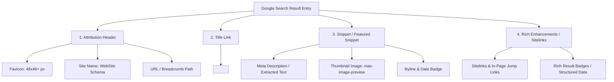
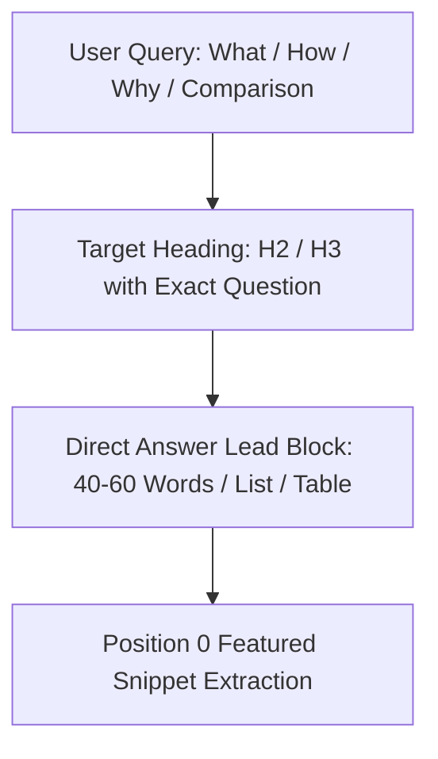
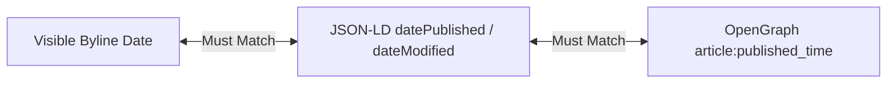
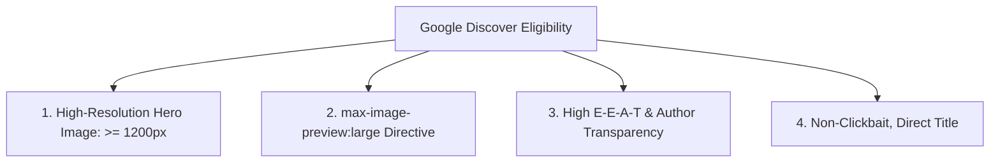

# Search Appearance & SERP Features Reference Guide

A comprehensive technical reference for controlling and optimizing how web content appears across Google Search result pages (SERPs) and Google Discover, based on official Google Search Central specifications.

---

## 1. SERP Anatomy & Visual Elements Gallery

Google Search displays organic results by combining discrete visual components into unified search result entries. Understanding these elements enables precise control over user perception, click-through rates (CTR), and snippet extraction.



### Core SERP Components

| Component | Function | Primary Signal Source | Control Mechanism |
| :--- | :--- | :--- | :--- |
| **Attribution Header** | Identifies source brand, domain, and category hierarchy. | Favicon file, `WebSite` structured data, `BreadcrumbList`. | `<link rel="icon">`, JSON-LD `WebSite`, JSON-LD `BreadcrumbList`. |
| **Site Name** | Visual brand name replacing raw domain strings. | JSON-LD `WebSite`, `og:site_name`, `<title>`, `<h1>`. | JSON-LD `WebSite` markup on homepage. |
| **Title Link** | Primary clickable heading for the search result. | `<title>` tag, on-page `<h1>`, anchor text, headings. | `<title>` tag optimization (50–60 characters). |
| **Snippet** | Text excerpt explaining page relevance to the search query. | `<meta name="description">`, on-page body text. | `<meta name="description">`, `data-nosnippet`, `max-snippet`. |
| **Thumbnail** | Visual image preview accompanying the snippet. | OpenGraph image, structured data `image`, on-page ``. | `robots: max-image-preview:large`, Schema `ImageObject`. |
| **Byline Date** | Visible publication or last-modified timestamp. | On-page visible date, JSON-LD `datePublished` / `dateModified`. | ISO 8601 timestamps, on-page date parity. |
| **Sitelinks** | Direct shortcut links to key subpages or page sections. | Internal link structure, Table of Contents, heading IDs. | Clean navigation hierarchy, semantic anchor IDs (`id="..."`). |
| **Rich Results** | Enhanced cards (articles, recipes, software, ratings). | Schema.org structured data. | JSON-LD markup adhering to Google search gallery. |

---

## 2. Site Names in Google Search

Google algorithmically determines site names to present a clean, brand-first identity in search results across mobile and desktop.

### WebSite Structured Data Specification

To declare the preferred site name, place a `WebSite` JSON-LD schema on the **homepage/root URL** of the domain:

```html
<script type="application/ld+json">
{
  "@context": "https://schema.org",
  "@type": "WebSite",
  "name": "Acme Engineering",
  "alternateName": ["Acme Tech", "acme.example.com"],
  "url": "https://example.com/"
}
</script>
```

### Key Properties

- **`name`** *(Required)*: The official name of the site (e.g., `"Acme Engineering"`). Must be concise, recognizable, and consistent across the site.
- **`alternateName`** *(Optional)*: Array of acceptable aliases, acronyms, or shorter variations (e.g., `["Acme Tech", "acme.example.com"]`).
- **`url`** *(Required)*: The canonical root URL of the website.

### Signal Hierarchy for Site Names

Google verifies site name consistency across multiple sources in order of preference:

1. **`WebSite` Structured Data**: JSON-LD on root URL.
2. **OpenGraph Site Name**: `<meta property="og:site_name" content="Brand Name">`.
3. **`<title>` Tag Brand Suffixes**: e.g., `<title>Article Title - Brand Name</title>`.
4. **Header Elements**: Prominent `<h1>`, logo alt text, and main navigation headers on the homepage.

> [!IMPORTANT]
> **Site Name Best Practices:**
> - Do **not** use generic names (e.g., "Best Tech Blog" or "Go Tutorials").
> - Maintain strict parity between the `WebSite` JSON-LD `name`, `og:site_name`, and the brand suffix in `<title>` tags.
> - Ensure the site name is identical for all sub-paths under the same domain or subdomain.

---

## 3. Favicons in Search Results

Google displays a favicon next to the site name and URL in mobile and desktop SERPs.

### Technical Requirements

| Specification | Google Requirement |
| :--- | :--- |
| **Dimensions** | Must be square and a multiple of 48px: **48x48**, **96x96**, **144x144**, **192x192**, or **SVG** format. Google scales down to 16x16 for SERP display. |
| **File Format** | Any valid icon format: `.svg`, `.png`, `.ico`, `.gif` (non-animated), or `.jpg`. |
| **HTML Syntax** | Declared in `<head>` via `<link rel="icon" href="...">` or `<link rel="shortcut icon" href="...">`. |
| **URL Stability** | The favicon URL must be persistent and stable. Do not frequently rotate the URL. |
| **Crawler Access** | The favicon URL and homepage must **not** be blocked by `robots.txt` and must be accessible to `Googlebot-Image` and `Googlebot`. |
| **Visual Policy** | Must visually represent the website brand. Inappropriate, hateful, or deceptive icons (e.g., fake verified badges) will be replaced with a default globe icon. |

### Recommended HTML Implementation

```html
<head>
  <!-- Primary High-Resolution SVG / PNG Favicon -->
  <link rel="icon" type="image/svg+xml" href="/favicon.svg">
  <link rel="icon" type="image/png" sizes="96x96" href="/favicon-96x96.png">
  <link rel="icon" type="image/png" sizes="48x48" href="/favicon-48x48.png">
  
  <!-- Apple Touch Icon fallback -->
  <link rel="apple-touch-icon" sizes="180x180" href="/apple-touch-icon.png">
</head>
```

---

## 4. Featured Snippets (Position 0 Optimization)

Featured Snippets are highlighted answer boxes displayed at the top of Google SERPs above traditional organic listings. They are extracted algorithmically from pages that rank on Page 1.



### Direct-Answer Targeting Formulas

#### 1. Paragraph Snippets (Definitions & Explanations)
- **Trigger Queries**: "What is X", "Why does X happen", "How does X work".
- **Targeting Formula**:
  1. Place the explicit query in an `<h2>` or `<h3>` heading.
  2. Provide the definitive, self-contained answer in the **very first sentence (40–60 words total)** directly below the heading.
  3. Start with an assertive declarative sentence: `"[Subject] is a [category] that [core function]..."`.
  4. Follow with context, code examples, or trade-offs.

```markdown
## What is Model Context Protocol (MCP)?

Model Context Protocol (MCP) is an open standard that enables AI models to securely connect with local and remote data sources, developer tools, and external services. By standardizing client-server JSON-RPC communication, MCP eliminates custom integration code and allows agents to discover and invoke tools dynamically.
```

#### 2. Numbered & Bulleted List Snippets (Steps & Collections)
- **Trigger Queries**: "How to install X", "Steps to configure Y", "Best tools for Z".
- **Targeting Formula**:
  - Use `<h2>How to [Action]</h2>`.
  - Use an ordered list (`<ol>` or Markdown `1.`, `2.`, `3.`) for sequential steps.
  - Use an unordered list (`<ul>` or Markdown `-`) for non-sequential collections.
  - Ensure each step starts with a strong imperative verb (e.g., `Install`, `Configure`, `Export`, `Verify`).
  - Keep each list item between 8–20 words.

```markdown
## How to Build an MCP Server in Go

1. **Initialize the Go Module**: Run `go mod init` and install the official MCP SDK dependencies.
2. **Define Tool Handlers**: Create handler functions with JSON-RPC schemas for tool execution.
3. **Register Tools with the Server**: Bind tool names and descriptions to the server instance.
4. **Configure Stdio Transport**: Connect standard input and output streams for agent communication.
5. **Test with Gemini CLI**: Connect the binary locally and verify tool discovery.
```

#### 3. Table Snippets (Comparisons & Specifications)
- **Trigger Queries**: "X vs Y comparison", "pricing tiers", "technical specifications".
- **Targeting Formula**:
  - Use clean HTML `<table>` or Markdown tables with explicit column headers (`<th>`).
  - Keep rows structured with high data density.
  - Place the most critical comparison attributes in the first 2–3 columns.

```markdown
## Antigravity CLI vs Traditional Scripting

| Feature | Antigravity CLI | Traditional Shell Scripts |
| :--- | :--- | :--- |
| **Tool Execution** | Dynamic MCP Tool Calling | Static Hardcoded Subprocesses |
| **Agentic Loop** | Autonomous Multistep Planning | Deterministic Single Pass |
| **Context Management** | Progressive Disclosure & Memory | Static Environment Variables |
| **Self-Correction** | Automated Rollback & Lint Gates | Manual Error Handling |
```

### Controlling Snippet Serving

Control snippet length and indexing with robots meta tags:

- `<meta name="robots" content="nosnippet">`: Completely disables text snippets and featured snippet extraction.
- `<meta name="robots" content="max-snippet:120">`: Restricts snippet excerpt length to 120 characters.
- `<meta name="robots" content="max-snippet:-1">`: Allows unlimited excerpt length (recommended for rich snippets).
- `<div data-nosnippet>`: Excludes specific text elements (e.g., boilerplate, licensing) from snippet generation.

---

## 5. Byline & Publication Date Parity

Google evaluates publication and modification dates to establish content freshness, author credibility, and topical relevance.

### The Date Consistency Principle

All dates associated with an article must maintain strict parity across three surfaces:
1. **Visible On-Page Byline**: What the human reader sees at the top or bottom of the post.
2. **JSON-LD Structured Data**: `datePublished` and `dateModified` fields.
3. **OpenGraph & Meta Tags**: `article:published_time` and `article:modified_time`.



### Format Requirements

- Use standard **ISO 8601** format with explicit timezone offsets:
  - `2026-08-18T10:00:00Z` (UTC)
  - `2026-08-18T11:00:00+01:00` (Local timezone)
- Always include the time and timezone offset to avoid ambiguous date interpretation across regional Google indexers.

### Anti-Abuse Rules: Date Modifications

> [!CAUTION]
> **Google Search Policy on Artificial Date Bumping:**
> - **Do NOT artificially bump `dateModified`** or the visible "Updated on" date without making **substantial, meaningful changes** to the article's core content.
> - Minor typo fixes, formatting adjustments, or tag tweaks do **not** justify updating the modification date.
> - Artificially refreshing publication dates without new content is considered deceptive freshness manipulation and can lead to algorithmic demotion or loss of date rich features.

### Implementation Checklist

- [x] Clear visible distinction between "Published on [Date]" and "Last updated on [Date]".
- [x] `datePublished` remains unchanged throughout the lifecycle of the document.
- [x] `dateModified` is updated only when code samples, explanations, or factual data are materially revised.
- [x] Visible author byline is positioned near the date stamp.

---

## 6. Google Discover Standards

Google Discover delivers personalized content feeds to mobile users based on automated interest matching and fresh topic engagement.



### Technical & Quality Criteria

| Criterion | Requirement | Rationale |
| :--- | :--- | :--- |
| **Image Resolution** | Hero image must be at least **1200px wide**. | High-resolution card rendering in mobile feeds. |
| **Robots Directive** | `<meta name="robots" content="max-image-preview:large">` or HTTP `X-Robots-Tag: max-image-preview:large`. | Explicitly authorizes Google to display large card previews. |
| **Title Integrity** | Descriptive, factual, engaging, without clickbait or curiosity gaps. | Avoid withholding context or sensationalizing claims. |
| **E-E-A-T Signals** | Visible author byline, author bio page link, publisher info, and clear sources. | Demonstrates first-hand expertise and institutional accountability. |
| **Content Freshness & Depth** | Original analysis, real benchmarks, or new engineering insights. | Discover prioritizes high Information Gain over generic aggregations. |

### Configuration Example

```html
<head>
  <title>Building a Local MCP Server in Go: Complete Architecture & Implementation</title>
  <meta name="robots" content="index, follow, max-image-preview:large">
  <meta property="og:image" content="https://example.com/images/mcp-go-hero.png">
  <meta property="og:image:width" content="1200">
  <meta property="og:image:height" content="630">
</head>
```

---

## 7. Organic Sitelinks & Deep In-Page Navigation

Sitelinks are algorithmic sub-links that appear beneath a main search result, providing direct access to key sections or subpages.

### Types of Sitelinks

1. **Domain-Level Sitelinks**: Multiple indented links pointing to major hub pages (e.g., `/docs`, `/blog`, `/pricing`, `/about`).
2. **In-Page Jump Sitelinks ("Jump to" Links)**: Direct deep-links to specific headings (`#installation`, `#benchmarks`) within a single long-form guide.

### Optimization Strategy for In-Page Sitelinks

- **Semantic Anchor IDs**: Provide clean, descriptive `id` attributes on all `<h2>` and `<h3>` headings:
  ```html
  <h2 id="installing-mcp-sdk">Installing the MCP Go SDK</h2>
  ```
- **Table of Contents**: Place a linked Table of Contents near the top of comprehensive documentation articles:
  ```markdown
  ## Table of Contents
  - [Prerequisites & Environment](#prerequisites)
  - [Installing the MCP SDK](#installing-mcp-sdk)
  - [Building the JSON-RPC Handler](#building-the-handler)
  - [Verification & Testing](#verification)
  ```
- **Descriptive Anchor Text**: Avoid generic links ("Section 1", "click here"). Use descriptive keywords matching user search intent.
- **Hierarchical Headings**: Follow strict heading structure without skipping levels (`H1` → `H2` → `H3`).

---

## 8. Subscription & Paywalled Content (Google Flexible Sampling)

Publishers providing gated or subscription content must configure paywalled structured data to allow Googlebot to crawl full articles while preventing cloaking penalties.

### Flexible Sampling Architecture

- **Lead-In Model**: Provides a portion of introductory content (e.g., the first 2–3 paragraphs) before prompting for login or subscription.
- **Metering Model**: Allows users to view a set number of free articles per month before paywall enforcement.

### Preventing Cloaking Penalties

> [!WARNING]
> **Avoid Cloaking Flags:**
> Showing full content to Googlebot while presenting a paywall to normal users is classified as **cloaking** unless properly declared using Schema.org paywalled structured data.

### Schema.org Paywall JSON-LD Specification

Mark paywalled sections using `isAccessibleForFree` and `hasPart` targeting specific CSS class selectors:

```html
<script type="application/ld+json">
{
  "@context": "https://schema.org",
  "@type": "TechArticle",
  "headline": "Advanced Agentic Workflows with Antigravity CLI",
  "isAccessibleForFree": false,
  "hasPart": {
    "@type": "WebPageElement",
    "isAccessibleForFree": false,
    "cssSelector": ".paywall-restricted-content"
  },
  "author": {
    "@type": "Person",
    "name": "Jane Doe",
    "url": "https://example.com/about/"
  },
  "publisher": {
    "@type": "Organization",
    "name": "Acme Engineering",
    "url": "https://example.com/"
  }
}
</script>
```

### HTML Structure for Paywalled Content

```html
<!-- Free Lead-In Section (Crawled and publicly visible) -->
<div class="lead-in-content">
  <p>This introductory guide covers the basics of Antigravity CLI agent orchestration...</p>
</div>

<!-- Paywalled Section (Crawled by Googlebot, gated for unauthorized users) -->
<div class="paywall-restricted-content">
  <p>Here is the proprietary architectural blueprint and benchmark breakdown...</p>
</div>
```

---

## 9. Comprehensive Search Appearance Audit Checklist

Use this operational checklist before publishing or updating technical content:

| Category | Verification Item | Status |
| :--- | :--- | :--- |
| **Site Name** | `WebSite` JSON-LD with `name`, `alternateName`, `url` deployed on homepage. | `[ ]` |
| **Site Name** | `<meta property="og:site_name">` matches `WebSite` schema `name`. | `[ ]` |
| **Favicon** | Square icon provided in multiple of 48px (48x48, 96x96, etc.) or SVG. | `[ ]` |
| **Favicon** | Favicon URL is stable, declared in `<head>`, and crawlable in `robots.txt`. | `[ ]` |
| **Title Link** | Title is 50–60 characters, brand-suffixed, frontloaded with primary query. | `[ ]` |
| **Snippets** | Meta description is 120–160 characters and answers core search intent. | `[ ]` |
| **Featured Snippet** | Direct answer formula applied under target `H2` (40–60 word paragraph, list, or table). | `[ ]` |
| **Date Parity** | Visible date matches JSON-LD `datePublished` and `dateModified` (ISO 8601). | `[ ]` |
| **Date Integrity** | `dateModified` is updated only for substantial content revisions. | `[ ]` |
| **Discover** | Hero image is $\ge 1200\text{px}$ wide with `max-image-preview:large` enabled. | `[ ]` |
| **Sitelinks** | Headings have explicit, human-readable anchor IDs (`id="slug"`). | `[ ]` |
| **Paywall** | If gated, `isAccessibleForFree: false` and `hasPart` CSS selectors are configured. | `[ ]` |
