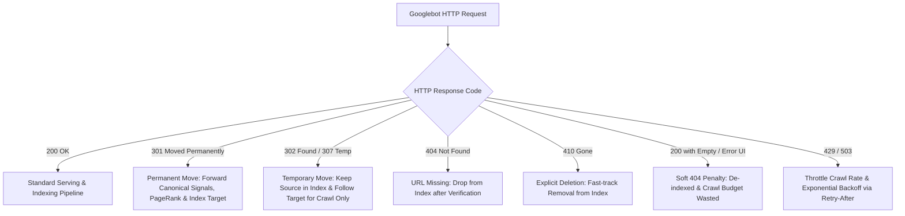
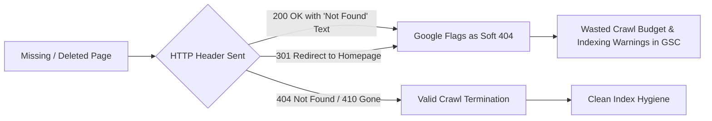
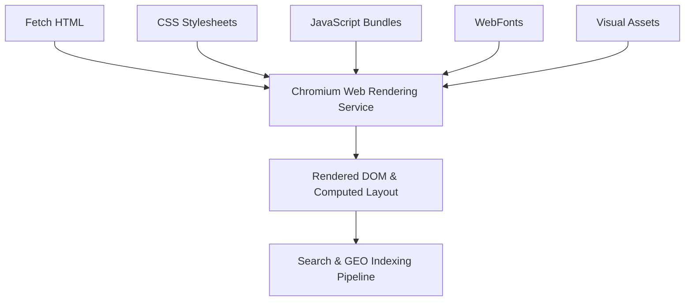
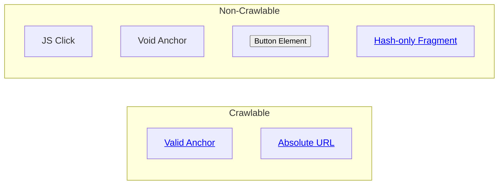

# Site Migrations, HTTP Status Codes, and Crawl Infrastructure

A comprehensive, authoritative engineering reference on HTTP status codes, domain and site migrations, crawl budget optimization, and crawlable site architecture based on official Google Search Central guidelines.

---

## 1. HTTP Status Codes Decision Tree & Indexing Behavior

HTTP status codes are the primary signal Googlebot uses to determine whether a URL should be crawled, indexed, canonicalized, or purged from the search index.



### Complete Status Code Matrix for Googlebot

| HTTP Status Code | Definition & Googlebot Behavior | Search Signal Transfer (PageRank, Canonical) | Recommended Implementation & Use Cases |
| :--- | :--- | :--- | :--- |
| **`200 OK`** | Document exists and serves valid content. Googlebot proceeds to render, parse structured data, and index. | Baseline indexable state. | Standard production serving for canonical URLs. |
| **`301 Moved Permanently`** | Resource permanently relocated. Googlebot updates search index to target URL and re-attributes inbound links. | **100% Signal Transfer** (PageRank, Anchor Text, Canonical Authority). | Permanent URL restructuring, HTTP to HTTPS migrations, domain brand changes. |
| **`302 Found` / `307 Temporary`** | Resource temporarily relocated. Googlebot crawls destination but retains source URL in index. | **0% Signal Transfer** (Source URL remains canonical). | Maintenance redirects, seasonal landing pages, temporary regional redirect tests. |
| **`304 Not Modified`** | Server confirms content matches cached `If-Modified-Since` or `ETag`. Googlebot saves bandwidth. | Preserves existing index state. | Static assets, unchanged large sitemaps, API feeds. |
| **`404 Not Found`** | Resource does not exist. Googlebot eventually drops URL from index after periodic confirmation. | Drops all signals. | Intentionally removed content with no 1-to-1 equivalent replacement. |
| **`410 Gone`** | Resource permanently deleted with no intention of return. Googlebot drops URL **significantly faster** than `404`. | Drops all signals immediately. | Decommissioned product lines, deleted thin/spam content, permanent site pruning. |
| **`429 Too Many Requests`** | Server is overloaded or hitting rate limits. Googlebot immediately slows down crawl rate. | Retains current index state. | Emergency crawl throttling. Must accompany `Retry-After` header. |
| **`503 Service Unavailable`** | Server temporarily unavailable (maintenance/outage). Googlebot preserves existing index and retries later. | Retains current index state without de-indexing. | Scheduled downtime, maintenance windows, transient backend overload. |

---

## 2. Preventing and Fixing Soft 404 Errors

A **Soft 404** occurs when a server returns an HTTP `200 OK` status for a page that is effectively an error page, empty document, or missing resource.

### Common Causes of Soft 404s
1. **Missing Content with `200 OK`**: Rendering a "Product not found" or "Page does not exist" message while returning `HTTP/1.1 200 OK`.
2. **Blank or Thin Templates**: Dynamic single-page applications (SPAs) rendering an empty `<div id="app"></div>` when an API entity returns 404.
3. **Blanket Homepage Redirects**: Redirecting hundreds of deleted sub-pages via `301` to `/` instead of a 1-to-1 equivalent or returning `404`/`410`.
4. **Infinite Category / Search Pages**: Faceted search or zero-result search result pages returning `200 OK` with zero listings.



### Server Configuration Fixes

#### NGINX Custom 404 / 410 Handling
```nginx
# Explicit 404 error page returning true 404 status
error_page 404 /errors/404.html;
location = /errors/404.html {
    root /var/www/site;
    internal;
}

# Decommissioned endpoint returning 410 Gone immediately
location /legacy-discontinued-api/ {
    return 410 "The requested endpoint has been permanently decommissioned.";
}
```

#### Apache `.htaccess` Configuration
```apache
# Set custom 404 document
ErrorDocument 404 /errors/404.html

# Return 410 Gone for legacy directory
RewriteEngine On
RewriteRule ^old-discontinued-products/.*$ - [G,L]
```

---

## 3. Full Site & Domain Migrations Playbook

A successful domain or site structure migration preserves search equity, historical traffic, and user trust by methodically managing URL transitions.

```mermaid
graph TD
    subgraph Phase 1: Pre-Migration Planning
        M1[Inventory All Live URLs] --> M2[Build 1-to-1 Redirect Mapping Matrix]
        M2 --> M3[Verify Staging Site & Canonical Parity]
    end

    subgraph Phase 2: Launch & Cutover
        L1[Deploy 301 Redirect Rules] --> L2[Keep Old XML Sitemap Active on Old Host]
        L2 --> L3[Submit New XML Sitemap to GSC on New Host]
        L3 --> L4[Execute Google Search Console Change of Address Tool]
    end

    subgraph Phase 3: Post-Migration Monitoring
        P1[Monitor GSC Page Indexing & Crawl Stats] --> P2[Verify 301 Logs & 404 Spikes]
        P2 --> P3[Maintain 301 Redirects for Minimum 12 Months]
    end

    Phase 1: Pre-Migration Planning --> Phase 2: Launch & Cutover
    Phase 2: Launch & Cutover --> Phase 3: Post-Migration Monitoring
```

### Step 1: Pre-Migration Redirect Mapping Matrix

Never rely on automated wildcard redirects for heterogeneous content. Build an exhaustive 1-to-1 CSV mapping matrix:

| Old URL (`source_url`) | New URL (`target_url`) | HTTP Code | Status | Notes |
| :--- | :--- | :--- | :--- | :--- |
| `https://old.example.com/blog/2025/post-a/` | `https://new.example.com/posts/post-a/` | `301` | Direct 1:1 | Canonical article preservation |
| `https://old.example.com/docs/v1/api/` | `https://new.example.com/docs/api/` | `301` | Direct 1:1 | Top-level documentation entry |
| `https://old.example.com/deprecated-feature/` | `https://old.example.com/deprecated-feature/` | `410` | Deleted | Purposely removed; fast index purge |

> [!WARNING]
> **Eliminate Redirect Chains and Loops:**
> A redirect chain (`URL A -> 301 -> URL B -> 301 -> URL C`) slows page loading, squanders crawl capacity, and may cause Googlebot to abort following redirects after 5 hops. Always point `URL A -> 301 -> URL C` directly.

### Step 2: XML Sitemaps Strategy During Migrations

During a site move, do **not** delete the old sitemap immediately:

1. **Maintain the Old Sitemap**: Keep the old sitemap (listing all legacy `old.example.com` URLs) live and submitted in Google Search Console on the old property. This signals Googlebot to crawl the legacy URLs and discover the `301` redirects immediately.
2. **Submit the New Sitemap**: Deploy and submit the new sitemap (listing only `200 OK` destination URLs on `new.example.com`) on the new Search Console property.
3. **Run Concurrently**: Keep both sitemaps submitted until the GSC Page Indexing report shows complete transition of indexation to the new domain (typically 3–6 months minimum).

### Step 3: Google Search Console Change of Address Tool

For domain-level migrations (e.g., `example.com` to `example.io` or `oldbrand.com` to `newbrand.com`), use the Change of Address tool:

1. **Verify Both Properties**: Ensure both the source domain and destination domain are verified in Google Search Console under the same Google account (Domain property verification via DNS TXT is recommended).
2. **Implement 301 Redirects**: Ensure sitewide 301 redirects are fully live and passing HTTP status code verification.
3. **Open Change of Address**:
   - In GSC, select the **Old Property**.
   - Navigate to **Settings** (`⚙`) -> **Change of Address**.
   - Select the **New Property** from the validated domain dropdown.
   - Run the automated pre-flight checks (redirect validation).
   - Click **Submit**.
4. **Duration**: The Change of Address signal remains active in Google's systems for **180 days** while search signals and indexing are migrated.

> [!NOTE]
> The Change of Address tool is designed for whole-domain or whole-subdomain moves (`old.com` -> `new.com` or `blog.old.com` -> `blog.new.com`). It does not support path-level moves (e.g. `example.com/blog/` to `example.com/news/` or `old.com/sub/` to `new.com/`). Path moves rely exclusively on 301 redirects and sitemap reconciliation.

---

## 4. Crawl Budget & Crawling Infrastructure for Large Sites

Crawl budget is the number of URLs Googlebot can and wants to crawl on your site within a given timeframe. It is governed by **Crawl Capacity Limit** (server health and throughput) and **Crawl Demand** (site popularity and freshness).

### The Control Triad: robots.txt vs. noindex vs. Sitemaps

| Mechanism | Primary Function | Level of Action | Can Googlebot Read Page Content? | Does it Appear in Google Search Results? |
| :--- | :--- | :--- | :--- | :--- |
| **`robots.txt` (`Disallow`)** | **Crawling Control** | Network / Request Level | **No** (Crawler is forbidden from fetching the URL). | **YES (Warning)**: If external links point to the URL, Google can index the URL *without snippet content*. |
| **`noindex` (Meta Tag / Header)** | **Indexing Control** | Parser / Document Level | **Yes** (Googlebot must fetch and parse the page to see `noindex`). | **NO**: Completely excluded from search results and AI snippets. |
| **`XML Sitemaps`** | **Discovery Priority** | Ingestion / Priority Queue | **Yes** (Declares canonical URLs and freshness timestamps). | **YES**: Encourages timely crawling and re-crawling. |

> [!CAUTION]
> **The `robots.txt` + `noindex` Trap:**
> If you add `noindex` to a page and simultaneously block that page with `Disallow` in `robots.txt`, Googlebot **cannot crawl the page to see the `noindex` tag**. The page may remain indexed if referenced by external links. **To remove an indexed URL via `noindex`, robots.txt MUST allow Googlebot to fetch the page.**

### Blocked Resources: Preserving Full Browser Rendering

Googlebot operates a full, modern rendering pipeline (Evergreen Chromium). To accurately evaluate page layouts, mobile-friendliness, Core Web Vitals, and hidden content, it requires access to all layout resources.



- **Never Disallow Assets**: Do not block `/css/`, `/js/`, `/static/`, `/fonts/`, or `/images/` in `robots.txt`.
- **Validation**: Use the GSC **URL Inspection Tool** -> **Test Live URL** -> **View Tested Page** -> **Screenshot / More Info** to confirm no critical resources are blocked.

### Preventing Infinite Crawl Traps & State-Changing Requests

Crawlers can be trapped in infinite loops or overload dynamic servers by executing state-altering actions.

#### 1. Blocking State-Changing Actions
Search crawlers should never trigger side-effects:
```robots.txt
User-agent: *
Disallow: /cart/add
Disallow: /cart/checkout
Disallow: /api/auth/
Disallow: /account/logout
Disallow: /user/preferences
```

#### 2. Faceted Navigation & Internal Search Queries
Faceted navigation (sorting by price, color, size, combined filter arrays) creates millions of duplicate low-value URL permutations:
```robots.txt
User-agent: *
# Disallow internal search results
Disallow: /search
Disallow: /find?*

# Disallow infinite filter permutations
Disallow: /*?*sort=
Disallow: /*?*filter=
Disallow: /*?*sessionid=
```

---

## 5. Crawlable Link Architecture

Googlebot discovers the web by extracting and traversing HTML hyperlinks. It does not click arbitrary buttons, execute synthetic event listeners, or parse arbitrary DOM data attributes as navigable links.

### Crawlable vs. Non-Crawlable Link Standards



| Link Format | Crawlable by Googlebot? | Architectural Impact |
| :--- | :--- | :--- |
| `<a href="/posts/mcp-guide/">Guide</a>` | ✅ **Yes** | Standard relative link. Fully discovered and queued. |
| `<a href="https://example.com/docs/">Docs</a>` | ✅ **Yes** | Absolute URL. Fully crawled and followed. |
| `<a href="/page" rel="nofollow">Link</a>` | ⚠️ **Crawlable / Untrusted** | Crawled optionally; does not pass ranking or PageRank signals. |
| `<span onclick="location.href='/docs'">Docs</span>` | ❌ **No** | Ignored. Googlebot does not simulate user click events. |
| `<a href="javascript:void(0)" onclick="load()">` | ❌ **No** | Ignored. `javascript:` pseudo-protocols are discarded. |
| `<button data-href="/target">Explore</button>` | ❌ **No** | Ignored. Buttons are UI triggers, not hyperlinks. |
| `<a href="#section-2">Section</a>` | ❌ **No** (for new pages) | In-page fragment. Does not queue a separate URL fetch. |

---

## 6. Pagination & Infinite Scroll Architecture

Content spanning multiple pages (multi-page technical guides, paginated archive listings, product catalogs) must provide explicit crawlable links in the document body.

### Deprecated Standards Notice
> [!IMPORTANT]
> Google **no longer supports** `<link rel="next" href="...">` and `<link rel="prev" href="...">` in the HTML `<head>`. Pagination discovery is driven entirely by standard crawlable `<a href="...">` links inside the HTML body prose or navigation components.

### HTML Body Pagination Structure
Multi-page articles and list feeds must render accessible navigation blocks:

```html
<nav class="pagination" aria-label="Pagination Navigation">
  <a href="/posts/page/1/" rel="prev" class="pagination-prev">← Previous Page</a>
  <a href="/posts/page/1/">1</a>
  <span class="pagination-current" aria-current="page">2</span>
  <a href="/posts/page/3/">3</a>
  <a href="/posts/page/3/" rel="next" class="pagination-next">Next Page →</a>
</nav>
```

### Search-Friendly Infinite Scroll Requirements

If your site implements infinite scroll or client-side lazy loading:
1. **Fallback Paginated URLs**: Each chunk or page of items must correspond to a distinct, bookmarkable, and shareable URL (e.g. `/posts/page/2/` or `/posts?page=2`).
2. **History API Integration**: Use `window.history.pushState()` or `window.history.replaceState()` to update the address bar as the user scrolls.
3. **HTML Accessibility**: Provide standard crawlable `<a href="...">` links in a `<noscript>` block or in the footer to ensure search bots can traverse all paginated segments without executing JavaScript scrolling gestures.

---

## 7. XML Sitemap Types & Freshness Integrity

Sitemaps inform search engines about discoverable URLs, media metadata, and content modification timestamps.

### Sitemap Types & Capabilities

| Sitemap Type | Namespace / Protocol | Key Elements | Primary Use Case |
| :--- | :--- | :--- | :--- |
| **Standard XML** | `http://www.sitemaps.org/schemas/sitemap/0.9` | `<loc>`, `<lastmod>`, `<changefreq>`, `<priority>` | All HTML articles, documentation pages, static routes. |
| **Image Sitemap** | `http://www.google.com/schemas/sitemap-image/1.1` | `<image:image>`, `<image:loc>`, `<image:title>`, `<image:caption>` | High-resolution architectural diagrams, infographics, product galleries. |
| **Video Sitemap** | `http://www.google.com/schemas/sitemap-video/1.1` | `<video:video>`, `<video:thumbnail_loc>`, `<video:title>`, `<video:description>`, `<video:content_loc>` | Embedded technical webinars, video tutorials, conference talks. |
| **News Sitemap** | `http://www.google.com/schemas/sitemap-news/0.9` | `<news:news>`, `<news:publication>`, `<news:publication_date>`, `<news:title>` | Time-sensitive news articles published within the last 48 hours. |

### Sitemap Limits & Index Architecture
- **Limits**: A single sitemap file cannot exceed **50,000 URLs** or **50MB** (uncompressed).
- **Sitemap Index Files**: For larger collections, organize sitemaps hierarchically using a sitemap index file:

```xml
<?xml version="1.0" encoding="UTF-8"?>
<sitemapindex xmlns="http://www.sitemaps.org/schemas/sitemap/0.9">
  <sitemap>
    <loc>https://example.com/sitemaps/posts-sitemap.xml</loc>
    <lastmod>2026-08-15T12:00:00+00:00</lastmod>
  </sitemap>
  <sitemap>
    <loc>https://example.com/sitemaps/docs-sitemap.xml</loc>
    <lastmod>2026-08-18T08:30:00+00:00</lastmod>
  </sitemap>
</sitemapindex>
```

### `<lastmod>` Freshness Integrity Standards

The `<lastmod>` tag tells Googlebot when a page was last meaningfully modified so it can prioritize re-crawling.

> [!IMPORTANT]
> **Rules for `<lastmod>` Integrity:**
> 1. **Format**: Must use valid W3C Datetime format (`YYYY-MM-DD` or `YYYY-MM-DDThh:mm:ss+00:00`).
> 2. **Reflect Real Changes**: Update `<lastmod>` **only when substantive page content changes** (e.g. text edits, updated code samples, revised facts).
> 3. **Do Not Touch on Automated Builds**: Never update `<lastmod>` across all URLs during routine site builds (e.g., CSS updates, header styling changes, or global re-compiles).
> 4. **Penalties for Falsification**: If Google detects that `<lastmod>` timestamps are consistently updated without corresponding page content changes, it will **completely disregard all `<lastmod>` values from your sitemap**.
