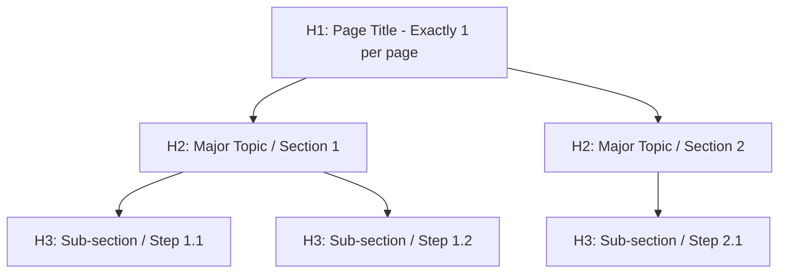

# Technical SEO Checklist for Developer Content

A comprehensive standard for engineering blogs, technical documentation, and static site generators (Hugo, Astro, Next.js), aligned with official Google Search Central guidelines.

---

## 1. Title Tags (`<title>` / Frontmatter `title`)

The title tag is the single most important on-page SEO ranking signal and title link source in SERPs.

| Parameter | Standard | Rationale |
| :--- | :--- | :--- |
| **Character Length** | **40–60 characters** | Below 40 is under-optimized; above 60 gets truncated on desktop and mobile SERPs. |
| **Front-Loading** | Core keyword/topic in first 3 words | Maximizes keyword prominence and matches rapid user scanning. |
| **Tone** | Action-oriented, specific, authentic | Specify the technology stack explicitly (e.g., "Building an MCP Server with Go and Gemini CLI"). |
| **Brand Suffix** | Handled in layout template | Append site brand (e.g. `| danicat.dev`) via template partial, not manually in frontmatter title. |

---

## 2. Meta Descriptions & Robots Settings

### Meta Description (`<meta name="description">`)
- **Length**: **120–160 characters**.
- **Structure**: Context/Problem + Core Solution/Takeaway.
- **Format**: Plain text with no unescaped double quotes (`"`).

### Recommended Robots Meta Directives
Ensure your base layout `<head>` includes:
```html
<meta name="robots" content="index, follow, max-image-preview:large, max-snippet:-1">
```
- `max-image-preview:large`: Allows large visual previews in Search and Discover.
- `max-snippet:-1`: Permits optimal length text snippets for Search and AI Overviews.

---

## 3. Heading Hierarchy (`H1`–`H4`)

Search engines and accessibility screen readers build an outline of your document from heading tags.



### Critical Heading Invariants:
1. **Exactly One `H1`**: In Hugo and static generators, the `H1` is automatically rendered from the frontmatter `title`. Do NOT place `# Title` at the start of your markdown body.
2. **Never Skip Levels**: Do not jump from `H2` (`##`) directly to `H4` (`####`). Maintain strict sequential nesting.
3. **Descriptive Headings**: Use clear, informative headings rather than cryptic puns (prefer `## Configuring SQLite WAL Mode` over `## Going Fast`).

---

## 4. Image Optimization & Multi-Modal Accessibility

Images without descriptive `alt` text harm accessibility and fail to rank in image search and generative AI features.

- **Bad**: `` or `` or ``
- **Good**: ``
- **Rules**:
  - Always explain what the image depicts and why it matters in context (30–100 characters).
  - Use modern, compressed image formats (WebP, optimized PNG/SVG).
  - For AI-generated images in commercial contexts, ensure IPTC `DigitalSourceType` metadata is preserved.

---

## 5. URL Slugs, Canonicalization & `hreflang`

- **Slug Structure**: Lowercase alphanumeric with single hyphens (`/posts/20260729-mcp-server-go/`).
- **Canonical Link**: Every page must output `<link rel="canonical" href="https://danicat.dev/posts/slug/">`.
- **Multilingual `hreflang`**: For translated content, link all editions bidirectionally with self-referencing links and `x-default` fallback.

---

## 6. Outbound Link Qualification (`rel` Attributes)

Qualify outbound links according to Google Search standards:

- **Regular Links**: `<a href="...">` (no qualification needed for normal editorial links).
- **`rel="sponsored"`**: Use for paid placements, sponsorships, or affiliate links.
- **`rel="ugc"`**: Use for user-generated content (comments, community forums).
- **`rel="nofollow"`**: Use when you don't want Google to pass signals to untrusted external sites.

### Internal Anchor Text Best Practices:
- Always link using descriptive topic names or exact article titles:
  - *Bad*: `Read more [here]()` or `Check this [link]()`.
  - *Good*: `For details on subagent lifecycles, see [The Rise of the Subagents]()`.
